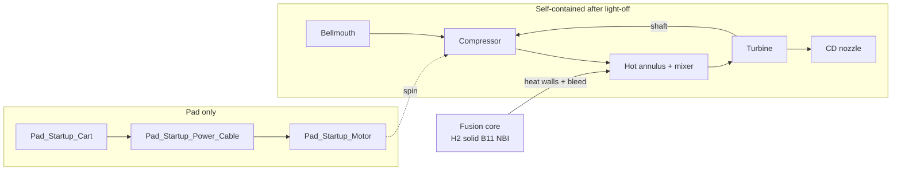

# Orbitron lab — gas & air path (p-¹¹B Orbitron)

**Core plasma:** [`ssto/orbitron/assembly_specs/orbitron_avalanche_core.yaml`](ssto/orbitron/assembly_specs/orbitron_avalanche_core.yaml)

**Reference propulsion plant (mechanism of action):** [`ssto/orbitron/assembly_specs/orbitron_reference_plant.yaml`](ssto/orbitron/assembly_specs/orbitron_reference_plant.yaml)

**Meshes / tree:** [`ssto/orbitron/assembly_specs/orbitron_lab.yaml`](ssto/orbitron/assembly_specs/orbitron_lab.yaml)

**Axis:** propulsion **−X → +X**; tank farm **+Y**.

---

## Dummy-level mechanism (air pushes the plane)

1. **Scoop** (`Bellmouth_Inlet`) captures **air**.
2. **Compressor** (on a **shaft**) raises **pressure** and **mass flow** — air is the **reaction mass**.
3. **Hot section** (annulus around the core + mixer): fusion heats the air by **wall convection** and by **mixing** with hot core exhaust / **⁴He ash** (small mass, large enthalpy).
4. **Turbine** (same shaft) extracts enough **shaft work** to keep the **compressor** spinning after startup.
5. **Nozzle** expands what is left → **high exit velocity** → **thrust**.

Fusion **does not** shove outside air into the plasma. **H₂ / solid ¹¹B** feed **NBI** only. **CH₄** cools the anode boundary (U2). Thrust energy leaves via the **air Brayton** path, not DEC or grid tie.

---

## Startup (test stand — self-contained after light-off)

| Phase | What happens | FlightGear (panel or keys) |
|--------|----------------|----------------------------|
| **Pad APU** | ``Pad_Startup_Cart`` → cable → ``Pad_Startup_Motor`` bus energized | **1** / ``Panel_Switch_APU`` → ``/sim/model/orbitron/pad-apu-online`` |
| **Starter** | Electric motor cranks compressor spool | **2** / ``Panel_Switch_Starter`` → ``/sim/model/orbitron/starter-engage`` (needs APU) |
| **Bleed air** | Bellmouth → compressor annulus open | **3** / ``Panel_Switch_Bleed`` → ``/sim/model/orbitron/bleed-air-open`` |
| **Spin-up** | **U/J** compressor command; mdot rises (surrogate) before ignite | ``/controls/orbitron/compressor`` × bleed × spool factor |
| **Ignite** | Fusion on; thrust / power armed | **SPACE** / ``Big_Red_Button`` → ``/sim/model/reactor/startup-trigger`` (needs bleed) |
| **Heat** | Hot walls + mixer raise gas temperature | W/S throttle after ignite |
| **Turbine takeover** | Turbine drives compressor → release starter (procedure) | Turn **starter** off when spool stable |
| **Run** | Spool + fusion heat + nozzle thrust | W/S beam, U/J air path, I/K cathode |

**Operator checklist:** [`ssto/orbitron/OPERATOR.md`](ssto/orbitron/OPERATOR.md).  
Machine-readable spec: [`orbitron_operator_console_spec.yaml`](ssto/orbitron/assembly_specs/orbitron_operator_console_spec.yaml). Interlocks: ``orbitron_ops.nas`` (from ``orbitron_nasal.yaml``).

Compressed air alone does **not** self-start the spool on a static rig; you need that first **electric** spin (pad APU).

---

## Heat: radial zones (not “air over the magnet”)

**Inside-out:** plasma vacuum → **first wall (hot)** → **air annulus** → **cryostat vacuum** → **HTS magnet (cold)**.
See `ssto/orbitron/THERMAL_ZONING.md`.

| Path | Physics | In mesh / story |
|------|---------|-----------------|
| **First-wall deposition** | α, bremsstrahlung, CX on **anode sheath** | `Outer_Anode_Grid` — **not** on HTS |
| **CH₄ intercept (U2)** | Removes high-grade wall load | Dewar → wall channels / magnet service bosses |
| **Air annulus (Brayton)** | Hot wall → compressed air enthalpy | `Reactor_Bay_Inlet_Shroud`, annulus around anode |
| **Cryostat** | Vacuum + MLI blocks heat to magnet | Gap between air channel and `Magnet` |
| **Gas mixing** | Hot core exhaust + **⁴He ash** → plenum | `Fusion_Hot_Gas_Outlet`, `Helium_Ash_Vent_Line` |
| **Shaft work** | Turbine drives compressor | `Turbine_Can` on same spool as `Compressor_Can` |

Alphas and X-rays **heat the first wall**; **CH₄** and **air** split that load. The **HTS coil stays outside** the hot air path.

---

## Fluid summary

| Fluid | Route | Core p-¹¹B? |
|--------|--------|----------------|
| **H₂** | `Tank_Hydrogen` → `Hydrogen_Trunk_Line` → `NBI_Injector` | **Yes** |
| **solid ¹¹B** | `Solid_Boron_11_Target` → `Boron_Trunk_Line` → `NBI_Injector` | **Yes** |
| **⁴He ash** | `Fusion_Hot_Gas_Outlet` → `Helium_Ash_Vent_Line` → nozzle plenum | **Yes** (product) |
| **Air** | Bellmouth → compressor → annulus → hot duct → turbine → nozzle | Propulsion |
| **CH₄** | Cryo dewar → magnet service bosses | SSTO wall thermal only |
| **HV** | Console → magnet feedthrough boss | Schematic bus |

**Plasma channel:** ``¹H + ¹¹B → 3 ⁴He``

---

## Plant diagram (single spool)



---

## Controls (FlightGear)

| Key / pick | Property | Meaning |
|------------|----------|---------|
| **1** / APU switch | `/sim/model/orbitron/pad-apu-online` | Pad cart powers starter bus |
| **2** / starter switch | `/sim/model/orbitron/starter-engage` | Crank motor (APU required) |
| **3** / bleed switch | `/sim/model/orbitron/bleed-air-open` | Intake / compressor path open |
| **SPACE** / red button | `/sim/model/reactor/startup-trigger` | Reactor ignite (bleed required) |
| W/S | `/controls/reactor/throttle` | Ion beam — ignition level → max |
| I/K | `/controls/orbitron/cathode-pulse` | Cathode shear program |
| U/J | `/controls/orbitron/compressor` | Compressor command (effective only with bleed + spool) |
| M | `/sim/model/reactor/debug-ui-window` | Extra telemetry window |

---

## Build (do **not** remodel from scratch in Blender)

From repo root:

```bash
./stand.sh          # glTF + orbitron.ac + surrogate + sounds (full runnable FG stand)
```

Preview in Blender only (after `./stand.sh` or `make orbitron-lab-gltf`):

```bash
./bl.sh             # re-import orbitron_lab.gltf (close old Blender scene first)
./bl.sh --collections   # optional VIEW__* layer toggles
```

Pad startup (beside −X intake): **grey** `Pad_Startup_Cart` on the deck, **black** `Pad_Startup_Power_Cable`, **orange** `Pad_Startup_Motor`. Intake train: **blue** `Compressor_Can`, **bronze** `Turbine_Can` on +X. Stale glTF? Rerun `./stand.sh` and `./bl.sh`.
