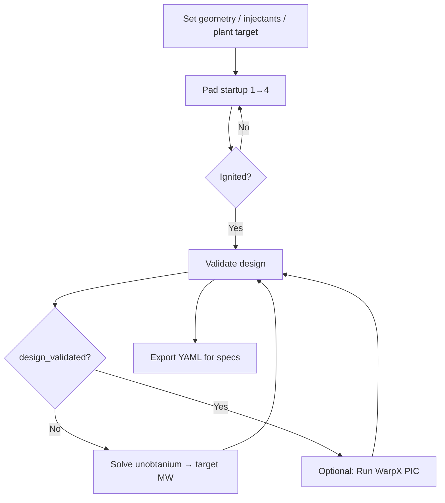

# p-¹¹B Orbitron Design Validation Simulator

**Status:** The simulator is **ready for design validation and unobtanium spec quantification**. It is **not** a full multi-D transport or PIC-integrated fusion-burn code—that is explicitly level 4 (future).

**One-sentence answer:** You can step through pad startup like FlightGear, run a **physics-based p-¹¹B power model** blended with the engineering surrogate, check **U1–U4** with numbers, **solve** for the unobtanium knobs needed to hit **3.5 MW**, and **export YAML** for spec documents.

---

## Table of contents

1. [Are we there yet?](#are-we-there-yet)
2. [Purpose and scope](#purpose-and-scope)
3. [Quick start](#quick-start)
4. [Recommended workflow](#recommended-workflow)
5. [Fidelity ladder](#fidelity-ladder)
6. [Proof Suite GUI](../PROOF_SUITE.md) — interactive step-by-step validation
7. [Proof chain pipeline](../validation_steps.md) — scripted steps 00–09
8. [Architecture](#architecture)
9. [Pad startup (FlightGear parity)](#pad-startup-flightgear-parity)
10. [Physics models](#physics-models)
11. [Unobtanium specs U1–U4](#unobtanium-specs-u1u4)
12. [Validation and YAML export](#validation-and-yaml-export)
13. [Graphical interface](#graphical-interface)
14. [Inverse solve](#inverse-solve)
15. [WarpX PIC and longitudinal views (auxiliary)](#warpx-pic-and-longitudinal-views-auxiliary)
16. [Single source of truth (repo links)](#single-source-of-truth-repo-links)
17. [Limitations and roadmap](#limitations-and-roadmap)
18. [Module index](#module-index)

---

## Are we there yet?

| Goal | Ready? | How |
|------|--------|-----|
| Step-through pad startup with FG-equivalent switches | **Yes** | **Pad startup** tab + interlocks |
| Quantify unobtanium performance specs (U1–U4) | **Yes** | **Validation** tab + `validation.py` |
| p-¹¹B fusion power model (not just a scale factor) | **Yes** | `fusion_pb11.py` + blend in `plant_0d.py` |
| Hit **3.5 MW** and check feasibility | **Yes** | **Solve unobtanium → target MW** |
| CH₄ / HTS sizing from wall load and B | **Yes** | `thermal_systems.py` |
| Export for spec documents | **Yes** | **Export YAML…** → `export_validation.py` |
| Calibrate to surrogate sweep CSV | **Partial** | `surrogate_calib.py` reads `build/orbitron/surrogate_sweep_results.csv` if present |
| Prove fusion Q from first-principles PIC | **No** | WarpX supplies ρ/beam proxies only |
| Orbitron “movies” / publication PIC animations | **No** | Longitudinal/heuristic views are optional aids |

**Verdict:** You can run **design validation** today: *given this geometry and these parameters, does the plant achieve fusion-class operating point and 3.5 MW without violating material limits, and what unobtanium margins are required?*

You are **not there** for claiming **first-principles proof** of p-¹¹B fusion yield—that requires level 4 (transport + measured reactivity).

---

## Purpose and scope

The Catskills **fusion_arcjet_engine** test stand is a **p-¹¹B** Orbitron-class device at **~−600 kV**, with energy offload via **fusion-heated Brayton** on ingested air (not DEC/grid-tie/multi-MV arc combustor).

This simulator answers:

> With this design and these operating parameters, do we achieve a credible fusion burn and **3.5 MW** gross thermal power, and what **unobtanium** material/physics margins are required?

It does **not** replace:

- Full 3D CAD/FEA
- Detailed CFD of the annulus
- FlightGear/JSBSim (those remain the pad **discipline** layer; this tool mirrors their **0D closure** and **startup sequence**)

Design basis and material narrative: [`../UNOBTANIUM.md`](../UNOBTANIUM.md).

---

## Quick start

From the repository root:

```bash
poetry install --with simulator
# If PySide6 resolver fails: poetry run pip install PySide6
poetry run python scripts/run_orbitron_simulator.py
```

Requirements:

- Python 3.10+
- PySide6 (GUI)
- SciPy (inverse solve)
- Optional: WarpX + yt for **Run WarpX PIC** (`WARPX_PYTHON` env var)

---

## Recommended workflow



1. **Geometry** — anode/cathode radius, length, **600 kV**, **2 T**.
2. **Injectants** — H₂ sccm + **laser_ablation_hz** (solid ¹¹B via UV ablation; Reply 9/19).
3. **Pad startup** — APU → starter → bleed → **ignite**; raise compressor / throttle / pulse.
4. **Validation** — read pass/fail for U1–U4, fusion model, CH₄, HTS, jet closure.
5. **Solve** — if not validated, auto-tune unobtanium knobs and run levers toward **3.5 MW**.
6. **WarpX** (optional) — refresh ρ_e / beam proxies; validate again.
7. **Export YAML** — attach to UNOBTANIUM / test-stand spec pack.

---

## Fidelity ladder

What “validated” means at each tier:

| Tier | Code / artifact | What it proves |
|------|-----------------|----------------|
| **0** | `pad_startup.py` | Correct **startup sequence** and interlocks (APU, starter, bleed, ignite) |
| **1** | `plant_0d.py`, `validation.py` | **U1–U4** inequality gates, **3.5 MW** target, **F²/(2ṁ) ≈ η·P_gross** jet closure |
| **2** | `warpx_backend.py`, PIC norms | **Density / beam coupling** at 600 kV — **not** fusion Q |
| **3** | `fusion_pb11.py`, `fusion_channel_sr.py` | **p-¹¹B** ⟨σv⟩(T_i) × fueling × volume × E_rxn; **longitudinal s–r** channel integral; blended with surrogate |
| **3b** | Longitudinal 2D level **1 — Fusion channel s–r** | **Laminar relaminarization** (shear + PSP2/Jin pulse) vs clump index — design-validation viz, not full PIC |
| **4** | *Future* | Transport / PIC-integrated reactivity replacing analytical ⟨σv⟩ |

**Critical honesty:** WarpX (`laminar_flow_2d_arcjet.py`) does **not** integrate the p-¹¹B fusion reaction rate. It informs **how well** the plasma fills the bore and beams deposit charge—not **whether** thermonuclear Q exceeds unity.

### Longitudinal fusion channel (Orbitron-video intent)

Reference: [Orbitron-style particle / clumping discussion](https://youtu.be/_7Hfyz-JIDA?si=IBN4ZQmWwQKrITxY).

| Video view | Simulator view |
|------------|----------------|
| **Axial** cross-section (end-on, r–θ) | **Longitudinal** cross-section (**s–r** along the bore) |
| Red off-center **clump** in heatmap | High **clump index** (p95/median density in bore) when laminar hack **OFF** |
| Scattered cyan particles / smooth ring | Lower clump index + higher **clump_reduction_ratio** (OFF/ON) when hack **ON** |

**How to demonstrate laminar hack:**

1. Open **Longitudinal 2D** → focus **1 — Fusion channel s–r**.
2. Run timelapse with **Laminar relaminarization ON**, scrub time — bore should smooth vs initial seed.
3. Uncheck laminar, re-run — mid-bore clumping returns (video “red blob” class).
4. **Validate design** — checks **LAMINAR**, **LAMINAR2**, **FCH** quantify clump index and integrated channel power.

Module: `ssto/orbitron/simulator/longitudinal/fusion_channel_sr.py`. Export block: `fusion_channel_sr` in validation YAML.

---

## Architecture

```
scripts/run_orbitron_simulator.py
    └── gui/app.py → MainWindow
            ├── Inputs: geometry, injectants, unobtanium, plant target
            ├── Pad startup (FG-equivalent)
            ├── plant_0d.evaluate_steady_state()
            │       ├── pad_startup.effective_operating_point()
            │       ├── fusion_pb11.evaluate_fusion_pb11()
            │       ├── surrogate_calib (blend + CSV calibration)
            │       └── thermal_systems (CH₄, HTS)
            ├── validation.validate_design()
            ├── solve.solve_unobtanium_requirements()
            ├── export_validation.export_validation_yaml()
            └── Optional: warpx_backend, timelapse, device layout
```

**Data flow at ignite:**

1. Pad state gates **compressor_effective**, **throttle**, injectant flows.
2. **Fusion physics** computes P_fusion from fueling + ⟨σv⟩(T_i).
3. **Surrogate map** computes P_surrogate ∝ T×C×ρ_norm.
4. **Blend** → `gross_power_mw` (default 70% physics / 30% surrogate).
5. Wall heat, beam mA, Brayton mdot/thrust from scales in `orbitron_physics_surrogate.yaml`.
6. **Validation** compares all results to U1–U4 and plant targets.

---

## Pad startup (FlightGear parity)

Mirrors [`../assembly_specs/orbitron_operator_console_spec.yaml`](../assembly_specs/orbitron_operator_console_spec.yaml) and FlightGear properties.

| Step | Control | FG property (concept) | Physics when ON |
|------|---------|------------------------|-----------------|
| 1 | Pad APU ON | `/sim/model/orbitron/pad-apu-online` | Starter bus live |
| 2 | STARTER | `/sim/model/orbitron/starter-engage` | Spool drive (requires APU) |
| 3 | BLEED AIR | `/sim/model/orbitron/bleed-air-open` | Air path; `compressor_effective` |
| 4 | IGNITE (BRB) | `/sim/model/reactor/startup-trigger` | Fusion armed |
| 5 | RUN | Throttle / compressor / cathode pulse sliders | Beam, fusion, mdot |

**Interlocks** (`pad_startup.py`):

- Starter without APU → starter forced off  
- Ignite without bleed → ignite forced off  

**Effective compressor** (same as Nasal/JSBSim):

```
compressor_effective = compressor × spool_drive
spool_drive = 0 | 0.12 (bleed only) | 0.42 (starter on) | 1.0 (turbine takeover)
turbine takeover = bleed ∧ ignited ∧ ¬starter
ṁ_core = (1 − β) ṁ_in     (β ≈ 0.12 when bleed open — see brayton_spool.py)
```

Pad **electric starter** drives the compressor until light-off; then the **turbine** balances
shaft work and the starter disengages (procedure in FlightGear; 0D uses spool factors above).

Operator checklist: [`../OPERATOR.md`](../OPERATOR.md).

---

## Physics models

### p-¹¹B fusion (`fusion_pb11.py`)

**Reaction:** ¹H + ¹¹B → 3 ⁴He + 8.68 MeV per reaction.

**Power:**

```
P_fusion [W] = η_conf · V_plasma · n_p · n_B · ⟨σv⟩(T_i) · E_rxn
```

| Quantity | Source |
|----------|--------|
| `T_i` [keV] | Cathode voltage, cathode pulse, throttle |
| `n_p`, `n_B` [m⁻³] | H₂ sccm + laser Hz → solid ¹¹B delivery scale into bore volume |
| `⟨σv⟩` | Analytical peaked fit vs T_i (calibrated to ~3.5 MW at lab reference) |
| `η_conf` | `fusion_reactivity_scale` × fueling mix × optional `pic_rho_e_norm` |
| `V_plasma` | π r_anode² × length × fill factor |

Injectant mixing penalizes off-stoichiometric H:B flow (tangential NBI narrative).

### 0D plant (`plant_0d.py`)

At **ignite**, gross power is:

```python
gross_mw = 0.7 * P_physics + 0.3 * P_surrogate  # blended; CSV calibration on physics leg
```

Pre-ignite: fusion power = 0; air path may still show mdot from bleed/starter.

Also computes: beam mA/kW, wall heat & flux, log₁₀ n, thrust, mdot, jet η closure.

### Surrogate calibration (`surrogate_calib.py`)

Aligns with `tools/build_surrogate_map.py` and `tools/surrogate_closure_check.py`:

- `yaml_scale_scalars(throttle, compressor, rho_norm)` — T×C×ρ map to thrust, mdot, MW, wall kW  
- Optional: `build/orbitron/surrogate_sweep_results.csv` for ρ_ref calibration  

### Thermal systems (`thermal_systems.py`)

| System | Output | Used in validation |
|--------|--------|-------------------|
| **CH₄ loop** | ṁ_CH₄, ΔT, required effectiveness | U2c |
| **HTS cryo** | Cryo load W vs B, L, r | U3b |

### Pad-only / no fusion

If **ignite** is off, `effective_operating_point` zeros throttle-driven fusion fueling; validation shows **PRE-IGNITE** state.

---

## Unobtanium specs U1–U4

Detailed material narrative: [`../UNOBTANIUM.md`](../UNOBTANIUM.md).

| ID | Physics | Simulator knob(s) | Validation check |
|----|---------|-------------------|------------------|
| **U1** | Non-arcing −600 kV cathode | `field_emission_margin` | Surface E vs emission limit |
| **U2** | X-ray wall + CH₄ cooling | `max_wall_heat_flux_W_m2`, `ch4_cooling_effectiveness` | Flux + CH₄ loop sizing |
| **U3** | 2 T HTS magnet @ CH₄ temp | `hts_capability_scale` | B limit + cryo load |
| **U4** | p-¹¹B plasma regime | `fusion_reactivity_scale`, `beam_coupling_scale` | n, beam mA, **P_fusion**, 3.5 MW |

**Interpretation of knobs after Solve:**

- `fusion_reactivity_scale` > 1 — need better confinement/reactivity than nominal fit  
- `field_emission_margin` > 1 — need more tolerant cathode surface  
- `max_wall_heat_flux_W_m2` — required allowable flux for stated CH₄ loop  
- `hts_capability_scale` < 1 — HTS/cryo cannot support 2 T as easily as nominal  

---

## Validation and YAML export

### In-GUI

**Validation** tab:

- **Validate design at current point** — full spec sheet in the panel + log  
- **Export YAML…** — save dialog → structured document  

### Programmatic

```python
from ssto.orbitron.simulator.plant_0d import evaluate_steady_state
from ssto.orbitron.simulator.validation import validate_design
from ssto.orbitron.simulator.export_validation import export_validation_yaml

inputs = ...  # SimulatorInputs
result = evaluate_steady_state(inputs)
report = validate_design(inputs, result)
export_validation_yaml(Path("build/orbitron/design_validation.yaml"), inputs, result, report)
```

### YAML document sections

| Section | Content |
|---------|---------|
| `summary` | `design_validated`, power target/achieved, jet closure error |
| `geometry` | r_anode, r_cathode, length, kV, B |
| `pad_startup` | All switches/levers + compressor_effective |
| `injectants` | H₂, laser_ablation_hz, mix scale |
| `unobtanium_parameters` | U1–U4 knobs |
| `fusion_physics_pb11` | T_i, ⟨σv⟩, P_physics, densities, PIC norms |
| `thermal_systems` | Wall heat, CH₄, HTS cryo |
| `plant_outputs` | Beam, thrust, mdot, jet power |
| `spec_checks` | Pass/fail table for every gate |
| `violations` | Human-readable failure list |

Use this file in spec reviews, UNOBTANIUM traceability, and test-stand acceptance docs.

---

## Graphical interface

| Left tab | Role |
|----------|------|
| **Pad startup** | FG switches + run levers + optional live refresh |
| **Geometry** | Anode/cathode, length, kV, B |
| **Injectants** | H₂ sccm, laser ablation Hz |
| **Unobtanium** | U1–U4 knobs |
| **Plant** | Target MW, jet η |

| Right tab | Role |
|-----------|------|
| **Validation** | **Primary output** — spec sheet + YAML export |
| **Device** | Blender-style longitudinal layout + plasma overlay |
| **Outputs** | Bar chart of steady-state scalars |
| **Sweep** | Throttle sweep at fixed geometry |
| **Longitudinal 2D** | Optional annulus / PIC timelapse (not required for validation) |

| Button | Action |
|--------|--------|
| **Run 0D steady state** | Evaluate at current point |
| **Solve unobtanium → target MW** | Inverse solve all knobs + levers |
| **Sweep r_anode → solve** | Geometry study at one radius |
| **Run WarpX PIC** | Slow; fills `pic_rho_e_norm` / `pic_beam_rho_norm` |
| **Use last PIC proxies in 0D** | Checkbox to feed PIC into plant |

---

## Inverse solve

`solve.py`:

| Function | Purpose |
|----------|---------|
| `solve_for_target_power()` | Throttle, compressor, emission margin, fusion scale |
| `solve_unobtanium_requirements()` | **Full** unobtanium vector + pad levers for **3.5 MW** with gates |

Objective: minimize \((P - P_\text{target})^2\) + violation penalty + keep knobs near 1.0 (nominal = “off-the-shelf barely works”).

Success = `validation.design_validated == True` (not merely small power error).

---

## WarpX PIC and longitudinal views (auxiliary)

### WarpX

- Script: `ssto/orbitron/laminar_flow_2d_arcjet.py`  
- Backend: `warpx_backend.py`  
- Reduces last plotfile → `pic_rho_e_norm`, `pic_beam_rho_norm`  
- **Does not** compute fusion power  

Set `WARPX_PYTHON` to the interpreter with `pywarpx` installed.

### Longitudinal 2D

Optional visualization (`longitudinal/`, **Longitudinal 2D** tab):

1. Core tube — transverse PIC or heuristic frames  
2. Core + magnet — same + magnet outline  
3. Full duct — s–r annulus air (pad-gated ignite/spin-up)  

**Pad sync** can auto-refresh annulus/heuristic views; this is **not** required for design validation.

### Device layout

`blender_layout.py` + `plasma_overlay.py` — schematic cross-section with injectors, density overlay, fusion-event markers. Helpful for intuition; **not** the validation deliverable.

---

## Single source of truth (repo links)

| Topic | File |
|-------|------|
| Unobtanium narrative | [`../UNOBTANIUM.md`](../UNOBTANIUM.md) |
| Physics surrogate / scales | [`../assembly_specs/orbitron_physics_surrogate.yaml`](../assembly_specs/orbitron_physics_surrogate.yaml) |
| Operator / FG startup | [`../assembly_specs/orbitron_operator_console_spec.yaml`](../assembly_specs/orbitron_operator_console_spec.yaml), [`../OPERATOR.md`](../OPERATOR.md) |
| p-¹¹B core | [`../assembly_specs/orbitron_avalanche_core.yaml`](../assembly_specs/orbitron_avalanche_core.yaml) |
| Surrogate sweep | `tools/build_surrogate_map.py` → `build/orbitron/surrogate_sweep_results.csv` |
| Jet closure check | `tools/surrogate_closure_check.py` |
| Gas path | [`../../gas_flow.md`](../../gas_flow.md) |

---

## Limitations and roadmap

### Current limitations

1. **⟨σv⟩** is an analytical fit, not measured p-¹¹B reactivity from transport.  
2. **PIC** does not output fusion power or ash physics.  
3. **0D** — no spatial profiles along bore except optional longitudinal demos.  
4. **Brayton** — mdot/thrust from bilinear scales, not a cycle deck solve.  
5. **CH₄ / HTS** sizing is order-of-magnitude, not a full thermal–hydraulic network.  

### Tier 4 roadmap (not implemented)

- Replace analytical ⟨σv⟩ with reactivity from reduced transport or published data tables per T_i  
- Couple WarpX moments → fusion rate (or explicit 0D burn module)  
- Automated regression against `surrogate_sweep_results.csv` on every CI run  
- Export PDF summary from validation YAML  

---

## Module index

| Module | Responsibility |
|--------|----------------|
| `types.py` | `SimulatorInputs`, `SteadyStateResult`, pad/unobtanium dataclasses |
| `physics_spec.py` | Load `PlantScales` from YAML |
| `pad_startup.py` | FG interlocks, `compressor_effective`, effective operating point |
| `fusion_pb11.py` | p-¹¹B fusion power model |
| `surrogate_calib.py` | T×C×ρ surrogate + CSV calibration |
| `thermal_systems.py` | CH₄ and HTS sizing |
| `plant_0d.py` | Steady-state plant evaluation |
| `validation.py` | U1–U4 + plant spec checks |
| `export_validation.py` | YAML spec document |
| `solve.py` | Inverse solve for target MW |
| `warpx_backend.py` | Optional PIC subprocess |
| `blender_layout.py` | Device longitudinal schematic |
| `plasma_overlay.py` | Plasma/injector overlay on schematic |
| `pic_session.py` | Cached PIC frames for GUI |
| `gui/main_window.py` | Main PySide6 application |
| `gui/startup_panel.py` | Pad console widgets |
| `gui/validation_panel.py` | Validation + export UI |
| `gui/timelapse_panel.py` | Optional 2D timelapse |
| `longitudinal/` | Annulus flow, PIC frames, heuristic preview |

---

*Catskills Fusion SSTO — Orbitron test stand simulator. For questions about FlightGear/JSBSim pad operation, see OPERATOR.md; for material specs, see UNOBTANIUM.md.*
