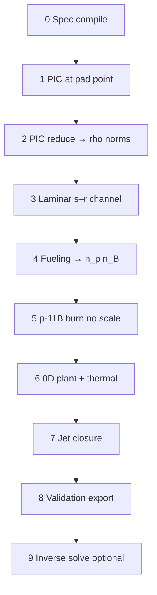

# Orbitron validation steps — first-principles proof chain

This document defines a **single forward chain** of simulations and exports. Each step consumes artifacts from the previous step under fixed paths in `build/orbitron/chain/`.

**Related:**

- **Proof Suite user guide (interactive GUI):** [`PROOF_SUITE.md`](PROOF_SUITE.md)
- Fidelity ladder: [`simulator/SIMULATOR.md`](simulator/SIMULATOR.md)
- Unobtanium specs: [`UNOBTANIUM.md`](UNOBTANIUM.md)
- Core plasma: [`assembly_specs/orbitron_avalanche_core.yaml`](assembly_specs/orbitron_avalanche_core.yaml)

---

## Proof Suite GUI (recommended for iterative design)

See **[`PROOF_SUITE.md`](PROOF_SUITE.md)** for launch, layout, per-step controls/visualizations, proof-mode rules, and why `design_validated` may be false in Tier 3.

```bash
./scripts/run_orbitron_proof_suite.sh
```

---

## Batch pipeline (CI / reproducible)

From repo root (after `poetry install --with simulator`):

```bash
# Full chain (steps 00–08). Step 09 if you want inverse unobtanium solve:
chmod +x tools/orbitron_proof_chain/*.sh
tools/orbitron_proof_chain/run_all.sh

# Optional: quantify minimum knobs after forward chain fails specs
RUN_INVERSE=1 tools/orbitron_proof_chain/run_all.sh
```

**Without WarpX** (PIC skipped; unity ρ norms — Tier 2 not closed):

```bash
SKIP_PIC=1 tools/orbitron_proof_chain/run_all.sh
```

**With WarpX** (set interpreter that has `pywarpx`):

```bash
export WARPX_PYTHON=/path/to/warpx-python
tools/orbitron_proof_chain/run_all.sh
```

**Pad levers** (override before `run_all.sh`):

```bash
export CHAIN_THROTTLE=0.85 CHAIN_CATHODE_PULSE=0.75
# CHAIN_COMPRESSOR affects step 06 plant only — not step 01 WarpX
export CHAIN_COMPRESSOR=0.7
```

### Headless experiments (YAML → report)

Run the full proof chain from an experiment YAML (all pad/interlock switches, geometry, inject, PIC, fusion channel). Writes a timestamped folder under `reports/<experiment-slug>/`:

```bash
./scripts/run_orbitron_experiment.sh experiments/orbitron_phase1_baseline.yaml

# Fast check (no WarpX):
./scripts/run_orbitron_experiment.sh experiments/orbitron_phase1_baseline.yaml --skip-pic

# One PIC step smoke test (set run.pic_steps: 1 in YAML or export):
# edit experiments/…yaml → run.pic_steps: 1

# Include inverse step 09 + gap-closed analytics (default; use --no-inverse to skip):
./scripts/run_orbitron_experiment.sh experiments/orbitron_phase1_baseline.yaml --skip-pic

# Physics evidence audit + stress inverse (literature σv) run automatically after step 08.
# Optional Cursor-agent R&D narrative (reads key from ~/Desktop/tokens_ssto.yaml):
pip install cursor-sdk
./scripts/run_orbitron_experiment.sh experiments/orbitron_phase1_baseline.yaml --skip-pic

# Proof-forward only (no inverse / gap-closed / agent):
./scripts/run_orbitron_experiment.sh experiments/orbitron_phase1_baseline.yaml --no-inverse
```

Each run produces `REPORT.md` (narrative + equations from this file, **physical assembly walkthrough** with CadQuery/Blender figures, parameters, per-step JSON, PNG figures), `results/step_*.json`, `figures/*.png`, and `run.log`. Timelapse plots use the **final frame** of each series.

---

## Fixed artifact paths

| Path | Step | Contents |
|------|------|----------|
| `build/orbitron/chain/chain_config.json` | 00 | Master config: geometry, pad, injectants, step paths |
| `build/orbitron/generated/picmi_overrides.json` | 00 | PICMI numeric overrides from YAML |
| `build/orbitron/chain/00_spec/picmi_overrides.json` | 00 | Copy used by step 01 |
| `build/orbitron/chain/00_spec/step_ok.json` | 00 | Step complete marker |
| `build/orbitron/chain/01_pic/diags/` | 01 | WarpX `density_diag*` plotfiles |
| `build/orbitron/chain/02_pic_norms/pic_norms.json` | 02 | `rho_e_norm` (electron ring; fuel × is step 03) |
| `build/orbitron/chain/03_fusion_channel/fusion_channel.json` | 03 | Clump index, laminar metrics, channel power |
| `build/orbitron/chain/04_fueling/fueling.json` | 04 | `n_p`, `n_B`, `T_i`, ⟨σv⟩ |
| `build/orbitron/chain/05_burn/burn.json` | 05 | `fusion_power_mw`, shortfall vs target |
| `build/orbitron/chain/06_plant/plant.json` | 06 | Full steady state + U1–U4 violations |
| `build/orbitron/chain/07_closure/closure.json` | 07 | Jet closure errors |
| `build/orbitron/chain/08_export/design_validation.yaml` | 08 | Spec export (UNOBTANIUM / test stand) |
| `build/orbitron/chain/09_solve/solve.json` | 09 | Inverse unobtanium (optional) |

Every step also writes `step_ok.json` in its directory (see `chain_config.json` → `steps`).

---

## Proof-mode rules

When `ORBITRON_PROOF_CHAIN=1` (set by `chain_config.sh` / `run_all.sh`):

| Rule | Implementation |
|------|----------------|
| `fusion_reactivity_scale = 1.0` | `chain_config.json` + `base_inputs()` |
| No surrogate blend for gross power | `plant_0d.py`: `physics_weight=1.0`, `calibration_factor=1.0` |
| No fusion-channel blend into gross MW | `plant_0d.py` skips 55/45 channel merge in proof mode |
| Export tagged | `design_validation.yaml` → `summary.proof_chain: true` |

**Inverse solve (step 09)** clears proof mode so knobs can move — use **only** to document **required** unobtanium performance, not as first-principles proof.

---

## Forward chain overview



| Label | Meaning |
|--------|---------|
| **Run today** | Implemented in `tools/orbitron_proof_chain/` |
| **Tier 4** | Required for honest *first-principles proof*; partially future |

---

## State evolution (equations SSOT)

Each step defines a **state vector** \(\mathbf{S}\), an **initial condition** \(\mathbf{S}(0)\), and a **discrete update** \(\mathbf{S}(t_{k+1}) = f_k(\mathbf{S}(t_k))\). Subscripts name the step; time index \(k\) is step-specific (PIC step, channel frame, or algebraic).

Symbols are factored so **fuel** and **Brayton compressor** do not appear in step 01 WarpX.

**Shared geometry (from step 00):** bore radii \(r_c, r_a\), length \(L\), cathode voltage \(V_c\), axial field \(B\).

**Pad levers (naming):**

| Symbol | UI (step 01) | Enters step 01 WarpX? | First step that uses it |
|--------|----------------|------------------------|-------------------------|
| \(\tau\) | Ring density scale (W/S) | Yes — initial \(n_e\) | 01 |
| \(p\) | Cathode pulse / shear (I/K) | Yes — \(n_e\) at \(t=0\) and \(E(t)\) ramp | 01 |
| \(c\) | Compressor (U/J) | **No** | 06 plant (mdot) |
| H₂ sccm, laser Hz | Step 00 injectants | **No** | 03–04 fueling |

`chain_config.json` stores \(\tau\) as `pad.throttle` for historical JSBSim naming; in step 01 documentation it is **ring density scale**, not beam fuel.

---

### Step 0 — Design compile

**State** \(\mathbf{S}_0 = \{G, I, Y\}\):

- \(G = (r_a, r_c, L, V_c, B)\) geometry
- \(I = (\dot Q_{H_2}, f_{\mathrm{laser}})\) injectants (sccm, Hz)
- \(Y\) = YAML spec bundle

**Initial:** user edits in GUI or checked-in YAML.

**Update (algebraic, one shot):**

\[
\mathbf{S}_1 = \mathrm{Compile}(Y, G, I) \rightarrow \{\texttt{chain\_config.json},\ \texttt{picmi\_overrides.json}\}
\]

No \(f(\mathbf{S}(t))\) — not a time integrator.

**Display:** Engine s–r layout, core cross-section, PICMI table (Proof Suite step 00).

---

### Step 1 — Electron-ring WarpX (Tier 2)

**State** at PIC index \(k\):

\[
\mathbf{S}_1(k) = \bigl(\{(\mathbf{x}_i, \mathbf{v}_i, w_i)\}_{i=1}^{N_p},\ t_k,\ \alpha_k\bigr)
\]

Species: **`electrons` only**. Prescribed fields (not from plasma Poisson):

**Initial** \(\mathbf{S}_1(0)\) before first push:

- Macroparticle set \(\{(x_i, v_i, w_i)\}\) for species **`electrons`** only.
- Simulation time \(t_T = T\,\Delta t\).
- Prescribed fields (not solved from plasma):
  - \(E_0(x,z)\) = analytic cylindrical cathode–anode radial field from step 00 \(V_c, r_c, r_a\).
  - \(B = (0, B, 0)\) constant from step 00.
- Initial density scale (set once at \(t=0\), before first push):

\[
n_e = n_{e,\mathrm{base}}\,\bigl(0.15 + 0.85\,\tau\bigr)\,\bigl(0.65 + 0.35\,p\bigr)
\]

- Cathode ramp (every step, multiplies the electric field E only):

\[
\alpha(t;\,p) =
\begin{cases}
0.30 + \bigl(0.88 + 0.12\,p - 0.30\bigr)\,t/t_{\mathrm{end}} & t \le t_{\mathrm{end}} \\
0.88 + 0.12\,p & t > t_{\mathrm{end}}
\end{cases}
\]

with \(t_{\mathrm{end}} = 0.35\,N_{\mathrm{steps}}\,\Delta t\).

**Not in state:** fuel species, compressor, arc seed, inject beams, Poisson solve.

**Update** \(k \to k+1\) (\(f_1\)):

\[
E(x,z,t_T) = E_0(x,z)\,\alpha(t_T;\,p), \quad B = \mathrm{const}
\]

\[
\mathbf{a}_i = \frac{q_e}{m_e}\,\bigl(\mathbf{E}(\mathbf{x}_i,t_T) + \mathbf{v}_i \times \mathbf{B}\bigr)
\]

\[
\mathbf{v}_i^{T+1} = \mathbf{v}_i^T + \Delta t\,\mathbf{a}_i, \quad
\mathbf{x}_i^{T+1} = \mathbf{x}_i^T + \Delta t\,\mathbf{v}_i^{T+1}
\]

\[
\rho_e^{T+1}(x,z) = \mathrm{Deposit}\bigl(\{x_i^{T+1}, w_i\}\bigr)
\]

\(\tau\) and \(p\) affect \(n_e\) only at initialization; \(p\) also enters \(\alpha(t)\) each step. **\(c\) does not appear.**

**(C) Display (Proof Suite step 01 movie):**

| Plot | Field | Source |
|------|-------|--------|
| x–z heatmap | \(\|\rho_e\|\) | WarpX plotfile `rho_electrons` every `diag_period` steps |
| Metrics | Ring τ, pulse p | Last successful run metadata |
| **Not plotted** | arc seed, H⁺/B⁺ beams | Removed from default deck (`electron_ring_only`) |

Implementation: `ssto/orbitron/laminar_flow_2d_arcjet.py` (`run_arcjet_picmi`, `full_deck=False`).

---

### Step 2 — PIC reduce

**State:** \(\mathbf{S}_2 = (\rho_e^{\mathrm{plotfile}}, n_e^{\mathrm{design}})\) from step 01 artifact + levers.

**Initial:** last `density_diag` on disk.

**Update** (algebraic):

\[
\rho_{e,\mathrm{p95}} = \mathrm{P95}\bigl(\|\rho_e\|\ \text{in annulus}\ [0.9\,r_c,\ 0.95\,r_a]\bigr)
\]

\[
\rho_{e,\mathrm{norm}} = \mathrm{clamp}_{[0.05,\,3]}\!\left(\frac{\rho_{e,\mathrm{p95}}}{n_e\,e}\right)
\]

**(C) Display:** Single bar **Electron ring ×** = \(\rho_{e,\mathrm{norm}}\). No fuel bar (fuel × is step 03).

---

### Step 3 — Fusion channel (s–r)

**State** at frame \(k\):

\[
\mathbf{S}_3(k) = \bigl(n_k(s,r),\ C_k,\ t_k\bigr)
\]

- \(n_k\) = fusion-relevant density on \((s,r)\) grid inside bore \(r \le r_a\)
- \(C_k\) = clump index = \(\mathrm{P95}(n) / \mathrm{median}(n)\) over active cells
- Controls (held fixed per run): \(\dot Q_{H_2}\), \(f_{\mathrm{laser}}\), \(\rho_{e,\mathrm{norm}}\), laminar flag \(L\), pad \(c_{\mathrm{eff}}\)

**Injection rate scale** (GUI **λ**):

\[
\lambda = \frac{\dot Q_{H_2}}{\dot Q_{H_2,\mathrm{ref}}} \sqrt{\frac{f_{\mathrm{laser}}}{f_{\mathrm{laser,ref}}}}
\quad (\mathrm{ref} = 80\ \mathrm{sccm},\ 10\ \mathrm{Hz})
\]

**Axial stir** (not fuel mass — Brayton path proxy):

\[
c_{\mathrm{eff}} = c \cdot s_{\mathrm{spool}}, \quad
s_{\mathrm{spool}} =
\begin{cases}
0 & \text{bleed closed} \\
0.12 & \text{bleed only} \\
0.42 & \text{starter on (electric shaft)} \\
1.0 & \text{armed, starter off (turbine takeover)}
\end{cases}
\]

Bleed splits inlet flow: \(\dot m_{\mathrm{bleed}} = \beta \dot m_{\mathrm{in}}\), \(\dot m_{\mathrm{core}} = (1-\beta)\dot m_{\mathrm{in}}\) (core path through jacket / turbine / nozzle).

**Initial** \(\mathbf{S}_3(0)\):

\[
n_0(s,r) = n_{\mathrm{seed}} \cdot \lambda
\]

If laminar **OFF**: multiply by deterministic ripple + \(\mathcal{N}(0,1)\) noise (seed from `fusion_channel.stochastic_seed`).

From 0D fueling: \(n_p, n_B, T_i, \langle\sigma v\rangle\) via `evaluate_fusion_pb11` (uses \(\rho_{e,\mathrm{norm}}\)).

**Update** \(k \to k+1\) (\(f_3\)) — `fusion_channel_sr.py`:

1. **End inject** (H⁺ / B⁺ blobs at \(s \approx\) ends):  
   \(n \mathrel{+}= \Delta t \cdot A_{\mathrm{inj}}(\lambda, \mathrm{mix}, \tau, p) \cdot \mathrm{Gaussian}_{s,r}\)

2. **Clump seed** (only if \(L=0\) and \(k > K/8\)): mid-bore Gaussian blobs \(\propto \lambda\)

3. **Radial diffusion:**  
   \(n \mathrel{+}= \Delta t \cdot D_{\mathrm{eff}}(L, p, \tau, B, \mathrm{mix}) \cdot \partial^2 n / \partial r^2\)

4. **Axial advection:**  
   \(n \mathrel{-}= \Delta t \cdot u_s(c_{\mathrm{eff}}, \tau) \cdot \partial n / \partial s\)

5. **Stochastic noise** (only if \(L=0\)):  
   \(n \mathrel{+}= \sigma_{\mathrm{noise}} \cdot n_{\mathrm{seed}} \cdot \mathcal{N}(0,1)\)

6. **Clip** \(n \ge 10^9\); store \(C_k\), reaction proxy \(R \propto n_p n_B \langle\sigma v\rangle\).

**Post-run scalars:**

\[
\mathrm{fuel\_coupling\_norm} = \mathrm{clamp}_{[0.2,3]}\!\left(\frac{\max_{s,r} n_K}{\mathrm{mean}_{s,r}\, n_0}\right)
\]

**Display (Proof Suite step 03):**

| Plot | Quantity | Source |
|------|----------|--------|
| Heatmaps OFF \| ON | \(n(s,r)\) or \(R(s,r)\) | `fields_laminar_off/on.npz` |
| Clump vs time | \(C_k\) | same NPZ `clump_index` |
| Radial profile | \(\langle n \rangle_s(r)\) at final \(K\) | mean over \(s\) |
| Metrics | λ, fuel ×, clump gate | `03_fusion_channel/fusion_channel.json` |

**Controls on screen:** H₂ sccm, laser Hz, compressor \(c\), RNG seed, noise fraction — **re-run** after changing.

---

### Step 4 — Fueling densities

**State:** \(\mathbf{S}_4 = (G, I, \rho_{e,\mathrm{norm}}, \tau, p, \eta_{\mathrm{react}})\).

**Initial:** step 00 injectants + step 02 \(\rho_{e,\mathrm{norm}}\).

**Update** (algebraic \(f_4\)):

\[
V = \pi r_a^2 L f_{\mathrm{fill}}, \quad
n_p = \mathrm{sccm\_to\_}n(\dot Q_{H_2} \cdot \mathrm{mix}, V, \tau_{\mathrm{res}}), \quad
n_B = \mathrm{sccm\_to\_}n(f_{\mathrm{laser}} \cdot \mathrm{scale}_B, V, \tau_{\mathrm{res}})
\]

\[
T_i = T_i(V_c, p, \tau), \quad \langle\sigma v\rangle = f_{\mathrm{pb11}}(T_i)
\]

\[
\eta_{\mathrm{conf}} = \eta_{\mathrm{react}} \cdot g(\tau, \mathrm{mix}) \cdot \mathrm{clamp}(\rho_{e,\mathrm{norm}})
\]

**Display:** \(n_p\), \(n_B\), \(T_i\), ⟨σv⟩ cards (step 04).

---

### Step 5 — p-¹¹B burn power

**State:** \(\mathbf{S}_5 = (n_p, n_B, T_i, \langle\sigma v\rangle, \eta_{\mathrm{conf}}, V)\).

**Initial:** step 04 output; proof mode \(\eta_{\mathrm{react}} = 1\).

**Update** (algebraic \(f_5\)):

\[
R = n_p n_B \langle\sigma v\rangle, \quad
P_{\mathrm{fusion}} = \eta_{\mathrm{conf}} \cdot V \cdot R \cdot E_{\mathrm{rxn}}
\]

\[
\mathrm{shortfall} = P_{\mathrm{target}} - P_{\mathrm{fusion}}
\]

**Display:** Target vs \(P_{\mathrm{fusion}}\) bar; shortfall MW (step 05).

---

### Step 6 — 0D plant

**State:** \(\mathbf{S}_6 = (P_{\mathrm{fusion}}, G, U, \mathrm{pad}, \mathrm{fuel\_coupling})\) with unobtanium \(U\).

**Initial:** steps 03–05 + pad (including **compressor \(c\)**).

**Update** (algebraic steady solve \(f_6\)):

\[
\dot m_{\mathrm{in}} = \dot m_0 \cdot c_{\mathrm{eff}} \cdot h(\tau, \rho_{e,\mathrm{norm}}, \mathrm{fuel\_coupling}), \quad
\dot m_{\mathrm{core}} = (1-\beta)\,\dot m_{\mathrm{in}}, \quad
\dot m_{\mathrm{bleed}} = \beta\,\dot m_{\mathrm{in}}
\]

\[
P_{\mathrm{gross}} = f_{\mathrm{plant}}(P_{\mathrm{fusion}}, \dot m_{\mathrm{core}}, U)
\]

Shaft: pad **electric starter** supplies \(W_{c,\mathrm{elec}}\) until ignite + starter off; then **turbine** shaft work balances \(w_c\) on the spool.

U1–U4 inequality checks (cathode \(|E|\), wall, HTS, density).

**Display:** Gross MW, thrust, \(\dot m_{\mathrm{core}}\), \(\dot m_{\mathrm{bleed}}\), shaft mode, violation list. **First step where \(c\) drives Brayton mdot.**

---

### Step 7 — Jet closure

**State:** \(\mathbf{S}_7 = (F, \dot m_{\mathrm{core}}, P_{\mathrm{jet}}, P_{\mathrm{gross}}, \eta)\) from step 06.

**Update** (algebraic \(f_7\)):

\[
P_{\mathrm{from\_}F} = \frac{F^2}{2\dot m_{\mathrm{core}}}, \quad
\varepsilon_{\mathrm{closure}} = \frac{|P_{\mathrm{from\_}F} - P_{\mathrm{jet}}|}{P_{\mathrm{jet}}}
\]

Gate: \(\varepsilon_{\mathrm{closure}} \le 0.12\).

**Display:** Closure error metrics (step 07).

---

### Step 8 — Validation export

**State:** full chain artifacts \(\mathbf{S}_8 = \{\mathbf{S}_0 \ldots \mathbf{S}_7\}\).

**Update:** \(f_8 = \mathrm{validate\_design} \rightarrow\) `design_validation.yaml` + pass/fail table.

**Display:** Spec checks, `design_validated` flag (step 08).

---

## Step-by-step (apps, dependencies, gates)

### Step 0 — Freeze design SSOT

| | |
|--|--|
| **Script** | `tools/orbitron_proof_chain/chain_00_spec.sh` |
| **Also runs** | `tools/compile_physics_surrogate_spec.py` |
| **Inputs** | `ssto/orbitron/assembly_specs/orbitron_physics_surrogate.yaml`, `orbitron_avalanche_core.yaml`, `orbitron_lab.yaml` |
| **Outputs** | `chain_config.json`, `00_spec/picmi_overrides.json` |
| **Depends on** | Nothing |
| **Gate** | Overrides match intended geometry (600 kV, 2 T, bore radii, length) |

```bash
tools/orbitron_proof_chain/chain_00_spec.sh
```

---

### Step 1 — Electron-ring WarpX (prescribed E×B)

| | |
|--|--|
| **Script** | `tools/orbitron_proof_chain/chain_01_pic.sh` |
| **App** | `ssto/orbitron/laminar_flow_2d_arcjet.py` (WarpX PICMI, `electron_ring_only`) |
| **Inputs** | Step 0 `picmi_overrides.json` + pad levers \(\tau\), \(p\) only |
| **Outputs** | `01_pic/diags/density_diag*` (`rho_electrons` only) |
| **Depends on** | Step 0 |
| **Gate** | Run completes; finite `rho_electrons` on last frame |
| **Proves today** | **Tier 2** — E×B electron ring coupling, **not** fuel or fusion Q |
| **Equations** | See § State evolution → Step 1 |

```bash
export WARPX_PYTHON="${WARPX_PYTHON:-python3}"   # must have pywarpx
tools/orbitron_proof_chain/chain_01_pic.sh
# or: SKIP_PIC=1 tools/orbitron_proof_chain/chain_01_pic.sh
```

**Not in this step:** H₂, laser ¹¹B, compressor \(c\), arc seed, H⁺/B⁺ inject beams (legacy `--full-deck` for surrogate sweeps only).

---

### Step 2 — Reduce PIC → electron ring norm

| | |
|--|--|
| **Script** | `poetry run python tools/orbitron_proof_chain/chain_02_reduce.py` |
| **App** | `tools/build_surrogate_map.py` reducers (`yt` on last plotfile) |
| **Inputs** | Step 1 plotfiles (`rho_electrons` only) |
| **Outputs** | `02_pic_norms/pic_norms.json` → `rho_e_norm` |
| **Depends on** | Step 1 |
| **Gate** | `rho_e_norm` in ~0.2–3.0 (plant clamps) |
| **Equations** | See § State evolution → Step 2 |

```bash
poetry run python tools/orbitron_proof_chain/chain_02_reduce.py
```

---

### Step 3 — Laminar / clump physics (longitudinal s–r)

| | |
|--|--|
| **Script** | `poetry run python tools/orbitron_proof_chain/chain_03_fusion_channel.py` |
| **App** | `ssto/orbitron/simulator/longitudinal/fusion_channel_sr.py` |
| **GUI equivalent** | Simulator → **Longitudinal 2D** → **1 — Fusion channel s–r** |
| **Inputs** | Step 0 geometry + pad; laminar ON/OFF from config |
| **Outputs** | `03_fusion_channel/fusion_channel.json` (clump index, reduction ratio, P_int) |
| **Depends on** | Steps 0, 2 |
| **Gate** | Laminar ON: clump index ≤ ~2.8, reduction ≥ ~1.25× vs OFF (validation **LAMINAR** / **LAMINAR2**) |
| **Proves today** | Relaminarization breaks clumps in validation channel |
| **Tier 4** | Drive mixing from PIC moments, not heuristic gains only |

Reference video intent: [Orbitron-style particle / clumping](https://youtu.be/_7Hfyz-JIDA?si=IBN4ZQmWwQKrITxY) — we use **longitudinal s–r**, not axial end-on.

| Video view | Simulator |
|------------|-----------|
| Axial cross-section (r–θ) | Longitudinal **s–r** along bore |
| Red off-center clump | High clump index, laminar OFF |
| Smooth ring / scattered particles | Lower clump index, laminar ON |

---

### Step 4 — Fueling → reactant densities

| | |
|--|--|
| **Script** | `poetry run python tools/orbitron_proof_chain/chain_04_fueling.py` |
| **App** | `fusion_pb11.evaluate_fusion_pb11` (density path) |
| **Inputs** | H₂ sccm + **laser_ablation_hz** (solid ¹¹B); step 2 `rho_e_norm` → confinement; pad interlocks |
| **Outputs** | `04_fueling/fueling.json` |
| **Depends on** | Steps 2, 0 |
| **Gate** | Documented n_p, n_B, T_i; τ and volume assumptions explicit in `fusion_pb11.py` |
| **Tier 4** | n from PIC volume averages or 1D transport along s |

---

### Step 5 — p-¹¹B burn power (forward headline)

| | |
|--|--|
| **Script** | `poetry run python tools/orbitron_proof_chain/chain_05_burn.py` |
| **App** | `fusion_pb11` (proof: `fusion_reactivity_scale = 1`) |
| **Inputs** | Step 4 |
| **Outputs** | `05_burn/burn.json` — `fusion_power_mw`, `shortfall_mw` vs 3.5 MW |
| **Depends on** | Step 4 |
| **Gate** | Power is **computed**, not tuned; record shortfall |
| **Tier 4** | ⟨σv⟩ from cross-section tables or PIC reaction rate |

---

### Step 6 — 0D plant + unobtanium constraints (U1–U4)

| | |
|--|--|
| **Script** | `poetry run python tools/orbitron_proof_chain/chain_06_plant.py` |
| **Apps** | `plant_0d.py`, `thermal_systems.py` |
| **Inputs** | Steps 2, 5; proof env |
| **Outputs** | `06_plant/plant.json` |
| **Depends on** | Steps 2, 5 |
| **Gate** | Which of U1–U4 pass at scale = 1 |

| Check | Source | Unobtanium knob if fail |
|--------|--------|------------------------|
| U1 Cathode \|E\| | geometry V, gap | `field_emission_margin` |
| U2 Wall / CH₄ | q_wall | `max_wall_heat_flux_W_m2`, `ch4_cooling_effectiveness` |
| U3 HTS | B, length, bore | `hts_capability_scale` |
| U4 Beam / density | beam norm, n | `beam_coupling_scale`, fueling / reactivity path |

```bash
ORBITRON_PROOF_CHAIN=1 poetry run python tools/orbitron_proof_chain/chain_06_plant.py
```

---

### Step 7 — Propulsive / plant closure

| | |
|--|--|
| **Script** | `poetry run python tools/orbitron_proof_chain/chain_07_closure.py` |
| **Identity** | F² ≈ 2 η P_gross ṁ; P_from_thrust ≈ P_jet |
| **Inputs** | Step 6 steady state |
| **Outputs** | `07_closure/closure.json` |
| **Depends on** | Step 6 |
| **Gate** | `closure_rel_error` ≤ 0.12 |

Optional cross-check: `python tools/surrogate_closure_check.py --throttle … --compressor …`

---

### Step 8 — Validation artifact (spec document)

| | |
|--|--|
| **Script** | `poetry run python tools/orbitron_proof_chain/chain_08_export.py` |
| **Apps** | `validation.validate_design`, `export_validation.export_validation_yaml` |
| **Inputs** | Full chain |
| **Outputs** | `08_export/design_validation.yaml` |
| **Depends on** | Steps 3–7 |
| **Gate** | `design_validated: true` only if all proof-mode checks pass; otherwise YAML records **gaps** |

```bash
ORBITRON_PROOF_CHAIN=1 poetry run python tools/orbitron_proof_chain/chain_08_export.py
```

GUI equivalent: simulator **Validate design** → **Export YAML**.

---

### Step 9 — Inverse pass (optional; not proof)

| | |
|--|--|
| **Script** | `RUN_INVERSE=1` … `chain_09_solve.py` |
| **App** | `solve.solve_unobtanium_requirements` |
| **Inputs** | Step 8 failure list |
| **Outputs** | `09_solve/solve.json` — required knobs |
| **Interpretation** | **Minimum unobtanium** to hit target MW if forward model is taken seriously |

```bash
RUN_INVERSE=1 poetry run python tools/orbitron_proof_chain/chain_09_solve.py
```

---

## Fidelity ladder (what each tier proves)

| Tier | Mechanism | What it proves |
|------|-----------|----------------|
| **0** | `pad_startup.py` | Correct startup sequence and interlocks |
| **1** | `plant_0d` + `validation.py` | U1–U4 inequalities, 3.5 MW target, jet closure |
| **2** | WarpX → ρ/beam norms (steps 1–2) | Density/beam coupling at 600 kV — **not** fusion Q |
| **3** | `fusion_pb11`, `fusion_channel_sr` | p-¹¹B ⟨σv⟩(T_i) × fueling × volume; longitudinal clump/laminar validation |
| **3b** | Step 3 | Laminar relaminarization vs clump index (design validation viz) |
| **4** | *Future* | Transport/PIC-integrated reactivity; no analytical ⟨σv⟩ fit or surrogate blend |

**Critical honesty:** WarpX step 01 (`laminar_flow_2d_arcjet.py`, default `electron_ring_only`) integrates **electrons in prescribed E×B fields only**. It does not include fuel, compressor, or p-¹¹B fusion yield. Fuel and Brayton compressor enter steps 03–06.

---

## When you can claim “first-principles proof of fusion”

All of the following in **one forward run** (steps 0→8, proof mode):

1. ⟨σv⟩ from **published tables or PIC**, not `pb11_reactivity_m3_s` alone, with `fusion_reactivity_scale = 1`.
2. n_p, n_B, T_i from **PIC/transport**, not sccm×τ alone.
3. **No** surrogate blend or CSV calibration to hit MW.
4. Export documents **Tier 4** and external cross-check (literature or test-stand diagnostics).
5. (Hardware) measured power/products agree with steps 5–6 within uncertainty.

Until then, this chain is **progressive design refinement** toward that claim; step 9 documents unobtanium **margins** if the physics-only forward model misses 3.5 MW.

---

## Mapping chain → unobtanium components

| Step | Refines |
|------|---------|
| 0–1 | **U1** cathode gap / voltage / emission feasibility |
| 2 | **U4** beam coupling (PIC deposit vs assumed mA) |
| 3 | Laminar **design** (shear, pulse, injectant mix) |
| 4–5 | **U4** fueling + reactivity path |
| 6 | **U2** wall + CH₄, **U3** HTS, gross power headline |
| 7 | Plant η, thrust, mdot consistency |
| 8 | Spec-ready YAML for UNOBTANIUM / test stand |
| 9 | Minimum U1–U4 knobs if forward chain misses target |

---

## Individual commands (manual sequence)

```bash
# Environment
export CHAIN_THROTTLE=0.85 CHAIN_COMPRESSOR=0.7 CHAIN_CATHODE_PULSE=0.75
export WARPX_PYTHON="${WARPX_PYTHON:-python3}"   # or SKIP_PIC=1

tools/orbitron_proof_chain/chain_00_spec.sh
tools/orbitron_proof_chain/chain_01_pic.sh
poetry run python tools/orbitron_proof_chain/chain_02_reduce.py
poetry run python tools/orbitron_proof_chain/chain_03_fusion_channel.py
poetry run python tools/orbitron_proof_chain/chain_04_fueling.py
poetry run python tools/orbitron_proof_chain/chain_05_burn.py
poetry run python tools/orbitron_proof_chain/chain_06_plant.py
poetry run python tools/orbitron_proof_chain/chain_07_closure.py
poetry run python tools/orbitron_proof_chain/chain_08_export.py
# optional:
RUN_INVERSE=1 poetry run python tools/orbitron_proof_chain/chain_09_solve.py
```

---

## Classic simulator mapping (optional)

| Chain step | Classic simulator tab |
|------------|------------------------|
| 0 | Geometry / Injectants tabs |
| 1–2 | **Run WarpX PIC** |
| 3 | **Longitudinal 2D** → fusion channel |
| 4–6 | **Run 0D** + pad startup |
| 7–8 | **Validation** → **Export YAML** |
| 9 | **Solve unobtanium → target MW** |

Use **Proof Suite** when you want one panel per chain step with dedicated plots; use the **classic** app for combined exploration.

---

## Pipeline source files

| File | Role |
|------|------|
| `tools/orbitron_proof_chain/chain_config.sh` | Fixed paths, env vars |
| `tools/orbitron_proof_chain/chain_lib.py` | Config, `base_inputs()`, step I/O |
| `tools/orbitron_proof_chain/run_all.sh` | Run steps 00–08 (+09 if `RUN_INVERSE=1`) |
| `tools/orbitron_proof_chain/chain_00_spec.sh` … `chain_01_pic.sh` | Shell entry points |
| `tools/orbitron_proof_chain/chain_02_reduce.py` … `chain_09_solve.py` | Python steps |

---

## Tier 4 roadmap (not in pipeline yet)

- Replace analytical ⟨σv⟩ with reactivity from reduced transport or published tables per T_i  
- Couple WarpX moments → fusion rate (or explicit burn module)  
- Automated regression against `surrogate_sweep_results.csv` on CI  
- PIC-driven `fusion_channel_sr` mixing (not heuristic-only)

See [`simulator/SIMULATOR.md`](simulator/SIMULATOR.md) § Tier 4 roadmap.

---

*Catskills Fusion SSTO — Orbitron test stand proof chain.*
