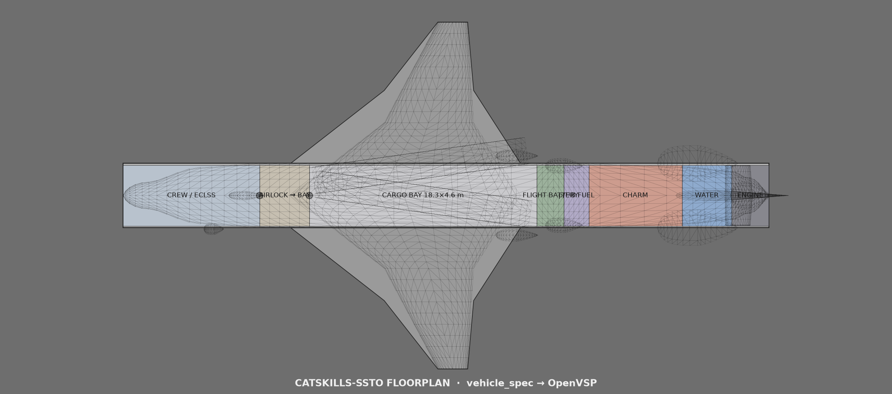
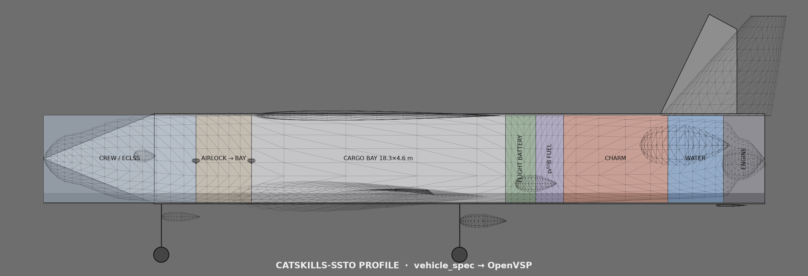
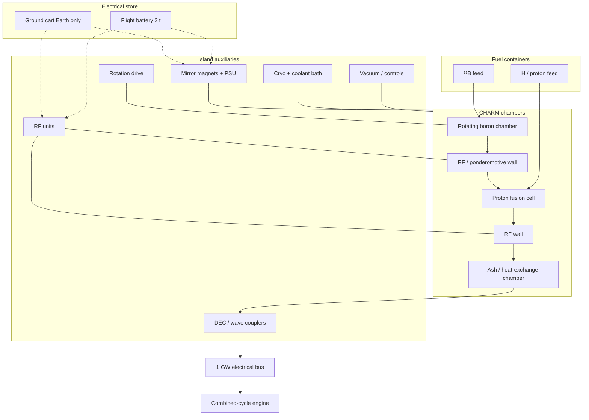
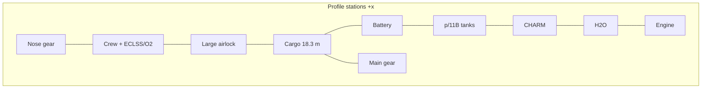
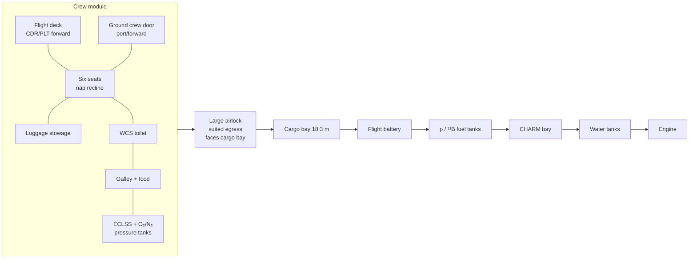

# SSTO fusion powered spaceplane using CHARM architecture with p-¹¹B fuel

**Lars Warren Ericson**  
Catskills Research Company  
ORCID: 0000-0001-8299-9361  
lars.ericson@catskillsresearch.com  

July 22, 2026  

---

## Abstract

We specify a single-stage-to-orbit (SSTO) spaceplane that flies Space Shuttle–style operations—including a Shuttle-class cargo bay—from a municipal airport to International Space Station (ISS) altitude in low Earth orbit (LEO), powered by a continuous Chambered Aneutronic Rotating Mirror (CHARM) \(p\text{-}^{11}\mathrm{B}\) plant [1] with direct energy conversion (DEC). Flight regimes use free air, then scarce air, then carried water. Each design step is written as a closed set of equations. We guesstimate the reactor mass hole, constrain water as a function of dry mass and vacuum \(\Delta v\), impose a \(1\,\mathrm{GW}\) plant with space restart and DEC, and solve a reference all-up mass. Combined-cycle engine maps and CHARM size/performance constraints follow.

---

## 1. Vehicle vision

Municipal runway to ISS-class LEO: a Shuttle-style SSTO spaceplane with a real cargo bay, a single-deck crew module, and a continuous CHARM \(p\text{-}^{11}\mathrm{B}\) plant driving a combined-cycle engine (free air → scarce air → carried water). The figures below are the vehicle picture; the equations that close the mass and energy budgets follow.

### Interior floorplan and exterior profile

Crew volume flattens the **Space Shuttle crew module** from two decks to **one** [14,21], then **stretches** the pressurized nose so life support and a suited airlock are not cartoon-thin. Reference overall length **$L \approx 52\,\mathrm{m}$**. ECLSS = **Environmental Control and Life Support System**. Depth $\approx 6.5$–$7\,\mathrm{m}$, span $\approx 28\,\mathrm{m}$.

Figures \ref{fig:charm-ssto-interior-floorplan} and \ref{fig:charm-ssto-exterior-profile} are orthographic CAD views of one station map (nose left, length $52\,\mathrm{m}$): crew/ECLSS $0$–$11\,\mathrm{m}$ (flight deck + six seats, internal O₂/N₂, port **ground-only** side hatch); airlock $11$–$15\,\mathrm{m}$ (hatches cabin↔airlock and airlock↔bay only—no outer side door); cargo bay $15$–$33.3\,\mathrm{m}$ ($18.3\times 4.6\,\mathrm{m}$, top clamshell payload-bay doors); flight battery $33.3$–$35.5\,\mathrm{m}$; $p\text{-}^{11}\mathrm{B}$ fuel $35.5$–$37.5\,\mathrm{m}$; CHARM $37.5$–$45\,\mathrm{m}$; water $45$–$49\,\mathrm{m}$; combined-cycle engine $49$–$52\,\mathrm{m}$. The floorplan is a top-down cutaway (no landing gear). The profile shows white upper OML, dark TPS belly, extended gear, the port crew hatch, and closed top bay doors. Both views are driven from the same geometry so stations stay consistent if the layout expands.

<!-- figure-landscape -->

<!-- figure-landscape -->

### CHARM power plant

<!-- mermaid-caption: CHARM power-plant schematic -->

### Profile stations

<!-- mermaid-caption: Profile view (to scale) -->

---

## 2. Design goals (the plane)

Table: Design goals for the plane.

| ID | Goal | Statement |
|----|------|-----------|
| G1 | **SSTO** | Single stage from runway to ISS-class LEO; no discarded boosters or external tank |
| G2 | **Shuttle style** | Orbiter-like airframe: wing–body, thermal protection system (TPS), runway landing, gear, control surfaces; crew systems (toilet, ECLSS, food) |
| G2b | **Single-deck crew** | Flatten Shuttle cabin to one deck: flight deck; six reclining seats; O₂/N₂ + ECLSS; luggage; forward/side ground door; large aft airlock into bay |
| G2c | **Length** | Stretch OML as needed for airlock, ECLSS tanks, battery, and fusion-fuel tanks—reference \(L \approx 52\,\mathrm{m}\) |
| G3 | **Shuttle cargo bay** | Usable bay \(\approx 18.3\,\mathrm{m}\times 4.6\,\mathrm{m}\) class for payload—not filled with reactors |
| G4 | **Payload** | Shuttle-class cargo: \(m_{\mathrm{pl}} = 24\,400\,\mathrm{kg}\) reference |
| G5 | **Destination** | Circular LEO compatible with ISS altitude (\(\approx 400\,\mathrm{km}\)); plane-change to \(51.6^\circ\) treated as margin |
| G6 | **Municipal airport** | Takeoff/landing on long civil runways; first gear cool enough for noise/oversight; no vertical pad |
| G7 | **One engine** | Single combined-cycle propulsion string; deadstick glide if plant fails |
| G8 | **Clean fuel** | \(p + {}^{11}\mathrm{B} \rightarrow 3\alpha + 8.7\,\mathrm{MeV}\); CHARM bottle; DEC-first electricity |
| G9 | **Power** | Plant electrical bus peak \(P_{\star} = 1\,\mathrm{GW}\) (design target) |

**Not goals:** expendable stages; D–T breeding plant; filling the bay with the fusion island.

---

## 3. Constants and symbols

Table: Physical constants and reference symbols.

| Symbol | Meaning | Reference value |
|--------|---------|-----------------|
| \(R_E\) | Earth radius | \(6.371\times 10^6\,\mathrm{m}\) |
| \(\mu_E\) | \(GM_E\) | \(3.986\times 10^{14}\,\mathrm{m}^3/\mathrm{s}^2\) |
| \(h_{\mathrm{ISS}}\) | ISS-class altitude | \(4.00\times 10^5\,\mathrm{m}\) |
| \(r\) | Orbit radius | \(R_E + h_{\mathrm{ISS}}\) |
| \(g_0\) | Standard gravity | \(9.80665\,\mathrm{m/s}^2\) |
| \(m_{\mathrm{pl}}\) | Cargo-bay payload | \(2.44\times 10^4\,\mathrm{kg}\) |
| \(P_{\star}\) | CHARM bus peak power | \(1.00\times 10^9\,\mathrm{W}\) |

Masses (all kg):

Table: Mass symbol definitions.

| Symbol | Meaning |
|--------|---------|
| \(m_{\mathrm{af}}\) | Airframe primary: fuselage, wings, TPS (excl. gear/controls) |
| \(m_{\mathrm{gear}}\) | Landing gear (nose + mains), doors, actuators |
| \(m_{\mathrm{ctrl}}\) | Control surfaces + actuators (elevons, rudder, speed brake / body flap equiv.) |
| \(m_{\mathrm{crew}}\) | Crew cabin systems: ECLSS, O₂/N₂ tanks, pressure control, toilet, galley, food, luggage, airlock fittings |
| \(m_{\mathrm{str}}\) | \(m_{\mathrm{af}}+m_{\mathrm{gear}}+m_{\mathrm{ctrl}}+m_{\mathrm{crew}}\) |
| \(m_{\mathrm{eng}}\) | Combined-cycle engine + inlets + nozzles + ducts |
| \(m_{\mathrm{C}}\) | CHARM island (chambers, magnets, radio-frequency (RF), DEC, local shield, cryo, bath) |
| \(m_{\mathrm{bat}}\) | Flight battery / auxiliary power unit (APU) (restart + hotel) |
| \(m_{\mathrm{f}}\) | \(p\text{-}^{11}\mathrm{B}\) fuel |
| \(m_{\mathrm{w}}\) | Water carried at takeoff (vacuum reaction mass) |
| \(m_{\mathrm{dry}}\) | All mass except water |
| \(m_0\) | Gross liftoff mass (GLOW) |
| \(m_{\mathrm{ins}}\) | Mass at LEO insertion (after water burn) |

---

## 4. MWh budget: Shuttle-class mass to ISS LEO

### 4.1 Ideal orbital specific energy

\[
r = R_E + h_{\mathrm{ISS}},\qquad
v_{\mathrm{orb}} = \sqrt{\frac{\mu_E}{r}},\qquad
\varepsilon_{\mathrm{orb}} = -\frac{\mu_E}{2r},\qquad
\varepsilon_{\mathrm{surf}} \approx -\frac{\mu_E}{R_E}.
\]

\[
\Delta\varepsilon
  = \varepsilon_{\mathrm{orb}} - \varepsilon_{\mathrm{surf}}
  = \frac{\mu_E}{R_E} - \frac{\mu_E}{2r}
  \approx 3.31\times 10^7\,\mathrm{J/kg}
  = 33.1\,\mathrm{MJ/kg}.
\]

Numerical anchors:

\[
v_{\mathrm{orb}} \approx 7.67\,\mathrm{km/s},\qquad
\Delta\varepsilon \approx 9.19\,\mathrm{kWh/kg}.
\]

### 4.2 Orbital energy of the inserted vehicle

Everything that arrives at ISS altitude is still aboard (SSTO):

\[
E_{\mathrm{orb}} = m_{\mathrm{ins}}\,\Delta\varepsilon.
\]

In MWh:

\[
E_{\mathrm{orb}}^{\mathrm{(MWh)}} = m_{\mathrm{ins}}\cdot\frac{\Delta\varepsilon}{3.6\times 10^9}.
\]

Table: Orbital energy for representative inserted masses.

| \(m_{\mathrm{ins}}\) | \(E_{\mathrm{orb}}\) | \(E_{\mathrm{orb}}\) |
|----------------------|----------------------|----------------------|
| \(100\,\mathrm{t}\) (orbiter+cargo class) | \(3.31\,\mathrm{TJ}\) | **\(920\,\mathrm{MWh}\)** |
| \(150\,\mathrm{t}\) | \(4.97\,\mathrm{TJ}\) | **\(1380\,\mathrm{MWh}\)** |
| \(200\,\mathrm{t}\) | \(6.62\,\mathrm{TJ}\) | **\(1840\,\mathrm{MWh}\)** |

### 4.3 Source energy (plant must supply)

Air-breathing and rocket/plasma paths leave energy in the wake and fight drag/gravity. Define a mission multiplier \(\kappa_E \ge 1\):

\[
E_{\mathrm{src}} = \kappa_E\,E_{\mathrm{orb}}
  = \kappa_E\,m_{\mathrm{ins}}\,\Delta\varepsilon.
\]

Working band for planning:

\[
\kappa_E \in [2,\,4]
\quad\Rightarrow\quad
E_{\mathrm{src}}^{\mathrm{(MWh)}} \approx (18\text{–}37)\,m_{\mathrm{ins},100\mathrm{t}}
\]

i.e. about **\(1.8\)–\(3.7\,\mathrm{GWh}\)** of source energy per \(100\,\mathrm{t}\) inserted, scaling linearly with \(m_{\mathrm{ins}}\).

Time at constant bus power \(P_{\star}\):

\[
t_{\mathrm{src}} = \frac{E_{\mathrm{src}}}{P_{\star}}
  = \frac{\kappa_E\,m_{\mathrm{ins}}\,\Delta\varepsilon}{P_{\star}}.
\]

For \(m_{\mathrm{ins}} = 1.9\times 10^5\,\mathrm{kg}\), \(\kappa_E = 3\), \(P_{\star} = 1\,\mathrm{GW}\):

\[
E_{\mathrm{src}} \approx 18.9\,\mathrm{TJ} \approx 5240\,\mathrm{MWh},\qquad
t_{\mathrm{src}} \approx 5.2\,\mathrm{h}.
\]

So a \(1\,\mathrm{GW}\) CHARM bus is an **energy-throughput** match for Shuttle-class SSTO only if the climb/insert lasts hours at high average power—or peak \(P_{\star}\) is used with \(\kappa_E\) toward the low end and a lighter \(m_{\mathrm{ins}}\).

**ISS note.** Matching ISS inclination adds plane-change \(\Delta v\). Fold into vacuum \(\Delta v\) margin (§5) rather than into \(\Delta\varepsilon\).

---

## 5. Flight regimes: free air → scarce air → water

Define cutoff speed \(v_{\mathrm{ab}}\) and altitude \(h_{\mathrm{ab}}\) where intakes seal and water thrust begins.

Table: Flight regimes and reaction-mass path.

| Regime | Density | Reaction mass | Plant → thrust path |
|--------|---------|---------------|---------------------|
| **R1 Free air** | Troposphere / lower stratosphere | **Free** ingested air | Electricity → fan / bypass |
| **R2 Scarce air** | Upper atmosphere | **Free** ram air | Electricity + heat → ram / plasma accelerator |
| **R3 Vacuum** | Exo-atmosphere / LEO insert | **Carried water** | Electricity / DEC → water plasma jet |

Energy split (schematic):

\[
E_{\mathrm{src}}
  = E_{\mathrm{R1}} + E_{\mathrm{R2}} + E_{\mathrm{R3}} + E_{\mathrm{hotel}} + E_{\mathrm{loss}}.
\]

With free reaction mass in R1–R2, plant energy primarily raises vehicle mechanical energy and pays drag:

\[
P_{\mathrm{prop}}(t) \approx \frac{D(t)\,v(t)}{\eta_{\mathrm{p}}(t)},
\qquad
\int P_{\mathrm{prop}}\,\mathrm{d}t \subset E_{\mathrm{R1}}+E_{\mathrm{R2}}.
\]

In R3, jet power for exhaust speed \(v_e\) and mass flow \(\dot{m}_{\mathrm{w}}\) is

\[
P_{\mathrm{jet}} = \frac{1}{2}\,\dot{m}_{\mathrm{w}} v_e^2,\qquad
T = \dot{m}_{\mathrm{w}} v_e
\quad\Rightarrow\quad
P_{\mathrm{jet}} = \frac{1}{2}\,T\,v_e.
\]

---

## 6. Water mass as a function of whole dry mass

Water is used only in R3. Let

\[
m_{\mathrm{dry}}
  = m_{\mathrm{str}} + m_{\mathrm{pl}} + m_{\mathrm{eng}} + m_{\mathrm{C}} + m_{\mathrm{bat}} + m_{\mathrm{f}},
\]

\[
m_0 = m_{\mathrm{dry}} + m_{\mathrm{w}},\qquad
m_{\mathrm{ins}} = m_{\mathrm{dry}}
\]

(all water expended by insertion). Rocket equation for vacuum \(\Delta v_{\mathrm{vac}}\):

\[
\Delta v_{\mathrm{vac}} = v_e\,\ln\!\left(\frac{m_{\mathrm{dry}}+m_{\mathrm{w}}}{m_{\mathrm{dry}}}\right)
  = v_e\,\ln\mu,\qquad
\mu = e^{\Delta v_{\mathrm{vac}}/v_e}.
\]

**Water constraint (closed form):**

\[
\boxed{
m_{\mathrm{w}} = m_{\mathrm{dry}}\left(e^{\Delta v_{\mathrm{vac}}/v_e} - 1\right)
= m_{\mathrm{dry}}\,(\mu - 1)
}
\]

\[
\boxed{
m_0 = m_{\mathrm{dry}}\,\mu = m_{\mathrm{dry}}\,e^{\Delta v_{\mathrm{vac}}/v_e}
}
\]

Vacuum \(\Delta v\) budget:

\[
\Delta v_{\mathrm{vac}}
  = v_{\mathrm{orb}} - v_{\mathrm{ab}}
  + \Delta v_{g,\mathrm{vac}}
  + \Delta v_{\mathrm{steer}}
  + \Delta v_{\mathrm{ISS\,plane}}.
\]

Reference planning values:

\[
v_{\mathrm{ab}} = 3.5\,\mathrm{km/s},\quad
\Delta v_{g,\mathrm{vac}}+\Delta v_{\mathrm{steer}} = 0.8\,\mathrm{km/s},\quad
\Delta v_{\mathrm{ISS\,plane}} = 0.2\,\mathrm{km/s}
\;\Rightarrow\;
\Delta v_{\mathrm{vac}} \approx 5.2\,\mathrm{km/s}.
\]

Optimistic air-breathing (\(v_{\mathrm{ab}} = 5\,\mathrm{km/s}\), small margins) → \(\Delta v_{\mathrm{vac}} \approx 3.5\)–\(4\,\mathrm{km/s}\).

Exhaust speed from specific impulse:

\[
v_e = I_{\mathrm{sp}} g_0.
\]

Table: Water mass fraction versus vacuum $\Delta v$ and $I_{\mathrm{sp}}$.

| \(\Delta v_{\mathrm{vac}}\) | \(I_{\mathrm{sp}}\) | \(v_e\) | \(\mu\) | \(m_{\mathrm{w}}/m_{\mathrm{dry}}\) |
|-----------------------------|---------------------|---------|---------|----------------------------------|
| \(4\,\mathrm{km/s}\) | \(2000\,\mathrm{s}\) | \(19.6\,\mathrm{km/s}\) | \(1.226\) | \(0.226\) |
| \(4\,\mathrm{km/s}\) | \(3000\,\mathrm{s}\) | \(29.4\,\mathrm{km/s}\) | \(1.146\) | \(0.146\) |
| \(5.2\,\mathrm{km/s}\) | \(2000\,\mathrm{s}\) | \(19.6\,\mathrm{km/s}\) | \(1.302\) | \(0.302\) |
| \(5.2\,\mathrm{km/s}\) | \(5000\,\mathrm{s}\) | \(49.0\,\mathrm{km/s}\) | \(1.112\) | \(0.112\) |

---

## 7. Vehicle sizing equations

### 7.1 Structure, crew, gear, controls, and bay

Cargo bay geometry (goal G3):

\[
L_{\mathrm{bay}} = 18.3\,\mathrm{m},\quad
D_{\mathrm{bay}} = 4.6\,\mathrm{m},\quad
V_{\mathrm{bay}} \approx \frac{\pi}{4} D_{\mathrm{bay}}^2 L_{\mathrm{bay}} \approx 304\,\mathrm{m}^3.
\]

Payload density check:

\[
\bar{\rho}_{\mathrm{pl}} = \frac{m_{\mathrm{pl}}}{V_{\mathrm{bay}}} \approx 80\,\mathrm{kg/m}^3
\]

(compatible with mixed cargo; bay remains payload volume).

**Crew (Shuttle functions, single deck).** Forward **flight deck**: commander and pilot **facing forward** into windows and a full control-panel wall [14,21]. Living volume: **six seats** with moderate nap recline; **waste collection system (WCS)**; **galley/food**; **crew luggage / personal stowage**; **ECLSS** with explicit **oxygen and nitrogen / pressure-control tankage** (not a token rack). **Forward/port crew door (side hatch)** for terrestrial ingress only. **Airlock** oversized vs a suit-closet: dual-hatch volume on the aft cabin bulkhead facing the **cargo bay**, sized for suited egress (Shuttle middeck airlock pattern, not undersized) [21].

**Landing gear and control surfaces** are explicit mass lines (not buried only in a lump “structure” number):

\[
\begin{aligned}
m_{\mathrm{af}} &= 7.20\times 10^4\,\mathrm{kg}
 && \text{(longer fuselage, wings, TPS, doors)},\\
m_{\mathrm{gear}} &= 4.00\times 10^3\,\mathrm{kg}
 && \text{(nose + dual main trucks; mass bill only—see profile)},\\
m_{\mathrm{ctrl}} &= 3.00\times 10^3\,\mathrm{kg}
 && \text{(elevons, rudder, speed-brake equiv.\ + actuators)},\\
m_{\mathrm{crew}} &= 8.50\times 10^3\,\mathrm{kg}
 && \text{(ECLSS, O$_2$/N$_2$, WCS, galley, food, luggage, airlock)},\\
m_{\mathrm{str}} &= m_{\mathrm{af}}+m_{\mathrm{gear}}+m_{\mathrm{ctrl}}+m_{\mathrm{crew}}
 = 8.75\times 10^4\,\mathrm{kg}.
\end{aligned}
\]

CHARM and propulsion water **do not** consume \(V_{\mathrm{bay}}\). Plant volume sits in a **fuselage island** (spine / aft of bay / wing carry-through), subject to

\[
V_{\mathrm{C}} \le V_{\mathrm{island}}^{\max}
\approx 80\text{–}150\,\mathrm{m}^3
\quad\text{(guesstimate for pancaked Shuttle envelope)}.
\]

### 7.2 CHARM mass hole

Define island specific power on the **electrical bus**:

\[
\alpha_{\mathrm{C}} = \frac{P_{\star}}{m_{\mathrm{C}}}
\quad\Rightarrow\quad
\boxed{m_{\mathrm{C}} = \frac{P_{\star}}{\alpha_{\mathrm{C}}}.}
\]

Table: CHARM island mass versus specific power at $1\,\mathrm{GW}$.

| \(\alpha_{\mathrm{C}}\) | \(m_{\mathrm{C}}\) at \(P_{\star}=1\,\mathrm{GW}\) | Comment |
|------------------------|--------------------------------------------------|---------|
| \(5\,\mathrm{kW/kg}\) | \(200\,\mathrm{t}\) | Heavy; fights SSTO |
| \(10\,\mathrm{kW/kg}\) | \(100\,\mathrm{t}\) | Stretch |
| \(15\,\mathrm{kW/kg}\) | \(67\,\mathrm{t}\) | **Reference hole** |
| \(25\,\mathrm{kW/kg}\) | \(40\,\mathrm{t}\) | Aggressive |

Volume consistency:

\[
\bar{p}_{\mathrm{C}} = \frac{P_{\star}}{V_{\mathrm{C}}}
\quad\Rightarrow\quad
V_{\mathrm{C}} = \frac{P_{\star}}{\bar{p}_{\mathrm{C}}}.
\]

For \(V_{\mathrm{C}} \le 120\,\mathrm{m}^3\): \(\bar{p}_{\mathrm{C}} \ge 8.3\,\mathrm{MW/m}^3\) bus-averaged over the island—severe packaging.

### 7.3 Engine and battery holes

\[
m_{\mathrm{eng}} = 1.5\times 10^4\,\mathrm{kg}
\quad\text{(single combined-cycle string guesstimate)},
\]

\[
m_{\mathrm{bat}} = 2.0\times 10^3\,\mathrm{kg}
\quad\text{(restart + hotel; ground cart does first light)},
\]

\[
m_{\mathrm{f}} = 5.0\times 10^2\,\mathrm{kg}
\quad(p\text{-}^{11}\mathrm{B}\text{ inventory; energy-rich)}.
\]

### 7.4 Closed dry / wet mass

\[
\boxed{
\begin{aligned}
m_{\mathrm{str}}
  &= m_{\mathrm{af}} + m_{\mathrm{gear}} + m_{\mathrm{ctrl}} + m_{\mathrm{crew}},\\[4pt]
m_{\mathrm{dry}}
  &= m_{\mathrm{str}} + m_{\mathrm{pl}} + m_{\mathrm{eng}} + \frac{P_{\star}}{\alpha_{\mathrm{C}}} + m_{\mathrm{bat}} + m_{\mathrm{f}},\\[4pt]
m_{\mathrm{w}}
  &= m_{\mathrm{dry}}\left(e^{\Delta v_{\mathrm{vac}}/v_e} - 1\right),\\[4pt]
m_0
  &= m_{\mathrm{dry}}\,e^{\Delta v_{\mathrm{vac}}/v_e},\\[4pt]
m_{\mathrm{ins}}
  &= m_{\mathrm{dry}}.
\end{aligned}
}
\]

---

## 8. Solved reference vehicle (all-up mass)

**Freeze:**

\[
\begin{aligned}
P_{\star} &= 1\,\mathrm{GW},&
\alpha_{\mathrm{C}} &= 15\,\mathrm{kW/kg},&
\Delta v_{\mathrm{vac}} &= 4.0\,\mathrm{km/s},\\
I_{\mathrm{sp}} &= 2000\,\mathrm{s},&
v_e &= I_{\mathrm{sp}} g_0 = 19.61\,\mathrm{km/s}.
\end{aligned}
\]

**Solve:**

\[
m_{\mathrm{C}} = \frac{10^9}{1.5\times 10^4} = 6.67\times 10^4\,\mathrm{kg}.
\]

\[
\begin{aligned}
m_{\mathrm{str}}
  &= 72\,000 + 4\,000 + 3\,000 + 8\,500
  = 8.75\times 10^4\,\mathrm{kg},\\[6pt]
m_{\mathrm{dry}}
  &= 87\,500 + 24\,400 + 15\,000 + 66\,700 + 2\,000 + 500
  = 1.961\times 10^5\,\mathrm{kg}
  \;\;(196.1\,\mathrm{t}),\\[6pt]
\mu &= e^{4000/19613} = 1.226,\qquad
m_{\mathrm{w}} = 0.226\,m_{\mathrm{dry}} = 4.43\times 10^4\,\mathrm{kg}
  \;\;(44.3\,\mathrm{t}),\\[6pt]
m_0 &= 2.404\times 10^5\,\mathrm{kg}
  \;\;\mathbf{(240\,\mathrm{t}\ GLOW)},\\[6pt]
m_{\mathrm{ins}} &= 196.1\,\mathrm{t}.
\end{aligned}
\]

**Mass bill (reference):**

Table: Reference vehicle mass bill.

| Item | Mass |
|------|------|
| Airframe + TPS (longer OML) | \(72.0\,\mathrm{t}\) |
| Landing gear | \(4.0\,\mathrm{t}\) |
| Control surfaces + actuators | \(3.0\,\mathrm{t}\) |
| Crew systems (ECLSS, O₂/N₂, WCS, galley, food, luggage, airlock) | \(8.5\,\mathrm{t}\) |
| Payload (cargo bay) | \(24.4\,\mathrm{t}\) |
| Combined-cycle engine | \(15.0\,\mathrm{t}\) |
| CHARM island | \(66.7\,\mathrm{t}\) |
| Flight battery | \(2.0\,\mathrm{t}\) |
| \(p\text{-}^{11}\mathrm{B}\) / proton fuel (+ tankage) | \(0.5\,\mathrm{t}\) |
| Water (vacuum propellant) | \(44.3\,\mathrm{t}\) |
| **GLOW** | **\(240\,\mathrm{t}\)** |

**Energy at this mass:**

\[
E_{\mathrm{orb}} = 6.49\,\mathrm{TJ} = 1800\,\mathrm{MWh},
\qquad
E_{\mathrm{src}}(\kappa_E=3) = 5410\,\mathrm{MWh},
\qquad
t_{\mathrm{src}}(1\,\mathrm{GW}) = 5.4\,\mathrm{h}.
\]

**Sensitivity (same \(\Delta v_{\mathrm{vac}}, I_{\mathrm{sp}}\); \(m_{\mathrm{str}}\) fixed):**

Table: Sensitivity of dry and wet mass to specific power.

| \(\alpha_{\mathrm{C}}\) | \(m_{\mathrm{C}}\) | \(m_{\mathrm{dry}}\) | \(m_{\mathrm{w}}\) | \(m_0\) |
|------------------------|--------------------|----------------------|--------------------|---------|
| \(10\,\mathrm{kW/kg}\) | \(100\,\mathrm{t}\) | \(229\,\mathrm{t}\) | \(52\,\mathrm{t}\) | \(281\,\mathrm{t}\) |
| \(15\,\mathrm{kW/kg}\) | \(67\,\mathrm{t}\) | \(196\,\mathrm{t}\) | \(44\,\mathrm{t}\) | \(\mathbf{240\,\mathrm{t}}\) |
| \(25\,\mathrm{kW/kg}\) | \(40\,\mathrm{t}\) | \(169\,\mathrm{t}\) | \(38\,\mathrm{t}\) | \(208\,\mathrm{t}\) |

Municipal takeoff weight \(\sim 210\)–\(280\,\mathrm{t}\) is heavy vs airliners but in the large-military / 747-class band—not a Citation.

---

## 9. Constraints on the CHARM power plant

Summarize as a requirement vector \(\mathcal{R}_{\mathrm{C}}\):

### 10.1 Power and mass

\[
\boxed{
P_{\mathrm{bus}}(t) \ge P_{\mathrm{prop}}(t) + P_{\mathrm{hotel}}(t),\qquad
\max P_{\mathrm{bus}} = P_{\star} = 1\,\mathrm{GW},
}
\]

\[
\boxed{
m_{\mathrm{C}} = \frac{P_{\star}}{\alpha_{\mathrm{C}}},\qquad
\alpha_{\mathrm{C}} \ge 15\,\mathrm{kW/kg}
\;\text{(reference; \(\ge 10\,\mathrm{kW/kg}\) hard floor for SSTO)}.
}
\]

\[
V_{\mathrm{C}} \le 120\,\mathrm{m}^3,\qquad
\bar{p}_{\mathrm{C}} = P_{\star}/V_{\mathrm{C}} \ge 8\,\mathrm{MW/m}^3.
\]

### 10.2 Fuel and ash

\[
\dot{N}_{p{}^{11}\mathrm{B}}
  = \frac{P_{\mathrm{fusion}}}{8.7\,\mathrm{MeV}},
\qquad
m_{\mathrm{f}}(t_{\mathrm{mission}}) \ll m_{\mathrm{w}}.
\]

Ash (He) strained per CHARM multi-chamber design; DEC captures charged-product free energy.

### 10.3 DEC

\[
P_{\mathrm{bus}} = \eta_{\mathrm{DEC}} P_{\alpha,\mathrm{ordered}}
  + \eta_{\mathrm{th}} P_{\mathrm{thermal\,reject}},
\qquad
\eta_{\mathrm{DEC}} \gtrsim 0.4\text{–}0.7
\;\text{(design target band)}.
\]

Thermal reject (X-ray, wall, inefficiencies) must be dumped to:

- air path (R1–R2 heat exchanger / microwave), and/or  
- island bath → compact turbine, and/or  
- radiators only after exo-atmospheric (limited area).

### 10.4 Restartable in space

\[
E_{\mathrm{restart}} \le \eta_{\mathrm{bat}} m_{\mathrm{bat}} e_{\mathrm{bat}},
\]

with \(m_{\mathrm{bat}} = 2\,\mathrm{t}\) reference and \(e_{\mathrm{bat}} \sim 0.15\)–\(0.25\,\mathrm{kWh/kg}\) ⇒ **\(300\)–\(500\,\mathrm{kWh}\)** class store—enough for **pilot-chamber relight + cascade**, not for ascent.

\[
\text{Ground cart: } P_{\mathrm{cart}} \ge P_{\mathrm{light-off}},\quad
\text{not carried}.
\]

Doctrine: continuous burn nominally; pilot-string kindling from \(m_{\mathrm{bat}}\) if segmented; glide if relight fails.

### 10.5 Continuous operation / no beam farm

Recirculating power is RF walls, rotation, magnets, vacuum, cryo:

\[
P_{\mathrm{recirc}} = f_{\mathrm{r}} P_{\mathrm{fusion}},\qquad
P_{\mathrm{bus}} = (1 - f_{\mathrm{r}})\,P_{\mathrm{fusion,net\,to\,bus}}.
\]

Design intent: \(f_{\mathrm{r}}\) small enough that \(1\,\mathrm{GW}\) **bus** does not require multi-MW neutral-beam injection (NBI).

### 9.6 Municipal and flight safety

- No tritium breeding inventory.  
- Shield so that ramp and cabin doses meet civil constraints with plant running in fan mode.  
- Single-string plant: accept engine-out ≡ plant-out → glide.

### 9.7 How CHARM is lit (and how much energy)

CHARM is **not** lit with a neutral-beam farm. Published architecture lights a **rotating open-field mirror** with **species-separated chambers** and **RF / ponderomotive walls** [1,8,9]. A practical light-off sequence for this vehicle is:

Table: CHARM light-off sequence.

| Step | Action | Power plant elements |
|------|--------|----------------------|
| 0 | Evacuate, interlocks, ground-cart connect | Vacuum, controls |
| 1 | Energize mirror / chamber **magnets** | Magnet PSU ← cart or battery |
| 2 | Spin up **plasma rotation** (centrifugal boron trap) | Rotation drive; energy later recoverable in principle [1] |
| 3 | Raise **RF one-way / ponderomotive barriers** | RF units |
| 4 | Inject **protons** and **boron** into separated regions | Fuel injectors + \(p\) / \({}^{11}\mathrm{B}\) tanks |
| 5 | Establish fusion cell; route alphas to **heat-exchange / DEC** | DEC electrodes / wave couplers |
| 6 | Disconnect cart; bus takes hotel + propulsion | Continuous burn doctrine |

**Energy scale (engineering estimate — CHARM papers do not publish a flight kWh bill of materials (BOM)):**

Magnet + RF + rotation spin-up for a segmented \(1\,\mathrm{GW}\) island is treated as **\(50\)–\(200\,\mathrm{kWh}\)** class to first useful plasma (seconds–minutes of MW-class RF/magnet draw), not **MWh-class beams**. That is why

\[
E_{\mathrm{restart}} \le 300\text{–}500\,\mathrm{kWh}
\quad(m_{\mathrm{bat}} = 2\,\mathrm{t})
\]

is booked for **on-orbit relight**, while **first light on Earth** uses the ground cart. One-way RF walls can be energetically expensive if overused [1]; the vehicle concept of operations (CONOPS) keeps barriers as needed for separation, not as a continuous full-power sink that eats the \(1\,\mathrm{GW}\) bus.

**Pilot-string kindling:** battery (or cart) lights a fraction of chambers → DEC/RF bus cascades the rest.

---

## 10. Combined-cycle engine (detail)

One propulsion string with mode variable \(\sigma \in \{1,2,3,4\}\).

### 9.1 Mode map

Table: Combined-cycle engine mode map.

| \(\sigma\) | Name | Mach / ambient | Mass flow | Thrust model (0D) |
|------------|------|----------------|-----------|-------------------|
| 1 | Electric fan | \(0 \le M \lesssim 0.9\) | \(\dot{m}_{\mathrm{air}}\) | \(T = \eta_{\mathrm{f}} P_{\mathrm{bus}} / v_{\mathrm{jet}}\) |
| 2 | Thermal ram | \(0.9 \lesssim M \lesssim 5\) | ram \(\dot{m}_{\mathrm{air}}(M,\rho)\) | heat addition \(\Delta h = \eta_{\mathrm{h}} P_{\mathrm{th}}/\dot{m}\) |
| 3 | Plasma / magnetohydrodynamic (MHD) | \(M \gtrsim 5\), scarce \(\rho\) | small \(\dot{m}_{\mathrm{air}}\) | \(T = \eta_{\mathrm{MHD}} P_{\mathrm{bus}} / v_{\mathrm{eff}}\) |
| 4 | Water plasma | intakes sealed | \(\dot{m}_{\mathrm{w}}\) | \(T = \dot{m}_{\mathrm{w}} v_e\), \(P_{\mathrm{jet}}=\tfrac12\dot{m}_{\mathrm{w}} v_e^2\) |

Switching laws (schematic):

\[
\sigma =
\begin{cases}
1 & \rho > \rho_1,\ M < M_{12},\\
2 & \rho > \rho_2,\ M_{12} \le M < M_{23},\\
3 & \rho_3 < \rho \le \rho_2,\ M \ge M_{23},\\
4 & \rho \le \rho_3\ \text{or intakes commanded sealed}.
\end{cases}
\]

### 9.2 Fan mode (municipal)

\[
P_{\mathrm{fan}} = \eta_{\mathrm{m}}^{-1} T\,v_{\mathrm{to}},
\qquad
T \ge (T/W)_{\min} m_0 g_0.
\]

For \((T/W)_{\min} = 0.25\), \(m_0 = 240\,\mathrm{t}\), \(v_{\mathrm{to}} = 80\,\mathrm{m/s}\), \(\eta_{\mathrm{m}} = 0.85\):

\[
T \approx 0.57\,\mathrm{MN},\qquad
P_{\mathrm{fan}} \approx 54\,\mathrm{MW}
\]

—well below \(P_{\star}\); municipal segment is **not** the power driver.

### 9.3 Ram / plasma modes

Ram drag and net thrust:

\[
D_{\mathrm{ram}} = \tfrac12\rho v^2 C_D S,\qquad
P_{\mathrm{need}} \approx \frac{(D_{\mathrm{ram}} - T_{\mathrm{excess}})\,v}{\eta_{\mathrm{p}}}.
\]

Peak \(P_{\mathrm{need}}\) near mid-hypersonic climb sets the \(1\,\mathrm{GW}\) requirement (design goal G9).

### 9.4 Water mode

\[
\dot{m}_{\mathrm{w}}(t) = \frac{T(t)}{v_e},\qquad
\int_0^{t_{\mathrm{vac}}} \dot{m}_{\mathrm{w}}\,\mathrm{d}t = m_{\mathrm{w}},
\]

\[
P_{\mathrm{bus,4}}(t) \ge \frac{1}{2\eta_{\mathrm{jet}}} \dot{m}_{\mathrm{w}} v_e^2.
\]

At \(T = 100\,\mathrm{kN}\), \(v_e = 20\,\mathrm{km/s}\): \(P_{\mathrm{jet}} = 1\,\mathrm{GW}\) — vacuum thrust is power-limited; insertion is a **long burn**, not a Space Shuttle Main Engine (SSME) sprint.

### 9.5 Physical envelope

- One rectangular / axisymmetric nacelle blended to wing root or aft fuselage.  
- Variable inlet; **airlock shutters** for R3 and reentry.  
- Shared nozzle for modes 2–4; fan bypass duct for mode 1.  
- Magnetic bearings / dry lubrication where vacuum survival matters.  
- \(m_{\mathrm{eng}} = 15\,\mathrm{t}\) reference includes motors, microwave/MHD hardware, pumps, and structure.

---

## 11. Layout details

Station map for the vision figures in §1. The **top-down bay connectivity** diagram is a reading aid for the floorplan; gear remains on the exterior profile only.

Table: Longitudinal station and bay layout.

| Station (m) | Bay | Contents |
|-------------|-----|----------|
| \(0\)–\(11\) | Crew module | Forward-facing commander (CDR) / pilot (PLT) + flight deck; four more nap-recline seats (six total); WCS; galley; **luggage stowage**; **ECLSS + O₂/N₂ / pressure tanks** |
| \(-\) | Ground door | **Forward/port crew door (side hatch)** — terrestrial ingress only |
| \(11\)–\(15\) | Airlock | **Suited-crew airlock** (\(\sim 2.5\,\mathrm{m}\) class clear), aft bulkhead facing **into cargo bay** |
| \(15\)–\(33.3\) | Cargo | \(18.3\,\mathrm{m}\times 4.6\,\mathrm{m}\) payload bay (no reactors) |
| \(33.3\)–\(35.5\) | Battery | Flight battery \(\approx 2\,\mathrm{t}\) (restart / hotel) |
| \(35.5\)–\(37.5\) | Fusion fuel | Proton / \({}^{11}\mathrm{B}\) feed tanks + plumbing (low mass, real volume) |
| \(37.5\)–\(45\) | CHARM | Reactor island (\(\lesssim 120\,\mathrm{m}^3\), \(67\,\mathrm{t}\)) |
| \(45\)–\(49\) | Water | \(\approx 44\,\mathrm{t}\) H\(_2\)O |
| \(49\)–\(52\) | Engine | Combined-cycle nacelle + nozzle |
| Wings | Controls | Elevons, rudder (gear not drawn on this figure) |

**Doors (Shuttle pattern).** (1) **Side/forward crew door** — runway/ground only; (2) **airlock** — on-orbit cabin ↔ cargo bay / vacuum for suited operations [21].

<!-- mermaid-caption: Top-down floorplan -->

---

## 12. Systems checklist (equations → constraints)

Table: Systems checklist: equations to constraints.

| Step | Governing relations | Binding output |
|------|---------------------|----------------|
| Goals | G1–G9 + single-deck crew | Shuttle bay + municipal SSTO to ISS |
| LEO energy | \(E_{\mathrm{orb}}=m_{\mathrm{ins}}\Delta\varepsilon\), \(E_{\mathrm{src}}=\kappa_E E_{\mathrm{orb}}\) | **\(\sim 1.8\,\mathrm{GWh}\)** orbital @ \(196\,\mathrm{t}\); **\(\sim 5.4\,\mathrm{GWh}\)** source @ \(\kappa_E=3\) |
| Regimes | R1–R3 mass-flow logic | Free air → scarce air → water |
| Water | \(m_{\mathrm{w}}=m_{\mathrm{dry}}(e^{\Delta v_{\mathrm{vac}}/v_e}-1)\) | **\(\sim 23\%\) of dry mass** @ ref |
| Structure | \(m_{\mathrm{str}}=m_{\mathrm{af}}+m_{\mathrm{gear}}+m_{\mathrm{ctrl}}+m_{\mathrm{crew}}\) | **\(87.5\,\mathrm{t}\)** incl.\ gear/controls/ECLSS+O₂/luggage/airlock |
| CHARM | \(m_{\mathrm{C}}=P_{\star}/\alpha_{\mathrm{C}}\), DEC, restart | **\(67\,\mathrm{t}\) @ \(15\,\mathrm{kW/kg}\)** |
| Light-off | Magnets + RF + rotation; no NBI | **\(50\)–\(200\,\mathrm{kWh}\)** est.; cart / \(2\,\mathrm{t}\) battery |
| Solve | \(m_0 = m_{\mathrm{dry}} e^{\Delta v_{\mathrm{vac}}/v_e}\) | **\(m_0 \approx 240\,\mathrm{t}\)**; **\(L \approx 52\,\mathrm{m}\)** |
| Engine | Mode map \(\sigma\); \(P_{\mathrm{fan}}\ll P_{\star}\); \(P_{\mathrm{jet}}=\tfrac12 T v_e\) | \(1\,\mathrm{GW}\) sizes R2–R4 |

---

## 13. Imputed CHARM plant specs, gap to present design, and unobtainiums

### 13.1 Specs this vehicle imputes to CHARM

The SSTO solve does not invent new plasma physics; it **back-solves** a power island that must fit the airframe. Reference imputed plant:

Table: Imputed CHARM plant requirements for this SSTO.

| Quantity | Imputed requirement | Source in this note |
|----------|---------------------|---------------------|
| Fuel | Continuous \(p\text{-}^{11}\mathrm{B}\) | G8; §2 |
| Architecture | Multi-chamber rotating mirror; species separation; ash strain; DEC | §3, §9, §1; [1,8–11] |
| Electrical bus peak | \(P_{\star} = 1\,\mathrm{GW}\) | G9; Phase B/C power |
| Mission source energy | \(\sim 5\,\mathrm{GWh}\) class per ascent (\(\kappa_E\sim 3\)) | §4, §8 |
| Island mass | \(m_{\mathrm{C}} \approx 67\,\mathrm{t}\) | \(\alpha_{\mathrm{C}} = 15\,\mathrm{kW/kg}\) |
| Specific power (bus) | \(\alpha_{\mathrm{C}} \ge 15\,\mathrm{kW/kg}\) (floor \(\sim 10\,\mathrm{kW/kg}\)) | §7.2, §9.1 |
| Island volume | \(V_{\mathrm{C}} \lesssim 120\,\mathrm{m}^3\) | Fuselage bay aft of cargo |
| Volumetric power | \(\bar{p}_{\mathrm{C}} \gtrsim 8\,\mathrm{MW/m}^3\) | \(P_{\star}/V_{\mathrm{C}}\) |
| DEC | \(\eta_{\mathrm{DEC}} \sim 0.4\)–\(0.7\) on ordered \(\alpha\) / wave channel | §9.3 |
| Aux heating | RF + rotation + magnets; **no** multi-MW NBI farm | §9.5, §9.7 |
| Light-off energy | \(\sim 50\)–\(200\,\mathrm{kWh}\) to useful plasma (est.) | §9.7 |
| Space restart | Pilot-string from \(\sim 2\,\mathrm{t}\) battery (\(\sim 300\)–\(500\,\mathrm{kWh}\)) | §6, §9.4 |
| Duty | Continuous burn through climb/insert; throttleable bus | §5 |
| Environment | Flight loads, TPS-adjacent thermal, municipal dose with fan-mode plant | G6, §9.6 |

### 13.2 Where published CHARM stands today

Relative to that invoice, the Fisch / Advanced Research Projects Agency–Energy (ARPA-E) / Pale Blue line today is a **physics and intellectual-property (IP) program**, not a flight power plant [1,2]:

Table: Gap between present CHARM and vehicle need.

| Gate | Present CHARM (public) | Vehicle need |
|------|------------------------|--------------|
| Fuel / kinetics | Strong papers on hybrid fast–thermal \(p\text{-}^{11}\mathrm{B}\), alpha channeling, ash poisoning [3–7] | Same fuel family — **aligned in intent** |
| Chambering | Architecture + patent filings for separated reactants, ponderomotive walls, open-trap HV, differential confinement [1,8–11] | Must work **together** in one island |
| Lawson / \(Q\) | Component studies and 0D balances; **integrated self-consistent power-positive reactor not demonstrated** [1] | Net bus power after recirculating RF/rotation |
| Hardware | No public GW-class (or even pilot) CHARM machine; software-first / early company path | Flyable \(67\,\mathrm{t}\) island |
| DEC | Themes in theory and open-trap high-voltage (HV) patents [1,10] | Flight-qualified \(\eta_{\mathrm{DEC}}\) at GW |
| Mass / volume | Not published as \(\mathrm{kW/kg}\) or \(\mathrm{MW/m}^3\) plant envelopes | \(15\,\mathrm{kW/kg}\), \(\gtrsim 8\,\mathrm{MW/m}^3\) |
| Operations | Lab/site thinking | Continuous ascent, g-load, restart, airport licensing |

**Gap in one line:** CHARM has a credible **aneutronic architecture story**; this vehicle needs a **closed, flight-packaged, gigawatt, high specific-power product** that does not yet exist on paper as an engineered BOM.

### 13.3 Unobtainiums in the gap

Call a requirement **unobtainium** if it is not implied by present CHARM results and would break the SSTO close if false. Ranked for this airframe:

1. **Integrated \(p\text{-}^{11}\mathrm{B}\) power balance with chambered species + ash removal + tolerable synchrotron/bremsstrahlung simultaneously** — components suggest feasibility; full self-consistency is explicitly still open [1].  
2. **Centrifugal / rotating-mirror differential confinement at useful density and confinement time**, including rotation sustainment **without intolerable wall voltage drops** [1].  
3. **Selective RF / ponderomotive “one-way” walls** that regulate ion traffic at acceptable recirculating power (slides note one-way walls can be energetically costly if overused) [1,9].  
4. **Wave-mediated ash extraction / alpha channeling into protons (or DEC)** fast enough that helium does not poison the cell [3,6].  
5. **Ultra-high DC / open-field electrode structures** that survive \(\alpha\) and X-ray loads while feeding a GW bus [10].  
6. **Flight specific power** \(\alpha_{\mathrm{C}} \sim 15\,\mathrm{kW/kg}\) **and** \(\bar{p}_{\mathrm{C}} \gtrsim 8\,\mathrm{MW/m}^3\) including magnets, RF, shield, cryo, and structure — beyond any published CHARM packaging study.  
7. **Continuous GW-class operation** through a multi-hour ascent with vibration, thrust-vector loads, and thermal transients — not part of the present ARPA-E scope.  
8. **Pilot-string light-off / space restart** at \(50\)–\(200\,\mathrm{kWh}\) class — engineering estimate only; not a CHARM experimental result.

Items 1–5 are **physics/architecture unobtainiums** shared with any CHARM plant. Items 6–8 are **aerospace packing and CONOPS unobtainiums** imposed by SSTO. If 1–5 fail, no amount of airframe cleverness saves the mission; if 1–5 hold but 6–8 fail, CHARM may still be a ground plant while this spaceplane does not close.

### 13.4 How to read the rest of this paper

Sections 1–12 are a **requirements mirror** held up to CHARM: they say what a successful bottle must look like to fly Shuttle-class cargo from a municipal runway to ISS altitude. They are **not** a claim that Pale Blue / Princeton has those numbers. Closing the gap is future plasma physics, materials, and packaging work—tracked against the unobtainium list above.

---

## 14. Conclusion

Design goals fix a **Shuttle-style SSTO** with a **real cargo bay**, municipal runway ops, and ISS-altitude LEO. The pressurized nose is **lengthened (\(\approx 52\,\mathrm{m}\) OML)** so the cabin can hold a real **ECLSS with O₂/N₂**, **luggage**, a **suited-size airlock** into the bay, plus visible **battery** and **fusion-fuel tank** bays. Crew: **forward-facing flight deck**, **six nap-recline seats**, **ground crew door**, **aft airlock into cargo**. **Landing gear (\(4\,\mathrm{t}\))** and **control surfaces (\(3\,\mathrm{t}\))** sit in the mass bill (gear drawn on the profile, not the floorplan). The MWh budget is linear in inserted mass: about **\(9.2\,\mathrm{kWh}\) per kg** orbital, times \(\kappa_E\sim 2\)–\(4\) at the CHARM bus. Water scales only with **dry mass** and vacuum \(\Delta v/I_{\mathrm{sp}}\). Closing \(P_{\star}=1\,\mathrm{GW}\) at \(\alpha_{\mathrm{C}}=15\,\mathrm{kW/kg}\) yields a reference vehicle of about **\(196\,\mathrm{t}\) dry, \(44\,\mathrm{t}\) water, \(240\,\mathrm{t}\) GLOW**, with CHARM as a **\(67\,\mathrm{t}\), \(\lesssim 120\,\mathrm{m}^3\)** island using **DEC**, lit by **magnets + RF + rotation** (\(50\)–\(200\,\mathrm{kWh}\) class light-off; space restart from a \(2\,\mathrm{t}\) battery), and a **single combined-cycle engine** spanning fan → ram/plasma → water jet. Vision figures (§1) show planform, plant, and profile. Those are the numbers the in-silico CHARM plant and engine maps must satisfy.

---

## Acknowledgments

CHARM denotes the chambered aneutronic rotating-mirror architecture developed at Princeton Plasma Physics Laboratory (PPPL) under the ARPA-E economical \(p\text{-}^{11}\mathrm{B}\) program [1]–[11] and discussed toward Pale Blue Fusion. This vehicle sketch is an independent systems exercise and does not speak for that program.

---

## References

[1] N. J. Fisch et al. (Princeton Plasma Physics Laboratory), “Why pB11?” ARPA-E Fusion Annual Meeting slides (Day2\_08\_Fisch.pdf), Aug. 2025. Primary public overview of the Chambered Aneutronic Rotating Mirror (CHARM) / chambered rotating-mirror \(p\text{-}^{11}\mathrm{B}\) architecture. [Online]. Available: https://arpa-e.energy.gov/sites/default/files/2025-08/Day2_08_Fisch.pdf

[2] Advanced Research Projects Agency–Energy (ARPA-E), “Economical Proton-Boron11 Fusion,” Award No. DE-AR0001554, OPEN 2021.

[3] E. J. Kolmes, I. E. Ochs, and N. J. Fisch, “Wave-supported hybrid fast-thermal \(p\)-\({}^{11}\)B fusion,” *Phys. Plasmas*, vol. 29, no. 11, Art. no. 110701, 2022, doi: 10.1063/5.0118337.

[4] I. E. Ochs, E. J. Kolmes, M. E. Mlodik, T. Rubin, and N. J. Fisch, “Improving the feasibility of economical proton–boron-11 fusion via alpha channeling with a hybrid fast and thermal proton scheme,” arXiv:2210.08076 [physics.plasm-ph], 2022.

[5] I. E. Ochs and N. J. Fisch, “Lowering the reactor breakeven requirements for proton–boron 11 fusion,” *Phys. Plasmas*, 2024, doi: 10.1063/5.0184945. (ARPA-E DE-AR0001554.)

[6] I. E. Ochs, E. J. Kolmes, and N. J. Fisch, “Preventing ash from poisoning proton–boron 11 fusion,” *Phys. Plasmas*, 2025. [Online]. Available: https://w3.pppl.gov/~fisch/fischpapers/2025/Ochs.poisoning.POP2025.pdf

[7] I. E. Ochs, E. J. Kolmes, and N. J. Fisch, “On the feasibility of radiation-trapping regimes in compressed proton-boron-11 plasmas,” *Phys. Plasmas*, vol. 32, no. 2, Art. no. 022504, 2025, doi: 10.1063/5.024504.

[8] N. J. Fisch, I. E. Ochs, E. J. Kolmes, M. E. Mlodik, and T. Rubin, “Nonthermal Proton-Boron11 Fusion with Separated Reactant Regions,” U.S. Patent Application 19/083,790, filed Mar. 19, 2025.

[9] T. Rubin, J.-M. Rax, N. J. Fisch, I. E. Ochs, and E. J. Kolmes, “Enhanced Particle Confinement with Positive and Negative Ponderomotive Potentials,” U.S. Patent Application 19/084,168, filed Mar. 19, 2025.

[10] N. J. Fisch et al., “Systems and Methods for Producing Ultra-high DC Voltages in Open Field Line Traps…,” U.S. Patent Application 19/175,473, filed Apr. 10, 2025.

[11] E. J. Kolmes, I. E. Ochs, and N. J. Fisch, “Method and Apparatus for Differential Confinement, Mixing, and Demixing…,” U.S. Provisional Patent 63/794,470, filed Apr. 25, 2025.

[12] N. J. Fisch, “Theory of current drive in plasmas,” *Rev. Mod. Phys.*, vol. 59, no. 1, pp. 175–208, 1987, doi: 10.1103/RevModPhys.59.175. (Alpha-channeling / wave–particle foundations.)

[13] N. J. Fisch and J.-M. Rax, “Interaction of energetic alpha particles with intense lower hybrid waves,” *Phys. Rev. Lett.*, vol. 69, no. 4, pp. 612–615, 1992, doi: 10.1103/PhysRevLett.69.612.

[14] National Aeronautics and Space Administration, *Space Shuttle Orbiter / OV-105 Atlantis* dimensional and mass data (cargo bay \(18.3\times 4.6\,\mathrm{m}\); payload to LEO \(\approx 24\,400\,\mathrm{kg}\); empty mass \(\approx 78\,000\,\mathrm{kg}\) class). NASA fact sheets and Orbiter inventory documentation.

[15] International Space Station Program, nominal orbital altitude \(\approx 400\,\mathrm{km}\) and inclination \(51.6^\circ\). NASA ISS reference.

[16] D. A. Vallado, *Fundamentals of Astrodynamics and Applications*, 4th ed. Hawthorne, CA: Microcosm Press / Springer, 2013. (Two-body orbital energy; LEO \(\Delta\varepsilon\).)

[17] G. P. Sutton and O. Biblarz, *Rocket Propulsion Elements*, 9th ed. Hoboken, NJ: Wiley, 2017. (Rocket equation; \(I_{\mathrm{sp}}\)–\(v_e\) relation.)

[18] J. D. Anderson Jr., *Modern Compressible Flow*, 3rd ed. New York, NY: McGraw-Hill, 2003. (Ram drag / air-breathing thermo context for modes 2–3.)

[19] W. J. D. Escher, E. H. Hyde, and D. M. Anderson, “A preliminary systems assessment of the ‘Star-Raker’… airbreathing SSTO concept,” AIAA Paper, 1980s SABRE/airbreathing SSTO literature survey context for combined-cycle mode logic.

[20] T. H. Rider, “Fundamental limitations on plasma fusion systems not in thermodynamic equilibrium,” Ph.D. dissertation, Massachusetts Institute of Technology, Cambridge, MA, 1995. (Non-equilibrium / radiation-limit context motivating chambered \(p\text{-}^{11}\mathrm{B}\) approaches.)

[21] NASA, *Space Shuttle Vehicle Familiarization* (SSV FAM), crew module description: flight deck; middeck galley, personal hygiene, airlock, and **side hatch** for ground ingress/egress; equipment bay ECLSS. Training document SSV-FAM-1107 and NASA *Space Shuttle News Reference* crew-cabin arrangement figures (flight deck p.\ 3-9; middeck p.\ 3-10).

[22] NASA, “A Walk Around the Space Shuttle,” crew compartment summary: flight deck controls; middeck living; side hatch; airlock hatch into the cargo bay. [Online]. Available: https://www.nasa.gov/wp-content/uploads/2016/08/113009main_walkaround.pdf

---

*Working draft for arxiv-style systems sizing. Not a license to operate a reactor.*
