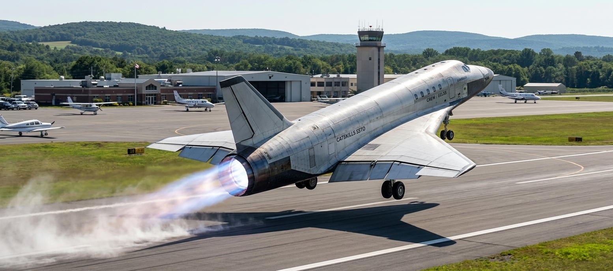
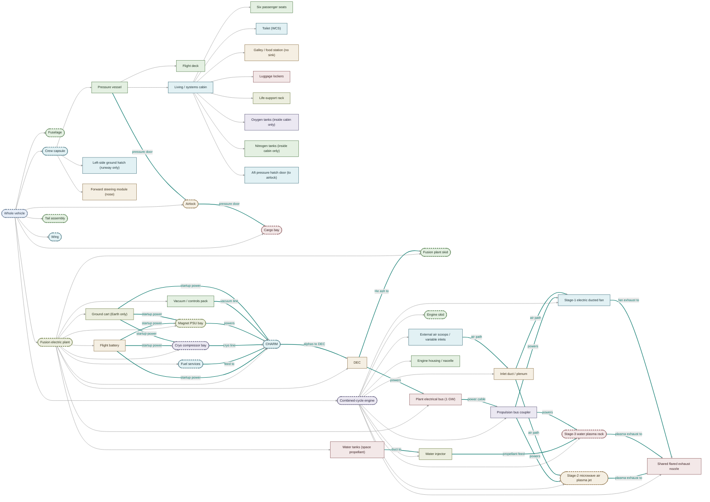

# SSTO fusion powered spaceplane using compact CHARM fusion reactor and 3-cycle electric rocket engine

**Lars Warren Ericson**  
Catskills Research Company  
ORCID: 0000-0001-8299-9361  
lars.ericson@catskillsresearch.com  

July 22, 2026  

---

## Abstract

We specify a single-stage-to-orbit (SSTO) spaceplane that flies Space Shuttle–class operations—including a Shuttle-class cargo bay—from a municipal airport to International Space Station (ISS) altitude in low Earth orbit (LEO), powered by a continuous Chambered Aneutronic Rotating Mirror (CHARM) \(p\text{-}^{11}\mathrm{B}\) plant [1] with direct energy conversion (DEC). As a flight **test article**, the design freezes a Space Shuttle orbiter outer mold line (OML), thermal protection system (TPS), landing gear, flight controls, and the full Shuttle reaction-control system (RCS) nozzle complement as the aero/ops baseline, and substitutes the propulsion and powertrain: a CHARM plant driving a three-stage electric combined-cycle engine (ducted fan on free air → microwave air plasma on climb → carried-water plasma with intakes sealed). Twin shoulder intakes occupy the former OMS-pod forward faces and feed stages 1–2; OMS engines are deleted. Each design step is written as a closed set of equations. We guesstimate the reactor mass hole, constrain water as a function of dry mass and vacuum \(\Delta v\), impose a \(1\,\mathrm{GW}\) plant with space restart and DEC, and solve a reference all-up mass. Combined-cycle engine maps and CHARM size/performance constraints follow.

---

## 1. Vehicle vision

Municipal runway to ISS-class LEO: an SSTO spaceplane with a real cargo bay, a single-deck crew module, and a continuous CHARM \(p\text{-}^{11}\mathrm{B}\) plant driving a three-stage combined-cycle engine (electric ducted fan → microwave air plasma → water plasma). The figures below are the vehicle picture; the equations that close the mass and energy budgets follow.

### 1.1 Test-article doctrine (heritage orbiter OML)

This paper is a **systems closure** for plant and propulsion, not a proposal to redesign the Shuttle as an art project. The **outer mold line (OML)**—the exact geometric outer surface of the vehicle—is the responsible engineering baseline for aero, TPS tile/blanket layout, structural packaging limits, and CFD of ascent/entry [12]. Freezing a **Space Shuttle orbiter OML** [12,13] therefore freezes wing–body aerodynamics, the black-tile belly boat, gear, elevons/body flap/rudder, forward and aft RCS thruster geometry, and the Shuttle-class cargo bay. What changes is the **powertrain**—CHARM + DEC bus + one combined-cycle nozzle string—and the **OMS pods**, whose forward faces become twin air scoops feeding stages 1–2 while **every existing RCS nozzle** on those pods (and the nose RCS) is retained for attitude control. Primary \(\Delta v\) is electric; RCS remains the fine-pointing and abort-attitude layer.

**Heritage orbiter OML footprint** (NASA orbiter inventory / fact-sheet class numbers [12]):

| Quantity | Imperial | SI |
|----------|----------|-----|
| Length | \(122.17\,\mathrm{ft}\) | \(L_{\mathrm{OML}} = 37.24\,\mathrm{m}\) |
| Wingspan | \(78.06\,\mathrm{ft}\) | \(b_{\mathrm{OML}} = 23.79\,\mathrm{m}\) |
| Height (to vertical-stabilizer tip) | \(56.58\,\mathrm{ft}\) | \(H_{\mathrm{OML}} = 17.25\,\mathrm{m}\) |

Major OML zones retained as frozen geometry: forward fuselage / RCC nose cap; mid-fuselage and double-delta wings (entry cross-range + unpowered landing); aft fuselage with OMS-pod shoulders (scoop conversion) and the former three-SSME termination replaced by a single combined-cycle nozzle fairing.

That framing is deliberate: holding aero, TPS, and RCS cues isolates the experiment (reactor plant + three-cycle engine). The reference designation used in the companion FlightGear operator model is **CATSKILLS-SSTO-TA-GRENADIER**. **Locked TA path (Plan A, §1.2b):** no cargo; keep Shuttle-derived kitbash DNA (cockpit, bay volume as plant bay, RCS, reusable TPS language); **grow wing and gear to the plant weight**; fly from a **15{,}000 ft-class** runway. Packaging length \(L\approx 52\,\mathrm{m}\) and Plan-A span \(\approx 33\,\mathrm{m}\) are OML-*derived*, not unmodified OV.

### 1.2 Heritage-OML TA fit (pass/fail)

**Question:** can the reference closure (\(P_{\star}=1\,\mathrm{GW}\), \(\alpha_{\mathrm{C}}=15\,\mathrm{kW/kg}\), \(m_{\mathrm{C}}\approx 67\,\mathrm{t}\), \(m_w\approx 44\,\mathrm{t}\), \(m_{\mathrm{dry}}\approx 196\,\mathrm{t}\)) package and fly inside an **unmodified** orbiter OML?

**Usable heritage envelopes** [12]: payload bay \(60\,\mathrm{ft}\times 15\,\mathrm{ft}\) diameter (\(18.29\,\mathrm{m}\times 4.57\,\mathrm{m}\), \(\approx 300\,\mathrm{m}^3\)); aft fuselage length \(18\,\mathrm{ft}\) (\(5.49\,\mathrm{m}\)). Packaging-study plant skid length \(\approx 15.7\,\mathrm{m}\) (battery + water + fuel + CHARM) and engine \(\approx 3\,\mathrm{m}\).

| Check | Need | Heritage | Result |
|-------|------|----------|--------|
| Plant length in bay | \(15.7\,\mathrm{m}\) | \(18.3\,\mathrm{m}\) bay | **PASS** (\(+2.6\,\mathrm{m}\) margin) |
| Engine length in aft | \(3\,\mathrm{m}\) | \(5.5\,\mathrm{m}\) aft | **PASS** |
| Bay volume (CHARM \(\bar{p}_{\mathrm{C}}\gtrsim 8\,\mathrm{MW/m}^3\) floor + water + ancillaries) | \(\sim 210\,\mathrm{m}^3\) | \(\sim 300\,\mathrm{m}^3\) | **PASS** (tight; CHARM alone \(\sim 125\,\mathrm{m}^3\) fills \(\sim 7.6\,\mathrm{m}\) of bay at full diameter) |
| Bay still carries \(24.4\,\mathrm{t}\) cargo | plant + water in bay | mutually exclusive | **FAIL** (TA carries **no cargo**) |
| Landing-mass proxy \(m_{\mathrm{dry}}\) (with \(m_{\mathrm{pl}}=24.4\,\mathrm{t}\)) | \(196\,\mathrm{t}\) | orbiter landing \(\sim 104\,\mathrm{t}\) class [12] | **FAIL** |
| Zero-payload on stock gear (\(m_{\mathrm{pl}}=0\)) | \(m_{\mathrm{dry}}\approx 172\,\mathrm{t}\) | \(\sim 104\,\mathrm{t}\) | **FAIL** (\(\sim 68\,\mathrm{t}\) over) |

**OVERALL (unmodified OV): FAIL** on mass. Length/volume can host the plant+water in the bay and the engine in the aft **only if the bay is not a cargo bay**. Stock landing gear/weight is the blocker—not 1 GW energy closure.

### 1.2b Locked path — Plan A (no-cargo TA closes)

**Decision:** do **not** force \(m_{\mathrm{dry}}\) under \(\sim 104\,\mathrm{t}\). Redesign the **lander** for the plant. Full \(P_{\star}=1\,\mathrm{GW}\) @ \(\alpha_{\mathrm{C}}=15\,\mathrm{kW/kg}\) stays.

| Quantity | Plan A TA value | Rationale |
|----------|-----------------|-----------|
| Payload | \(m_{\mathrm{pl}}=0\) | Bay = plant + water only; no cargo story on this article |
| Dry mass | \(m_{\mathrm{dry}}\approx 172\,\mathrm{t}\) | \(m_{\mathrm{str}}+m_{\mathrm{C}}+m_{\mathrm{eng}}+m_{\mathrm{bat}}+m_{\mathrm{f}}\) |
| Water / GLOW | \(m_w\approx 39\,\mathrm{t}\), \(m_0\approx 211\,\mathrm{t}\) | Same \(\mu\approx 1.23\) closure |
| Design landing mass | \(m_{\mathrm{land}}\approx 190\,\mathrm{t}\) | \(\approx m_{\mathrm{dry}}\) + 10\% gear margin |
| Wing area | \(S\approx 480\,\mathrm{m}^2\) (\(\approx 1.9\times\) Shuttle \(250\,\mathrm{m}^2\)) | Match Shuttle takeoff wing-loading class at GLOW (\(\sim 440\,\mathrm{kg/m}^2\)) |
| Span (derived) | \(b\approx 33\,\mathrm{m}\) | Geometric scale from heritage planform; kitbash lifting body OK |
| Primary structure | Carbon sandwich (Scaled-style); Al/Ti fittings | Less aluminum; “fishing rods” cold structure |
| TPS | **Reusable only** (blankets / advanced tile or metallic / CMC on stagnation) | No ablatives; zoned hot faces where composites would melt |
| Home runway | **KEDW** Edwards AFB (15{,}000 ft / \(4572\,\mathrm{m}\) class; lakebed abort) | Alternate: KTTS Shuttle Landing Facility, same length class |

**Plan A fit checks (no cargo):**

| Check | Need | Plan A | Result |
|-------|------|--------|--------|
| Plant + engine in bay/aft volume | as §1.2 | same envelopes / stretch \(L\approx 52\,\mathrm{m}\) | **PASS** |
| \(m_{\mathrm{pl}}=0\) | required | required | **PASS** |
| Landing vs **design** gear | \(172\,\mathrm{t}\) dry | \(m_{\mathrm{land}}=190\,\mathrm{t}\) | **PASS** |
| Wing loading at GLOW | \(\lesssim 440\,\mathrm{kg/m}^2\) class | \(211\,\mathrm{t}/480\,\mathrm{m}^2\approx 440\,\mathrm{kg/m}^2\) | **PASS** |
| Runway length | heavy TO roll | \(4572\,\mathrm{m}\) (KEDW/KTTS) | **PASS** |
| 1 GW upstairs | \(\sim 5\,\mathrm{GWh}\) class / hours | unchanged energy hole; longer roll OK | **PASS** |

**OVERALL (Plan A TA): PASS** — closed by raising land/wing/runway to the reactor, not by shrinking the reactor. Production cargo (\(m_{\mathrm{pl}}=24.4\,\mathrm{t}\)) remains a **later** vehicle, not this test article.

Executable check: `python3 research/figures/cad/ta_oml_fit.py` (prints both unmodified-OV FAIL and Plan A PASS).

### AI concept render

Fig.~\ref{fig:catskills-ssto-beauty-shot} is an AI-rendered concept illustration, not an engineering drawing: **Google Nano Banana Pro** (Gemini 3 Pro Image) was given the two CAD wireframes below as reference images and prompted to render the vehicle's true fuselage/wing contour — the grey wireframe lines, not the blocky bounding box — taking off from a municipal airport [21]. Proportions, panel lines, livery, and the runway scene are AI interpretation; the dimensioned CAD wireframes immediately below remain the source of truth for station layout and outer mold line. **Ops baseline for the TA is now KEDW-class**, not a short municipal strip.

<!-- figure-landscape -->


Fig.~\ref{fig:catskills-ssto-cabin-liftoff-view} is a companion AI concept render of the flight deck at the same moment, from the rear seats looking forward: six crew in Crew-Dragon-style seats and suits (captain and copilot forward, four aft), helmets marked "Catskills Research," small oval windows sized to match Fig.~\ref{fig:catskills-ssto-beauty-shot}, and Crew-Dragon-style forward flight-deck controls. Illustrative only — seat count, suit design, and cockpit layout are AI interpretation prompted from the interior floorplan schematic (Fig.~\ref{fig:charm-ssto-interior-floorplan}), not an engineering cabin design.

<!-- figure-landscape -->


### Interior floorplan and exterior profile

Crew volume flattens the **Space Shuttle crew module** from two decks to **one** [12,13], then **stretches** the pressurized nose so life support and a suited airlock are not cartoon-thin. **Plan A packaging:** length **$L \approx 52\,\mathrm{m}$** (vs heritage \(L_{\mathrm{OML}}=37.24\,\mathrm{m}\)); fuselage depth $\approx 6.5$–$7\,\mathrm{m}$; **span \(b\approx 33\,\mathrm{m}\)** and **wing area \(S\approx 480\,\mathrm{m}^2\)** so GLOW wing-loading stays Shuttle-class (§1.2b). ECLSS = **Environmental Control and Life Support System**. FlightGear Grenadier still boots on a kitbash Shuttle mesh for ops training; Plan A geometry is the mass/aero closure target.

Figs.~\ref{fig:charm-ssto-interior-floorplan} and \ref{fig:charm-ssto-exterior-profile} are orthographic CAD views of the same station map as `assembly.json` (nose left, length $52\,\mathrm{m}$): crew capsule $0$–$11\,\mathrm{m}$ (flight deck + seats, internal O₂/N₂, port **ground-only** side hatch); airlock $11$–$15\,\mathrm{m}$ (hatches cabin↔airlock and airlock↔bay only); cargo bay $15$–$33.3\,\mathrm{m}$ ($18.3\times 4.6\,\mathrm{m}$, clamshell doors on the cargo-skid drop-in; exterior OML is an unbroken tube); **fusion electric plant** $33.3$–$49\,\mathrm{m}$ on one skid (flight battery $33.3$–$35.5\,\mathrm{m}$, water tanks $35.5$–$39.5\,\mathrm{m}$ — relocated ahead of CHARM as a supplemental radiation shield, §9.3 — fuel services $39.5$–$41.5\,\mathrm{m}$, CHARM island incl. permanent shield bulkhead $41.5$–$49\,\mathrm{m}$); **combined-cycle engine** $49$–$52\,\mathrm{m}$ (stages 1–3 + nozzle). The plant schematic (Fig.~\ref{fig:mermaid-fusion-electric-plant}) is 1–1 with that JSON tree. Fig.~\ref{fig:charm-ssto-interior-floorplan} is a top-down cutaway (no landing gear). Fig.~\ref{fig:charm-ssto-exterior-profile} shows white upper OML, dark TPS belly, extended gear, the port crew hatch, and closed top bay doors.

<!-- figure-landscape -->


<!-- figure-landscape -->


### Forward drop-ins (top-down, covers off)

Figs.~\ref{fig:crew-capsule-top}–\ref{fig:fusion-plant-skid-top} are **Blender** orthographic top views built procedurally from `assembly.json` (`make cad-drop-ins`; see `research/figures/cad/build_crew_capsule_blender.py`, `build_airlock_blender.py`, `build_cargo_skid_blender.py`, `build_fusion_plant_skid_blender.py`, and the shared helpers in `research/figures/cad/lib/`). No AI-generated imagery remains in this section.

<!-- figure-landscape -->


<!-- figure-landscape -->


<!-- figure-landscape -->


<!-- figure-landscape -->


### Fusion electric plant (assembly SSOT)

Fig.~\ref{fig:mermaid-fusion-electric-plant} is auto-generated from `research/figures/cad/assembly.json` on every build (`scripts/update_arxiv_mermaid.py`, same visible-set algorithm as the interactive outliner — see `research/figures/cad/lib/mermaid_builder.py`). Boxes are plant parts/collections, not a separate physics cartoon; this figure is hard-scoped to the fusion plant assembly, so the one connection leaving it (to the combined-cycle engine) is drawn as a dashed boundary stub rather than pulling in the engine's own parts.

```mermaid
flowchart TB
  linkStyle default stroke:#9a9a9a,stroke-width:1.5px
  classDef collection fill:#e7eef8,stroke:#5a6f8c,stroke-width:1.8px,stroke-dasharray:6 4,color:#243447
  classDef part fill:#ffffff,stroke:#333,stroke-width:1.5px,color:#222
  classDef boundary fill:#f6ece4,stroke:#9a5a3a,stroke-width:1.5px,stroke-dasharray:3 3,color:#4a2e1c
  classDef tint0c fill:#e4f0e2,stroke:#4f7a48,stroke-width:1.8px,stroke-dasharray:6 4,color:#1e3320
  classDef tint0p fill:#e4f0e2,stroke:#4f7a48,stroke-width:1.5px,color:#1e3320
  classDef tint1c fill:#e2f1f4,stroke:#3d6f7c,stroke-width:1.8px,stroke-dasharray:6 4,color:#1a3036
  classDef tint1p fill:#e2f1f4,stroke:#3d6f7c,stroke-width:1.5px,color:#1a3036
  classDef tint2c fill:#f5efe3,stroke:#8a6e42,stroke-width:1.8px,stroke-dasharray:6 4,color:#3a2e18
  classDef tint2p fill:#f5efe3,stroke:#8a6e42,stroke-width:1.5px,color:#3a2e18
  classDef tint3c fill:#f3e8e8,stroke:#8a5558,stroke-width:1.8px,stroke-dasharray:6 4,color:#3a1e20
  classDef tint3p fill:#f3e8e8,stroke:#8a5558,stroke-width:1.5px,color:#3a1e20
  classDef tint4c fill:#eceedf,stroke:#6a7a40,stroke-width:1.8px,stroke-dasharray:6 4,color:#2a3218
  classDef tint4p fill:#eceedf,stroke:#6a7a40,stroke-width:1.5px,color:#2a3218
  classDef tint5c fill:#ebe8f2,stroke:#5a5578,stroke-width:1.8px,stroke-dasharray:6 4,color:#242038
  classDef tint5p fill:#ebe8f2,stroke:#5a5578,stroke-width:1.5px,color:#242038
  charm_power_plant(["Fusion electric plant"])
  fusion_plant_skid(["Fusion plant skid"])
  charm_skid["Skid structure"]
  left_fusion_plant_door["Left fusion plant bay door"]
  right_fusion_plant_door["Right fusion plant bay door"]
  fusion_plant_bay_atmosphere["Fusion plant bay atmosphere"]
  charm(["CHARM"])
  charm_shield_bulkhead["Permanent shield bulkhead"]
  charm_backbone["CHARM backbone / strongback"]
  charm_chamber_string(["Chamber string"])
  left_fusion_chamber["Left fusion chamber"]
  heat_exchange_chamber["Heat exchange chamber"]
  right_fusion_chamber["Right fusion chamber"]
  charm_axis["Central axis / shaft"]
  charm_magnet_rack(["Magnet rack"])
  charm_rf_rack(["RF rack"])
  charm_drive_rack(["Rotation drive rack"])
  charm_thermal_rack(["Thermal rack"])
  dec["DEC"]
  plant_electrical_bus["Plant electrical bus (1 GW)"]
  magnet_psu_bay(["Magnet PSU bay"])
  cryo_compressor_bay(["Cryo compressor bay"])
  vacuum_controls["Vacuum / controls pack"]
  fuel_services(["Fuel services"])
  fuel_services_frame["Fuel services frame"]
  proton_tank["Proton tank"]
  boron11_container["Boron-11 container"]
  boron11_injector["Boron-11 solid fuel injector"]
  flight_battery["Flight battery"]
  water_tanks["Water tanks (space propellant)"]
  ground_cart["Ground cart (Earth only)"]
  class charm_power_plant collection
  class fusion_plant_skid,charm_thermal_rack tint0c
  class charm_skid,charm_shield_bulkhead,left_fusion_chamber,vacuum_controls,fuel_services_frame tint0p
  class left_fusion_plant_door,charm_backbone,heat_exchange_chamber,proton_tank tint1p
  class right_fusion_plant_door,right_fusion_chamber,dec,boron11_container,flight_battery tint2p
  class fusion_plant_bay_atmosphere,charm_axis,plant_electrical_bus,boron11_injector,water_tanks tint3p
  class charm,fuel_services tint1c
  class charm_chamber_string tint2c
  class charm_magnet_rack tint3c
  class charm_rf_rack,magnet_psu_bay tint4c
  class charm_drive_rack,cryo_compressor_bay tint5c
  class ground_cart tint4p
  charm_power_plant --> fusion_plant_skid
  fusion_plant_skid --> charm_skid
  fusion_plant_skid --> left_fusion_plant_door
  fusion_plant_skid --> right_fusion_plant_door
  fusion_plant_skid --> fusion_plant_bay_atmosphere
  charm_power_plant --> charm
  charm --> charm_shield_bulkhead
  charm --> charm_backbone
  charm --> charm_chamber_string
  charm_chamber_string --> left_fusion_chamber
  charm_chamber_string --> heat_exchange_chamber
  charm_chamber_string --> right_fusion_chamber
  charm_chamber_string --> charm_axis
  charm --> charm_magnet_rack
  charm --> charm_rf_rack
  charm --> charm_drive_rack
  charm --> charm_thermal_rack
  charm_power_plant --> dec
  charm_power_plant --> plant_electrical_bus
  charm_power_plant --> magnet_psu_bay
  charm_power_plant --> cryo_compressor_bay
  charm_power_plant --> vacuum_controls
  charm_power_plant --> fuel_services
  fuel_services --> fuel_services_frame
  fuel_services --> proton_tank
  fuel_services --> boron11_container
  fuel_services --> boron11_injector
  charm_power_plant --> flight_battery
  charm_power_plant --> water_tanks
  charm_power_plant --> ground_cart
  %% connections
  flight_battery ==>|startup power| charm_drive_rack
  boron11_container ==>|solid feed to| boron11_injector
  flight_battery ==>|startup power| magnet_psu_bay
  flight_battery ==>|startup power| cryo_compressor_bay
  left_fusion_chamber ==>|necks into| heat_exchange_chamber
  right_fusion_chamber ==>|necks into| heat_exchange_chamber
  heat_exchange_chamber ==>|alphas to DEC| dec
  proton_tank ==>|feed to| left_fusion_chamber
  proton_tank ==>|feed to| right_fusion_chamber
  boron11_injector ==>|feed to| left_fusion_chamber
  boron11_injector ==>|feed to| right_fusion_chamber
  charm_magnet_rack ==>|magnet leads to| left_fusion_chamber
  charm_magnet_rack ==>|magnet leads to| right_fusion_chamber
  charm_thermal_rack ==>|coolant loop| heat_exchange_chamber
  cryo_compressor_bay ==>|cryo line| charm_magnet_rack
  cryo_compressor_bay ==>|cryo line| charm_thermal_rack
  magnet_psu_bay ==>|powers| charm_magnet_rack
  charm_drive_rack ==>|rotation drive| charm_axis
  dec ==>|He ash to| fusion_plant_bay_atmosphere
  dec ==>|powers| plant_electrical_bus
  vacuum_controls ==>|vacuum line| heat_exchange_chamber
  ground_cart ==>|startup power| magnet_psu_bay
  ground_cart ==>|startup power| charm_rf_rack
  ground_cart ==>|startup power| cryo_compressor_bay
  _boundary_combined_cycle_engine(("→ Combined-cycle engine"))
  class _boundary_combined_cycle_engine boundary
  water_tanks -.->|duct to| _boundary_combined_cycle_engine
  plant_electrical_bus -.->|power cable| _boundary_combined_cycle_engine
  linkStyle 0,1,2,3,4,5,6,7,8,9,10,11,12,13,14,15,16,17,18,19,20,21,22,23,24,25,26,27,28,29 stroke:#9a9a9a,stroke-width:1.5px,color:#9a9a9a
  linkStyle 30,31,32,33,34,35,36,37,38,39,40,41,42,43,44,45,46,47,48,49,50,51,52,53 stroke:#0d7a6f,stroke-width:2.5px,color:#0d7a6f
  linkStyle 54,55 stroke:#9a5a3a,stroke-width:1.5px,stroke-dasharray:3 3,color:#9a5a3a
```

<!-- mermaid-landscape -->
<!-- mermaid-caption: Fusion electric plant (assembly.json) -->
<!-- mermaid-label: fig:mermaid-fusion-electric-plant -->
<!--mermaid-gen fusion_electric_plant-->

<!--/mermaid-gen-->

### Profile stations

Stations match assembly envelopes: crew \(0\)–\(11\,\mathrm{m}\), airlock \(11\)–\(15\,\mathrm{m}\), cargo \(15\)–\(33.3\,\mathrm{m}\), fusion plant \(33.3\)–\(49\,\mathrm{m}\) (battery + water + fuel + CHARM on one skid — water relocated ahead of CHARM as a supplemental shield, §9.3), engine \(49\)–\(52\,\mathrm{m}\). Fig.~\ref{fig:mermaid-profile-stations} is auto-generated (whole-vehicle scope, one level into the fusion plant and engine) by the same `scripts/update_arxiv_mermaid.py` pipeline as Fig.~\ref{fig:mermaid-fusion-electric-plant}.

```mermaid
flowchart TD
  linkStyle default stroke:#9a9a9a,stroke-width:1.5px
  classDef collection fill:#e7eef8,stroke:#5a6f8c,stroke-width:1.8px,stroke-dasharray:6 4,color:#243447
  classDef part fill:#ffffff,stroke:#333,stroke-width:1.5px,color:#222
  classDef tint0c fill:#e4f0e2,stroke:#4f7a48,stroke-width:1.8px,stroke-dasharray:6 4,color:#1e3320
  classDef tint0p fill:#e4f0e2,stroke:#4f7a48,stroke-width:1.5px,color:#1e3320
  classDef tint1c fill:#e2f1f4,stroke:#3d6f7c,stroke-width:1.8px,stroke-dasharray:6 4,color:#1a3036
  classDef tint1p fill:#e2f1f4,stroke:#3d6f7c,stroke-width:1.5px,color:#1a3036
  classDef tint2c fill:#f5efe3,stroke:#8a6e42,stroke-width:1.8px,stroke-dasharray:6 4,color:#3a2e18
  classDef tint2p fill:#f5efe3,stroke:#8a6e42,stroke-width:1.5px,color:#3a2e18
  classDef tint3c fill:#f3e8e8,stroke:#8a5558,stroke-width:1.8px,stroke-dasharray:6 4,color:#3a1e20
  classDef tint3p fill:#f3e8e8,stroke:#8a5558,stroke-width:1.5px,color:#3a1e20
  classDef tint4c fill:#eceedf,stroke:#6a7a40,stroke-width:1.8px,stroke-dasharray:6 4,color:#2a3218
  classDef tint4p fill:#eceedf,stroke:#6a7a40,stroke-width:1.5px,color:#2a3218
  classDef tint5c fill:#ebe8f2,stroke:#5a5578,stroke-width:1.8px,stroke-dasharray:6 4,color:#242038
  classDef tint5p fill:#ebe8f2,stroke:#5a5578,stroke-width:1.5px,color:#242038
  vehicle(["Whole vehicle"])
  fuselage(["Fuselage"])
  crew_capsule(["Crew capsule"])
  airlock(["Airlock"])
  cargo_bay(["Cargo bay"])
  charm_power_plant(["Fusion electric plant"])
  fusion_plant_skid(["Fusion plant skid"])
  charm(["CHARM"])
  dec["DEC"]
  plant_electrical_bus["Plant electrical bus (1 GW)"]
  magnet_psu_bay(["Magnet PSU bay"])
  cryo_compressor_bay(["Cryo compressor bay"])
  vacuum_controls["Vacuum / controls pack"]
  fuel_services(["Fuel services"])
  flight_battery["Flight battery"]
  water_tanks["Water tanks (space propellant)"]
  ground_cart["Ground cart (Earth only)"]
  combined_cycle_engine(["Combined-cycle engine"])
  engine_skid(["Engine skid"])
  stage1_edf["Stage-1 electric ducted fan"]
  stage2_air_plasma(["Stage-2 microwave air plasma jet"])
  stage3_water_plasma_rack(["Stage-3 water plasma rack"])
  water_injector["Water injector"]
  propulsion_bus_coupler["Propulsion bus coupler"]
  nacelle["Engine housing / nacelle"]
  variable_inlets["External air scoops / variable inlets"]
  inlet_duct["Inlet duct / plenum"]
  shared_nozzle["Shared flared exhaust nozzle"]
  tail_assembly(["Tail assembly"])
  wing(["Wing"])
  class vehicle collection
  class fuselage,fusion_plant_skid,engine_skid,tail_assembly tint0c
  class crew_capsule,charm,fuel_services,wing tint1c
  class airlock,stage2_air_plasma tint2c
  class cargo_bay,stage3_water_plasma_rack tint3c
  class charm_power_plant,magnet_psu_bay tint4c
  class dec,flight_battery,inlet_duct tint2p
  class plant_electrical_bus,water_tanks,shared_nozzle tint3p
  class cryo_compressor_bay,combined_cycle_engine tint5c
  class vacuum_controls,nacelle tint0p
  class ground_cart,water_injector tint4p
  class stage1_edf,variable_inlets tint1p
  class propulsion_bus_coupler tint5p
  vehicle --> fuselage
  vehicle --> crew_capsule
  vehicle --> airlock
  vehicle --> cargo_bay
  vehicle --> charm_power_plant
  charm_power_plant --> fusion_plant_skid
  charm_power_plant --> charm
  charm_power_plant --> dec
  charm_power_plant --> plant_electrical_bus
  charm_power_plant --> magnet_psu_bay
  charm_power_plant --> cryo_compressor_bay
  charm_power_plant --> vacuum_controls
  charm_power_plant --> fuel_services
  charm_power_plant --> flight_battery
  charm_power_plant --> water_tanks
  charm_power_plant --> ground_cart
  vehicle --> combined_cycle_engine
  combined_cycle_engine --> engine_skid
  combined_cycle_engine --> stage1_edf
  combined_cycle_engine --> stage2_air_plasma
  combined_cycle_engine --> stage3_water_plasma_rack
  combined_cycle_engine --> water_injector
  combined_cycle_engine --> propulsion_bus_coupler
  combined_cycle_engine --> nacelle
  combined_cycle_engine --> variable_inlets
  combined_cycle_engine --> inlet_duct
  combined_cycle_engine --> shared_nozzle
  vehicle --> tail_assembly
  vehicle --> wing
  %% connections
  crew_capsule ==>|pressure door| airlock
  airlock ==>|pressure door| cargo_bay
  water_tanks ==>|duct to| water_injector
  plant_electrical_bus ==>|power cable| propulsion_bus_coupler
  flight_battery ==>|startup power| charm
  flight_battery ==>|startup power| magnet_psu_bay
  flight_battery ==>|startup power| cryo_compressor_bay
  charm ==>|alphas to DEC| dec
  fuel_services ==>|feed to| charm
  cryo_compressor_bay ==>|cryo line| charm
  magnet_psu_bay ==>|powers| charm
  dec ==>|He ash to| fusion_plant_skid
  propulsion_bus_coupler ==>|powers| stage1_edf
  stage2_air_plasma ==>|plasma exhaust to| shared_nozzle
  water_injector ==>|propellant feed| stage3_water_plasma_rack
  stage3_water_plasma_rack ==>|plasma exhaust to| shared_nozzle
  propulsion_bus_coupler ==>|powers| stage2_air_plasma
  propulsion_bus_coupler ==>|powers| stage3_water_plasma_rack
  stage1_edf ==>|fan exhaust to| shared_nozzle
  dec ==>|powers| plant_electrical_bus
  vacuum_controls ==>|vacuum line| charm
  ground_cart ==>|startup power| magnet_psu_bay
  ground_cart ==>|startup power| charm
  ground_cart ==>|startup power| cryo_compressor_bay
  variable_inlets ==>|air path| inlet_duct
  inlet_duct ==>|air path| stage1_edf
  inlet_duct ==>|air path| stage2_air_plasma
  linkStyle 0,1,2,3,4,5,6,7,8,9,10,11,12,13,14,15,16,17,18,19,20,21,22,23,24,25,26,27,28 stroke:#9a9a9a,stroke-width:1.5px,color:#9a9a9a
  linkStyle 29,30,31,32,33,34,35,36,37,38,39,40,41,42,43,44,45,46,47,48,49,50,51,52,53,54,55 stroke:#0d7a6f,stroke-width:2.5px,color:#0d7a6f
```

<!-- mermaid-landscape -->
<!-- mermaid-caption: Profile stations from assembly envelopes -->
<!-- mermaid-label: fig:mermaid-profile-stations -->
<!--mermaid-gen profile_stations-->

<!--/mermaid-gen-->

---

## 2. Design goals (the plane)

Table: Design goals for the plane.

| ID | Goal | Statement |
|----|------|-----------|
| G1 | **SSTO** | Single stage from runway to ISS-class LEO; no discarded boosters or external tank |
| G2 | **Heritage orbiter OML** | Freeze Shuttle OML as aero/TPS/ops baseline (§1.1): \(L_{\mathrm{OML}}=37.24\,\mathrm{m}\), \(b_{\mathrm{OML}}=23.79\,\mathrm{m}\), \(H_{\mathrm{OML}}=17.25\,\mathrm{m}\) [12]—not a clean-sheet airframe. **Unmodified OV mass fit fails** at reference closure (§1.2) |
| G2b | **Single-deck crew** | Flatten Shuttle cabin to one deck: flight deck; six reclining seats; O₂/N₂ + ECLSS; luggage; forward/side ground door; large aft airlock into bay |
| G2c | **Packaging stretch** | Lengthen beyond \(L_{\mathrm{OML}}\) for airlock, ECLSS, battery, water, and CHARM—Plan A: \(L \approx 52\,\mathrm{m}\), \(b\approx 33\,\mathrm{m}\), \(S\approx 480\,\mathrm{m}^2\) (§1.2b) |
| G2d | **Full Shuttle RCS + LMP-103S** | Retain complete orbiter RCS nozzle complement (forward + aft); green monoprop **LMP-103S** with Bradford/ECAPS-class thrusters; do not delete thrusters when converting OMS pods |
| G2e | **OMS → shoulder scoops** | Delete OMS engines; convert left/right OMS-pod forward faces to sealed twin intakes feeding σ1/σ2; belly TPS stays a solid boat (no ventral scoop) |
| G2f | **Plan A lander** | Size wing/gear to plant weight (\(m_{\mathrm{land}}\approx 190\,\mathrm{t}\)); carbon sandwich primary; reusable-only zoned TPS; no ablatives |
| G3 | **Bay volume** | Keep \(\approx 18.3\,\mathrm{m}\times 4.6\,\mathrm{m}\) class bay geometry; **TA uses it for plant+water only** (no cargo). Production cargo is a later vehicle |
| G4 | **Payload** | **TA: \(m_{\mathrm{pl}}=0\)**. Production reference remains \(24\,400\,\mathrm{kg}\) for a follow-on article |
| G5 | **Destination** | Circular LEO compatible with ISS altitude (\(\approx 400\,\mathrm{km}\)); plane-change to \(51.6^\circ\) treated as margin |
| G6 | **Long runway** | Takeoff/landing on **15{,}000 ft-class** strips (**KEDW** Edwards primary; KTTS SLF alternate); lakebed abort preferred; no vertical pad |
| G7 | **One engine** | Single combined-cycle propulsion string; deadstick glide if plant fails |
| G8 | **Clean fuel** | \(p + {}^{11}\mathrm{B} \rightarrow 3\alpha + 8.7\,\mathrm{MeV}\); CHARM bottle; DEC-first electricity |
| G9 | **Power** | Plant electrical bus peak \(P_{\star} = 1\,\mathrm{GW}\) (design target) |

**Not goals:** expendable stages; D–T breeding plant; filling the bay with the fusion island; reinventing orbiter aero/TPS when the experiment is the powertrain.

---

## 3. Constants and symbols

Table: Physical constants and reference symbols.

| Symbol | Meaning | Reference value |
|--------|---------|-----------------|
| \(R_E\) | Earth radius | \(6.371\times 10^6\,\mathrm{m}\) |
| \(\mu_E\) | \(GM_E\) | \(3.986\times 10^{14}\,\mathrm{m}^3/\mathrm{s}^2\) |
| \(h_{\mathrm{ISS}}\) | ISS-class altitude | \(4.00\times 10^5\,\mathrm{m}\) |
| \(r\) | Orbit radius | \(R_E + h_{\mathrm{ISS}}\) |
| \(g_0\) | Standard gravity | \(9.80665\,\mathrm{m/s}^2\) |
| \(m_{\mathrm{pl}}\) | Cargo-bay payload | \(2.44\times 10^4\,\mathrm{kg}\) |
| \(P_{\star}\) | CHARM bus peak power | \(1.00\times 10^9\,\mathrm{W}\) |
| \(L_{\mathrm{OML}}\) | Heritage orbiter length | \(37.24\,\mathrm{m}\) (\(122.17\,\mathrm{ft}\)) [12] |
| \(b_{\mathrm{OML}}\) | Heritage orbiter wingspan | \(23.79\,\mathrm{m}\) (\(78.06\,\mathrm{ft}\)) [12] |
| \(H_{\mathrm{OML}}\) | Heritage orbiter height (fin tip) | \(17.25\,\mathrm{m}\) (\(56.58\,\mathrm{ft}\)) [12] |
| \(L\) | Packaging-study length (Plan A) | \(52.0\,\mathrm{m}\) |
| \(b\) | Plan A span (wing∝weight) | \(33.0\,\mathrm{m}\) |
| \(S\) | Plan A wing area | \(480\,\mathrm{m}^2\) |
| \(m_{\mathrm{land}}\) | Plan A design landing mass | \(1.90\times 10^5\,\mathrm{kg}\) |
| Runway | Plan A home field | KEDW / \(4572\,\mathrm{m}\) (15{,}000 ft) |

Masses (all kg):

Table: Mass symbol definitions.

| Symbol | Meaning |
|--------|---------|
| \(m_{\mathrm{af}}\) | Airframe primary: fuselage, wings, TPS (excl. gear/controls) |
| \(m_{\mathrm{gear}}\) | Landing gear (nose + mains), doors, actuators |
| \(m_{\mathrm{ctrl}}\) | Control surfaces + actuators (elevons, rudder, speed brake / body flap equiv.) |
| \(m_{\mathrm{crew}}\) | Crew cabin systems: ECLSS, O₂/N₂ tanks, pressure control, toilet, galley, food, luggage, airlock fittings |
| \(m_{\mathrm{str}}\) | \(m_{\mathrm{af}}+m_{\mathrm{gear}}+m_{\mathrm{ctrl}}+m_{\mathrm{crew}}\) |
| \(m_{\mathrm{eng}}\) | Combined-cycle engine + inlets + nozzles + ducts |
| \(m_{\mathrm{C}}\) | CHARM island (chambers, magnets, radio-frequency (RF), DEC, local shield, cryo, bath) |
| \(m_{\mathrm{bat}}\) | Flight battery / auxiliary power unit (APU) (restart + hotel) |
| \(m_{\mathrm{f}}\) | \(p\text{-}^{11}\mathrm{B}\) fuel |
| \(m_{\mathrm{w}}\) | Water carried at takeoff (vacuum reaction mass) |
| \(m_{\mathrm{dry}}\) | All mass except water |
| \(m_0\) | Gross liftoff mass (GLOW) |
| \(m_{\mathrm{ins}}\) | Mass at LEO insertion (after water burn) |

---

## 4. MWh budget: Shuttle-class mass to ISS LEO

### 4.1 Ideal orbital specific energy

\[
r = R_E + h_{\mathrm{ISS}},\qquad
v_{\mathrm{orb}} = \sqrt{\frac{\mu_E}{r}},\qquad
\varepsilon_{\mathrm{orb}} = -\frac{\mu_E}{2r},\qquad
\varepsilon_{\mathrm{surf}} \approx -\frac{\mu_E}{R_E}.
\]

\[
\Delta\varepsilon
  = \varepsilon_{\mathrm{orb}} - \varepsilon_{\mathrm{surf}}
  = \frac{\mu_E}{R_E} - \frac{\mu_E}{2r}
  \approx 3.31\times 10^7\,\mathrm{J/kg}
  = 33.1\,\mathrm{MJ/kg}.
\]

Numerical anchors:

\[
v_{\mathrm{orb}} \approx 7.67\,\mathrm{km/s},\qquad
\Delta\varepsilon \approx 9.19\,\mathrm{kWh/kg}.
\]

### 4.2 Orbital energy of the inserted vehicle

Everything that arrives at ISS altitude is still aboard (SSTO):

\[
E_{\mathrm{orb}} = m_{\mathrm{ins}}\,\Delta\varepsilon.
\]

In MWh:

\[
E_{\mathrm{orb}}^{\mathrm{(MWh)}} = m_{\mathrm{ins}}\cdot\frac{\Delta\varepsilon}{3.6\times 10^9}.
\]

Table: Orbital energy for representative inserted masses.

| \(m_{\mathrm{ins}}\) | \(E_{\mathrm{orb}}\) | \(E_{\mathrm{orb}}\) |
|----------------------|----------------------|----------------------|
| \(100\,\mathrm{t}\) (orbiter+cargo class) | \(3.31\,\mathrm{TJ}\) | **\(920\,\mathrm{MWh}\)** |
| \(150\,\mathrm{t}\) | \(4.97\,\mathrm{TJ}\) | **\(1380\,\mathrm{MWh}\)** |
| \(200\,\mathrm{t}\) | \(6.62\,\mathrm{TJ}\) | **\(1840\,\mathrm{MWh}\)** |

### 4.3 Source energy (plant must supply)

Air-breathing and rocket/plasma paths leave energy in the wake and fight drag/gravity. Define a mission multiplier \(\kappa_E \ge 1\):

\[
E_{\mathrm{src}} = \kappa_E\,E_{\mathrm{orb}}
  = \kappa_E\,m_{\mathrm{ins}}\,\Delta\varepsilon.
\]

Working band for planning:

\[
\kappa_E \in [2,\,4]
\quad\Rightarrow\quad
E_{\mathrm{src}}^{\mathrm{(MWh)}} \approx (18\text{–}37)\,m_{\mathrm{ins},100\mathrm{t}}
\]

i.e. about **\(1.8\)–\(3.7\,\mathrm{GWh}\)** of source energy per \(100\,\mathrm{t}\) inserted, scaling linearly with \(m_{\mathrm{ins}}\).

Time at constant bus power \(P_{\star}\):

\[
t_{\mathrm{src}} = \frac{E_{\mathrm{src}}}{P_{\star}}
  = \frac{\kappa_E\,m_{\mathrm{ins}}\,\Delta\varepsilon}{P_{\star}}.
\]

For \(m_{\mathrm{ins}} = 1.9\times 10^5\,\mathrm{kg}\), \(\kappa_E = 3\), \(P_{\star} = 1\,\mathrm{GW}\):

\[
E_{\mathrm{src}} \approx 18.9\,\mathrm{TJ} \approx 5240\,\mathrm{MWh},\qquad
t_{\mathrm{src}} \approx 5.2\,\mathrm{h}.
\]

So a \(1\,\mathrm{GW}\) CHARM bus is an **energy-throughput** match for Shuttle-class SSTO only if the climb/insert lasts hours at high average power—or peak \(P_{\star}\) is used with \(\kappa_E\) toward the low end and a lighter \(m_{\mathrm{ins}}\).

**ISS note.** Matching ISS inclination adds plane-change \(\Delta v\). Fold into vacuum \(\Delta v\) margin (§5) rather than into \(\Delta\varepsilon\).

---

## 5. Flight regimes: three electric stages

One propulsion string, three stages. No scramjet claim. Plant couples only by **power cable** (DEC → bus).

Table: Combined-cycle stages (reaction mass and thruster family).

| Stage | Ambient | Reaction mass | Thruster family (anchor lit.) |
|-------|---------|---------------|-------------------------------|
| **1** Municipal / dense air | Free air | Ingested air | Electric ducted fan (EDF) |
| **2** Climb / scarce air | Free air | Ingested + compressed air | Microwave **air** plasma jet [14] |
| **3** Vacuum / LEO insert | Intakes sealed | Carried **water** | Microwave **water** plasma thruster lineage [15] |

Cutoff: intakes seal at density/Mach command \(\rho\le\rho_{\mathrm{seal}}\) (or crew/auto seal for reentry); stage 3 begins.

Energy split (schematic):

\[
E_{\mathrm{src}}
  = E_{1} + E_{2} + E_{3} + E_{\mathrm{hotel}} + E_{\mathrm{loss}}.
\]

With free reaction mass in stages 1–2, plant energy primarily raises vehicle mechanical energy and pays drag:

\[
P_{\mathrm{prop}}(t) \approx \frac{D(t)\,v(t)}{\eta_{\mathrm{p}}(t)},
\qquad
\int P_{\mathrm{prop}}\,\mathrm{d}t \subset E_{1}+E_{2}.
\]

In stage 3, jet power for exhaust speed \(v_e\) and water mass flow \(\dot{m}_{\mathrm{w}}\) is

\[
P_{\mathrm{jet}} = \frac{1}{2}\,\dot{m}_{\mathrm{w}} v_e^2,\qquad
T = \dot{m}_{\mathrm{w}} v_e
\quad\Rightarrow\quad
P_{\mathrm{jet}} = \frac{1}{2}\,T\,v_e.
\]

---

## 6. Water mass as a function of whole dry mass

Water is used only in stage 3. Let

\[
m_{\mathrm{dry}}
  = m_{\mathrm{str}} + m_{\mathrm{pl}} + m_{\mathrm{eng}} + m_{\mathrm{C}} + m_{\mathrm{bat}} + m_{\mathrm{f}},
\]

\[
m_0 = m_{\mathrm{dry}} + m_{\mathrm{w}},\qquad
m_{\mathrm{ins}} = m_{\mathrm{dry}}
\]

(all water expended by insertion). Rocket equation for vacuum \(\Delta v_{\mathrm{vac}}\):

\[
\Delta v_{\mathrm{vac}} = v_e\,\ln\!\left(\frac{m_{\mathrm{dry}}+m_{\mathrm{w}}}{m_{\mathrm{dry}}}\right)
  = v_e\,\ln\mu,\qquad
\mu = e^{\Delta v_{\mathrm{vac}}/v_e}.
\]

**Water constraint (closed form):**

\[
\boxed{
m_{\mathrm{w}} = m_{\mathrm{dry}}\left(e^{\Delta v_{\mathrm{vac}}/v_e} - 1\right)
= m_{\mathrm{dry}}\,(\mu - 1)
}
\]

\[
\boxed{
m_0 = m_{\mathrm{dry}}\,\mu = m_{\mathrm{dry}}\,e^{\Delta v_{\mathrm{vac}}/v_e}
}
\]

Vacuum \(\Delta v\) budget:

\[
\Delta v_{\mathrm{vac}}
  = v_{\mathrm{orb}} - v_{\mathrm{ab}}
  + \Delta v_{g,\mathrm{vac}}
  + \Delta v_{\mathrm{steer}}
  + \Delta v_{\mathrm{ISS\,plane}}.
\]

Reference planning values:

\[
v_{\mathrm{ab}} = 3.5\,\mathrm{km/s},\quad
\Delta v_{g,\mathrm{vac}}+\Delta v_{\mathrm{steer}} = 0.8\,\mathrm{km/s},\quad
\Delta v_{\mathrm{ISS\,plane}} = 0.2\,\mathrm{km/s}
\;\Rightarrow\;
\Delta v_{\mathrm{vac}} \approx 5.2\,\mathrm{km/s}.
\]

Optimistic air-breathing (\(v_{\mathrm{ab}} = 5\,\mathrm{km/s}\), small margins) → \(\Delta v_{\mathrm{vac}} \approx 3.5\)–\(4\,\mathrm{km/s}\).

Exhaust speed from specific impulse:

\[
v_e = I_{\mathrm{sp}} g_0.
\]

Table: Water mass fraction versus vacuum $\Delta v$ and $I_{\mathrm{sp}}$.

| \(\Delta v_{\mathrm{vac}}\) | \(I_{\mathrm{sp}}\) | \(v_e\) | \(\mu\) | \(m_{\mathrm{w}}/m_{\mathrm{dry}}\) |
|-----------------------------|---------------------|---------|---------|----------------------------------|
| \(4\,\mathrm{km/s}\) | \(2000\,\mathrm{s}\) | \(19.6\,\mathrm{km/s}\) | \(1.226\) | \(0.226\) |
| \(4\,\mathrm{km/s}\) | \(3000\,\mathrm{s}\) | \(29.4\,\mathrm{km/s}\) | \(1.146\) | \(0.146\) |
| \(5.2\,\mathrm{km/s}\) | \(2000\,\mathrm{s}\) | \(19.6\,\mathrm{km/s}\) | \(1.302\) | \(0.302\) |
| \(5.2\,\mathrm{km/s}\) | \(5000\,\mathrm{s}\) | \(49.0\,\mathrm{km/s}\) | \(1.112\) | \(0.112\) |

---

## 7. Vehicle sizing equations

### 7.1 Structure, crew, gear, controls, and bay

Cargo bay geometry (goal G3):

\[
L_{\mathrm{bay}} = 18.3\,\mathrm{m},\quad
D_{\mathrm{bay}} = 4.6\,\mathrm{m},\quad
V_{\mathrm{bay}} \approx \frac{\pi}{4} D_{\mathrm{bay}}^2 L_{\mathrm{bay}} \approx 304\,\mathrm{m}^3.
\]

Payload density check:

\[
\bar{\rho}_{\mathrm{pl}} = \frac{m_{\mathrm{pl}}}{V_{\mathrm{bay}}} \approx 80\,\mathrm{kg/m}^3
\]

(compatible with mixed cargo; bay remains payload volume).

**Crew (Shuttle functions, single deck).** Forward **flight deck**: commander and pilot **facing forward** into windows and a full control-panel wall [12,13]. Living volume: **six forward-facing passenger seats** (Crew Dragon–like rows, stretched cabin) plus the flight-deck pair; **waste collection system (WCS)**; **galley/food station without a kitchen sink** (0g); **crew luggage** with doors into the aisle; **ECLSS** with **O₂/N₂ tankage inside the pressure vessel**. **Solid port side hatch** (Earth/runway only) and **solid aft pressure hatch** to the airlock. **Airlock** oversized vs a suit-closet: dual-hatch volume on the aft cabin bulkhead facing the **cargo bay**, sized for suited egress (Shuttle middeck airlock pattern, not undersized) [13].

**Landing gear and control surfaces** are explicit mass lines (not buried only in a lump “structure” number):

\[
\begin{aligned}
m_{\mathrm{af}} &= 7.20\times 10^4\,\mathrm{kg}
 && \text{(longer fuselage, wings, TPS, doors)},\\
m_{\mathrm{gear}} &= 4.00\times 10^3\,\mathrm{kg}
 && \text{(nose + dual main trucks; mass bill only—see profile)},\\
m_{\mathrm{ctrl}} &= 3.00\times 10^3\,\mathrm{kg}
 && \text{(elevons, rudder, speed-brake equiv.\ + actuators)},\\
m_{\mathrm{crew}} &= 8.50\times 10^3\,\mathrm{kg}
 && \text{(ECLSS, O$_2$/N$_2$, WCS, galley, food, luggage, airlock)},\\
m_{\mathrm{str}} &= m_{\mathrm{af}}+m_{\mathrm{gear}}+m_{\mathrm{ctrl}}+m_{\mathrm{crew}}
 = 8.75\times 10^4\,\mathrm{kg}.
\end{aligned}
\]

CHARM and propulsion water **do not** consume \(V_{\mathrm{bay}}\). Plant volume sits in a **fuselage island** (spine / aft of bay / wing carry-through), subject to

\[
V_{\mathrm{C}} \le V_{\mathrm{island}}^{\max}
\approx 80\text{–}150\,\mathrm{m}^3
\quad\text{(guesstimate for pancaked Shuttle envelope)}.
\]

### 7.2 CHARM mass hole

Define island specific power on the **electrical bus**:

\[
\alpha_{\mathrm{C}} = \frac{P_{\star}}{m_{\mathrm{C}}}
\quad\Rightarrow\quad
\boxed{m_{\mathrm{C}} = \frac{P_{\star}}{\alpha_{\mathrm{C}}}.}
\]

Table: CHARM island mass versus specific power at $1\,\mathrm{GW}$.

| \(\alpha_{\mathrm{C}}\) | \(m_{\mathrm{C}}\) at \(P_{\star}=1\,\mathrm{GW}\) | Comment |
|------------------------|--------------------------------------------------|---------|
| \(5\,\mathrm{kW/kg}\) | \(<!--gen sens5.m_c_t:.0f-->200<!--/gen-->\,\mathrm{t}\) | Heavy; fights SSTO |
| \(10\,\mathrm{kW/kg}\) | \(<!--gen sens10.m_c_t:.0f-->100<!--/gen-->\,\mathrm{t}\) | Stretch |
| \(15\,\mathrm{kW/kg}\) | \(<!--gen sens15.m_c_t:.0f-->67<!--/gen-->\,\mathrm{t}\) | **Reference hole** — bottom-up roll-up in §9.3 |
| \(25\,\mathrm{kW/kg}\) | \(<!--gen sens25.m_c_t:.0f-->40<!--/gen-->\,\mathrm{t}\) | Aggressive |

Volume consistency:

\[
\bar{p}_{\mathrm{C}} = \frac{P_{\star}}{V_{\mathrm{C}}}
\quad\Rightarrow\quad
V_{\mathrm{C}} = \frac{P_{\star}}{\bar{p}_{\mathrm{C}}}.
\]

For \(V_{\mathrm{C}} \le 120\,\mathrm{m}^3\): \(\bar{p}_{\mathrm{C}} \ge 8.3\,\mathrm{MW/m}^3\) bus-averaged over the island—severe packaging.

### 7.3 Engine and battery holes

\[
m_{\mathrm{eng}}
  = m_{\mathrm{EDF}} + m_{\mu\mathrm{air}} + m_{\mathrm{wth}} + m_{\mathrm{shared}}
  = 1.5\times 10^4\,\mathrm{kg}
\quad\text{(reference packaging hole; closed in §10.2)},
\]

\[
m_{\mathrm{bat}} = 2.0\times 10^3\,\mathrm{kg}
\quad\text{(restart + hotel; ground cart does first light)},
\]

\[
m_{\mathrm{f}} = 5.0\times 10^2\,\mathrm{kg}
\quad(p\text{-}^{11}\mathrm{B}+\mathrm{H}\text{ inventory; water dominates expendables; §10.2)}.
\]

### 7.4 Closed dry / wet mass

\[
\boxed{
\begin{aligned}
m_{\mathrm{str}}
  &= m_{\mathrm{af}} + m_{\mathrm{gear}} + m_{\mathrm{ctrl}} + m_{\mathrm{crew}},\\[4pt]
m_{\mathrm{dry}}
  &= m_{\mathrm{str}} + m_{\mathrm{pl}} + m_{\mathrm{eng}} + \frac{P_{\star}}{\alpha_{\mathrm{C}}} + m_{\mathrm{bat}} + m_{\mathrm{f}},\\[4pt]
m_{\mathrm{w}}
  &= m_{\mathrm{dry}}\left(e^{\Delta v_{\mathrm{vac}}/v_e} - 1\right),\\[4pt]
m_0
  &= m_{\mathrm{dry}}\,e^{\Delta v_{\mathrm{vac}}/v_e},\\[4pt]
m_{\mathrm{ins}}
  &= m_{\mathrm{dry}}.
\end{aligned}
}
\]

---

## 8. Solved reference vehicle (all-up mass)

**Freeze:**

\[
\begin{aligned}
P_{\star} &= 1\,\mathrm{GW},&
\alpha_{\mathrm{C}} &= 15\,\mathrm{kW/kg},&
\Delta v_{\mathrm{vac}} &= 4.0\,\mathrm{km/s},\\
I_{\mathrm{sp}} &= 2000\,\mathrm{s},&
v_e &= I_{\mathrm{sp}} g_0 = <!--gen mass.v_e_km_s:.2f-->19.61<!--/gen-->\,\mathrm{km/s}.
\end{aligned}
\]

**Solve:**

\[
m_{\mathrm{C}} = \frac{10^9}{1.5\times 10^4} = <!--gen charm.m_c_kg_sci-->6.67\times 10^4<!--/gen-->\,\mathrm{kg}
\quad\text{(bottom-up roll-up: §9.3).}
\]

\[
\begin{aligned}
m_{\mathrm{str}}
  &= 72\,000 + 4\,000 + 3\,000 + 8\,500
  = <!--gen mass.m_str_kg_sci-->8.75\times 10^4<!--/gen-->\,\mathrm{kg},\\[6pt]
m_{\mathrm{dry}}
  &= 87\,500 + 24\,400 + 15\,000 + <!--gen charm.m_c_kg_latex-->66\,667<!--/gen--> + 2\,000 + 500
  = <!--gen mass.m_dry_kg_sci-->1.961\times 10^5<!--/gen-->\,\mathrm{kg}
  \;\;(<!--gen mass.m_dry_t:.1f-->196.1<!--/gen-->\,\mathrm{t}),\\[6pt]
\mu &= e^{4000/19613} = <!--gen mass.mu:.3f-->1.226<!--/gen-->,\qquad
m_{\mathrm{w}} = <!--gen mass.mu_minus1:.3f-->0.226<!--/gen-->\,m_{\mathrm{dry}} = <!--gen mass.m_w_kg_sci-->4.44\times 10^4<!--/gen-->\,\mathrm{kg}
  \;\;(<!--gen mass.m_w_t:.1f-->44.4<!--/gen-->\,\mathrm{t}),\\[6pt]
m_0 &= <!--gen mass.m0_kg_sci-->2.404\times 10^5<!--/gen-->\,\mathrm{kg}
  \;\;\mathbf{(<!--gen mass.m0_t:.0f-->240<!--/gen-->\,\mathrm{t}\ GLOW)},\\[6pt]
m_{\mathrm{ins}} &= <!--gen mass.m_ins_t:.1f-->196.1<!--/gen-->\,\mathrm{t}.
\end{aligned}
\]

**Mass bill (reference):**

Table: Reference vehicle mass bill.

| Item | Mass |
|------|------|
| Airframe + TPS (longer OML) | \(72.0\,\mathrm{t}\) |
| Landing gear | \(4.0\,\mathrm{t}\) |
| Control surfaces + actuators | \(3.0\,\mathrm{t}\) |
| Crew systems (ECLSS, O₂/N₂, WCS, galley, food, luggage, airlock) | \(8.5\,\mathrm{t}\) |
| Payload (cargo bay) | \(24.4\,\mathrm{t}\) |
| Combined-cycle engine (EDF \(5.0\) + air-plasma \(4.4\) + water thruster \(3.1\) + shared \(2.5\)) | \(15.0\,\mathrm{t}\) |
| CHARM island (bottom-up roll-up: magnets + cryo + unsized remainder, §9.3) | \(<!--gen charm.m_c_t:.1f-->66.7<!--/gen-->\,\mathrm{t}\) |
| Flight battery | \(2.0\,\mathrm{t}\) |
| \(p\text{-}^{11}\mathrm{B}\) / proton fuel (+ tankage) | \(0.5\,\mathrm{t}\) |
| Water (vacuum propellant) | \(<!--gen mass.m_w_t:.1f-->44.4<!--/gen-->\,\mathrm{t}\) |
| **GLOW** | **\(<!--gen mass.m0_t:.0f-->240<!--/gen-->\,\mathrm{t}\)** |

**Energy at this mass:**

\[
E_{\mathrm{orb}} = 6.49\,\mathrm{TJ} = 1800\,\mathrm{MWh},
\qquad
E_{\mathrm{src}}(\kappa_E=3) = 5410\,\mathrm{MWh},
\qquad
t_{\mathrm{src}}(1\,\mathrm{GW}) = 5.4\,\mathrm{h}.
\]

**Sensitivity (same \(\Delta v_{\mathrm{vac}}, I_{\mathrm{sp}}\); \(m_{\mathrm{str}}\) fixed):**

Table: Sensitivity of dry and wet mass to specific power.

| \(\alpha_{\mathrm{C}}\) | \(m_{\mathrm{C}}\) | \(m_{\mathrm{dry}}\) | \(m_{\mathrm{w}}\) | \(m_0\) |
|------------------------|--------------------|----------------------|--------------------|---------|
| \(10\,\mathrm{kW/kg}\) | \(<!--gen sens10.m_c_t:.0f-->100<!--/gen-->\,\mathrm{t}\) | \(<!--gen sens10.m_dry_t:.0f-->229<!--/gen-->\,\mathrm{t}\) | \(<!--gen sens10.m_w_t:.0f-->52<!--/gen-->\,\mathrm{t}\) | \(<!--gen sens10.m0_t:.0f-->281<!--/gen-->\,\mathrm{t}\) |
| \(15\,\mathrm{kW/kg}\) | \(<!--gen sens15.m_c_t:.0f-->67<!--/gen-->\,\mathrm{t}\) | \(<!--gen sens15.m_dry_t:.0f-->196<!--/gen-->\,\mathrm{t}\) | \(<!--gen sens15.m_w_t:.0f-->44<!--/gen-->\,\mathrm{t}\) | \(\mathbf{<!--gen sens15.m0_t:.0f-->240<!--/gen-->\,\mathrm{t}}\) |
| \(25\,\mathrm{kW/kg}\) | \(<!--gen sens25.m_c_t:.0f-->40<!--/gen-->\,\mathrm{t}\) | \(<!--gen sens25.m_dry_t:.0f-->169<!--/gen-->\,\mathrm{t}\) | \(<!--gen sens25.m_w_t:.0f-->38<!--/gen-->\,\mathrm{t}\) | \(<!--gen sens25.m0_t:.0f-->208<!--/gen-->\,\mathrm{t}\) |

Municipal takeoff weight \(\sim 210\)–\(280\,\mathrm{t}\) is heavy vs airliners but in the large-military / 747-class band—not a Citation.

---

## 9. Constraints on the CHARM power plant (summary)

This section states only the vehicle-level requirement vector \(\mathcal{R}_{\mathrm{C}}\) that the CHARM plant must satisfy and the resulting mass/power numbers this paper's mass closure (§7–§8) depends on. The full bottom-up derivation — magnet/cryo mass roll-up anchored to real WHAM/SPARC hardware, the permanent radiation-shield bulkhead sizing, light-off sequence, and the itemized unobtainium list — now lives in the companion reactor paper, **"Compact CHARM p-¹¹B fusion reactor for electricity generation for aerospace propulsion"** [16]; see that paper for citations, sensitivity cases, and the honestly-flagged unsized remainder.

### 9.1 Power, mass, and volume

\[
\boxed{
P_{\mathrm{bus}}(t) \ge P_{\mathrm{prop}}(t) + P_{\mathrm{hotel}}(t),\qquad
\max P_{\mathrm{bus}} = P_{\star} = 1\,\mathrm{GW},
}
\]

\[
\boxed{
m_{\mathrm{C}} = \frac{P_{\star}}{\alpha_{\mathrm{C}}},\qquad
\alpha_{\mathrm{C}} \ge 15\,\mathrm{kW/kg}
\;\text{(reference; \(\ge 10\,\mathrm{kW/kg}\) hard floor for SSTO)}.
}
\]

\[
V_{\mathrm{C}} \le 120\,\mathrm{m}^3,\qquad
\bar{p}_{\mathrm{C}} = P_{\star}/V_{\mathrm{C}} \ge 8\,\mathrm{MW/m}^3.
\]

### 9.2 Fuel, ash, DEC, restart, and duty (one line each)

- **Fuel/ash:** continuous \(p\text{-}^{11}\mathrm{B}\) burn, \(m_{\mathrm{f}}(t_{\mathrm{mission}}) \ll m_{\mathrm{w}}\); ash (He) strained per CHARM's multi-chamber design.
- **DEC:** \(\eta_{\mathrm{DEC}} \gtrsim 0.4\)–\(0.7\) on ordered \(\alpha\)/wave channel; thermal reject dumped to the air path, an island bath/turbine, or (exo-atmospheric only) radiators.
- **Space restart:** \(E_{\mathrm{restart}} \le 300\)–\(500\,\mathrm{kWh}\) from a \(m_{\mathrm{bat}} = 2\,\mathrm{t}\) battery — enough for pilot-chamber relight, not for ascent; first light on Earth uses a ground cart, not carried.
- **Continuous operation:** recirculating power (RF walls, rotation, magnets, vacuum, cryo) is designed small enough that the \(1\,\mathrm{GW}\) bus does not require a multi-MW neutral-beam-injection (NBI) farm [1,8,9].
- **Municipal/flight safety:** no tritium breeding inventory; ramp/cabin doses must meet civil constraints in fan mode; single-string plant — engine-out ≡ plant-out → glide.

### 9.3 CHARM island mass: magnets, cryo, and shielding (reference numbers)

The reactor paper [16] sizes the CHARM island bottom-up against real hardware anchors — the Wisconsin HTS Axisymmetric Mirror (WHAM) magnets and the SPARC Toroidal Field Model Coil cryo program — plus a permanent radiation-shield bulkhead, and carries an explicit, honestly-labeled unsized remainder for RF hardware and chamber/backbone structure. The reference numbers this paper's mass closure uses are:

Table: CHARM island reference mass/power (full derivation: [16]).

| Item | Mass / power |
|------|---------------|
| Magnets (6, WHAM-anchored) | \(\approx <!--gen charm.m_magnets_t:.1f-->10.8<!--/gen-->\,\mathrm{t}\) |
| Cryo compressor bay (6 flight-remanufactured AL630s) | \(\approx <!--gen charm.m_cryo_t:.1f-->2.4<!--/gen-->\,\mathrm{t}\), \(\approx <!--gen charm.p_cryo_kw:.0f-->88<!--/gen--> \,\mathrm{kW}\) |
| Permanent radiation-shield bulkhead (polyethylene, sized for empty water tank) | \(\approx <!--gen shield.b1_mass_t:.1f-->21.9<!--/gen-->\,\mathrm{t}\) (\(<!--gen shield.b1_thickness_m:.2f-->0.69<!--/gen--> \,\mathrm{m}\)) |
| RF hardware + backbone/chamber structure | \(\approx <!--gen charm.m_remainder_after_b1_t:.1f-->31.5<!--/gen-->\,\mathrm{t}\), **not independently sized** — tracked unobtainium |
| **CHARM island total** \(m_{\mathrm{C}} = \max(m_{\mathrm{C,target}}, m_{\mathrm{bottom\text{-}up}})\) | \(\boxed{<!--gen charm.m_c_t:.1f-->66.7<!--/gen-->\,\mathrm{t}}\ \Rightarrow\ \alpha_{\mathrm{C,implied}} = <!--gen charm.alpha_c_implied_kw_per_kg:.2f-->15.00<!--/gen--> \,\mathrm{kW/kg}\) |

Because the known bottom-up pieces fit inside the \(67\,\mathrm{t}\) top-down target, \(m_{\mathrm{C}}\), \(m_{\mathrm{dry}}\), and GLOW in §8 do not move — but a future RF/shield/structure sizing pass (or a heavier magnet/cryo number) in the reactor paper would cascade into \(m_0\) automatically. A full-tank water slab (§11, relocated ahead of CHARM) supplements the permanent bulkhead with \(\gg 30\,\mathrm{dB}\) of additional photon/neutron attenuation when present; RF/microwave leakage is a separate, near-zero-incremental-mass Faraday-cage problem. See [16] §9 for the shared shielding methodology, sensitivity cases, and the flight-cryocooler ceiling check.

---

## 10. Combined-cycle engine (summary)

This section states only the vehicle-level stage architecture and the closed powers/masses that this paper's mass closure (§7–§8) depends on. The full derivation — VSPAERO/OpenFOAM/SU2 aero checks, the Stage‑2 constant-\(Q\) climb integrator, Stage‑3 water/\(I_{\mathrm{sp}}\) trade cases, the acoustic-signature calibration, and the orbital ascent profile — now lives in the companion engine paper, **"Three cycle electric SSTO rocket engine"** [17]; see that paper for citations, pass/fail smoke-test tables, and the itemized propulsion unobtainiums.

One propulsion string with stage index \(\sigma \in \{1,2,3\}\). Plant couples **only** by power cable. Stages 1–2 burn **free air** (reaction mass not carried); stage 3 burns **carried water**. Fusion fuel \(m_{\mathrm{f}}\) is not propellant for the nozzle.

### 10.1 Stage map (reference)

Table: Stages, reaction mass, and closed reference performance at the solved vehicle (§8; full derivation [17]).

| \(\sigma\) | Name | Reaction mass | Peak power | Duration | Energy |
|------------|------|----------------|------------|----------|--------|
| 1 | Electric ducted fan | Free air | \(P_1^{\star}\approx <!--gen stage.p1_mw:.0f-->93<!--/gen-->\,\mathrm{MW}\) | \(<!--gen stage.t1_s:.0f-->133<!--/gen-->\,\mathrm{s}\) | \(<!--gen stage.e1_mwh:.1f-->3.4<!--/gen-->\,\mathrm{MWh}\) |
| 2 | Microwave air plasma jet | Free compressed air | \(P_2^{\star}=<!--gen stage.p2_star_mw:.0f-->995<!--/gen-->\,\mathrm{MW}\) | \(<!--gen stage.t2_min:.1f-->28.7<!--/gen-->\,\mathrm{min}\) | \(<!--gen stage.e2_mwh:.0f-->476<!--/gen-->\,\mathrm{MWh}\) |
| 3 | Water plasma thruster | Carried \(\mathrm{H_2O}\) (\(<!--gen mass.m_w_t:.0f-->44<!--/gen-->\,\mathrm{t}\), \(I_{\mathrm{sp}}=2000\,\mathrm{s}\)) | \(P_3^{\star}=<!--gen stage.p3_star_mw:.0f-->995<!--/gen-->\,\mathrm{MW}\) | \(<!--gen stage.t3_h:.2f-->4.33<!--/gen-->\,\mathrm{h}\) | \(<!--gen stage.e3_mwh:.0f-->4309<!--/gen-->\,\mathrm{MWh}\) |
| Hotel | Plant recirculating floor | — | \(5\,\mathrm{MW}\) | \(t_1+t_2+t_3\) | \(<!--gen stage.e_hotel_mwh:.1f-->24.2<!--/gen-->\,\mathrm{MWh}\) |

\(P_2^{\star}=P_3^{\star}\) is a bus-ceiling coincidence, not physics: stage 2 is a short, low-mass-flow hypersonic climb; stage 3 is a long, power-limited vacuum burn that expends the entire water store — [17] derives \(t_2\), \(h_{\mathrm{seal}}\), and \(E_2\ll E_3\) independently from a constant-ascent-dynamic-pressure climb integrator, then reconciles the bottom-up stage-energy total (\(\approx <!--gen stage.e_bottom_up_mwh:.0f-->4812<!--/gen-->\,\mathrm{MWh}\)) against the top-down §4/§8 \(\kappa_E\in[2,4]\) budget (\(\kappa_{E,\mathrm{implied}}\approx <!--gen stage.kappa_e_implied:.2f-->2.67<!--/gen-->\)).

Switching between stages is by atmospheric density and Mach number:

\[
\sigma =
\begin{cases}
1 & \rho > \rho_{12},\ M < M_{12},\\
2 & \rho > \rho_{\mathrm{seal}},\ M \ge M_{12},\\
3 & \rho \le \rho_{\mathrm{seal}}\ \text{or intakes sealed}.
\end{cases}
\]

### 10.1b Intakes, OMS deletion, and green RCS

Stages 1–2 need free air. On the heritage orbiter OML, the natural place for twin intakes is the **OMS pod shoulders**: convert each pod’s **forward face** into a scoop, duct both sides into a center plenum feeding the σ1 EDF and σ2 microwave plasma path, and **delete the OMS engines** (primary \(\Delta v\) is the combined-cycle nozzle). The **aft RCS thruster nozzles** on those pods—and the **forward RCS** set on the nose—remain in the design at Shuttle locations and counts [12,13].

**Locked RCS propellant / thruster class:** green monopropellant **LMP-103S** (ammonium dinitramide, ADN-based) feeding **Bradford/ECAPS-class HPGP** thrusters packaged to the heritage nozzle ports (primary + vernier banks on the nose module and each aft pod). Each RCS station carries its own LMP-103S tank, helium pressurant bottle, and feed manifold; OMS hypergol tanks and engines are not carried. RCS is attitude control, DAP, and abort-attitude only—this paper does **not** claim RCS \(\Delta v\) replaces stage-3 water-plasma insertion. σ3 seals the shoulder scoops (`inlet-sealed`) so the water-plasma path does not ingest rarefied air. The belly black-tile “boat” is not pierced by a ventral scoop—TPS stays continuous.

### 10.2 Engine mass budget

Table: Engine component mass allocation and implied packaging specific power (reference hole \(m_{\mathrm{eng}}=15\,\mathrm{t}\); full sizing/literature anchors [17]).

| Component | Mass | Sized to | Implied \(\alpha = P/m\) |
|-----------|------|----------|---------------------------|
| Stage-1 EDF (motor+fan+duct) | \(5.0\,\mathrm{t}\) | \(P_1^{\star}\) | \(\sim 13\,\mathrm{kW/kg}\) (near NASA HEMM-class motors) |
| Stage-2 MW farm + applicator + precompress | \(4.4\,\mathrm{t}\) | \(P_2^{\star}\) | \(\sim 230\,\mathrm{kW/kg}\) (**packaging unobtainium**) |
| Stage-3 thruster head + vaporizer/feed | \(3.1\,\mathrm{t}\) | \(P_3^{\star}\) | \(\sim 320\,\mathrm{kW/kg}\) (**packaging unobtainium**) |
| Shared nacelle / nozzle / inlets / bus coupler | \(2.5\,\mathrm{t}\) | structure | — |
| **Engine total** | **\(15\,\mathrm{t}\)** | §8 freeze | — |

If stage-2/3 hardware were packaged at a more literal \(\sim 8\,\mathrm{kW/kg}\), \(m_{\mathrm{eng}}\) would jump to \(\mathcal{O}(100\,\mathrm{t})\) and GLOW to \(\sim 400\,\mathrm{t}\). The \(15\,\mathrm{t}\) engine line is therefore a **same-class hole as \(\alpha_{\mathrm{C}}=15\,\mathrm{kW/kg}\)** (§13) — while **power** and **water** closes are on firmer ground (rocket-equation water mass and the \(E_3\) invariant both close in closed form; [17] §10.5).

**Fusion fuel (not nozzle propellant):** stoichiometric \(p\text{-}^{11}\mathrm{B}\) rest-mass for the mission bus energy is \(\ll 1\,\mathrm{kg}\) at ideal conversion, \(\sim 1\,\mathrm{kg}\) at realistic chain efficiency; freeze \(m_{\mathrm{f}}=0.5\,\mathrm{t}\) covers tankage, residuals, and margin — **water dominates expendables**.

### 10.3 Physical envelope

One nacelle with external air scoops feeding an inlet duct/plenum; stage-1 EDF sits in-duct behind the scoops; a shared flared aft nozzle is the common exit for all three stages. Water tanks sit on the fusion plant skid ahead of CHARM (§9.3, §11) rather than aft of the engine, doubling as a supplemental radiation shield when full. Atmospheric acoustic signature, sonic-boom crossing altitude, and the full ascent-to-orbit trajectory are engine-paper content [17].

---

## 11. Layout details

Station map for the vision figures in §1. The **top-down bay connectivity** diagram is a reading aid for the floorplan; gear remains on the exterior profile only.

Table: Longitudinal station and bay layout.

| Station (m) | Bay | Contents |
|-------------|-----|----------|
| \(0\)–\(11\) | Crew module | Forward-facing CDR/PLT flight deck; **six** forward-facing passenger seats; WCS; galley (no sink); **luggage stowage**; **ECLSS + O₂/N₂** inside pressure vessel; solid side + aft hatches |
| \(-\) | Ground door | **Forward/port crew door (side hatch)** — terrestrial ingress only |
| \(11\)–\(15\) | Airlock | **Suited-crew airlock** (\(\sim 2.5\,\mathrm{m}\) class clear), aft bulkhead facing **into cargo bay** |
| \(15\)–\(33.3\) | Cargo | \(18.3\,\mathrm{m}\times 4.6\,\mathrm{m}\) payload bay (no reactors) |
| \(33.3\)–\(35.5\) | Battery | Flight battery \(\approx 2\,\mathrm{t}\) (restart / hotel) |
| \(35.5\)–\(39.5\) | Water | \(\approx <!--gen mass.m_w_t:.0f-->44<!--/gen-->\,\mathrm{t}\) H\(_2\)O — relocated ahead of CHARM: supplemental radiation shield when full (§9.3) |
| \(39.5\)–\(41.5\) | Fusion fuel | Proton / \({}^{11}\mathrm{B}\) feed tanks + plumbing (low mass, real volume) |
| \(41.5\)–\(49\) | CHARM | Reactor island incl. permanent shield bulkhead (\(\lesssim 120\,\mathrm{m}^3\), \(<!--gen charm.m_c_t:.1f-->66.7<!--/gen-->\,\mathrm{t}\)) |
| \(49\)–\(52\) | Engine | Combined-cycle nacelle + nozzle |
| Wings | Controls | Elevons, rudder (gear not drawn on this figure) |

**Doors (Shuttle pattern).** (1) **Side/forward crew door** — runway/ground only; (2) **airlock** — on-orbit cabin ↔ cargo bay / vacuum for suited operations [13]. Fig.~\ref{fig:mermaid-floorplan} is auto-generated (whole-vehicle scope; crew capsule expanded to system level, airlock/cargo bay as single boxes, plant/engine one level) by the same pipeline as Figs.~\ref{fig:mermaid-fusion-electric-plant}–\ref{fig:mermaid-profile-stations}.

<!-- mermaid-landscape -->
<!-- mermaid-caption: Top-down floorplan from assembly.json -->
<!-- mermaid-label: fig:mermaid-floorplan -->
<!--mermaid-gen floorplan-->

<!--/mermaid-gen-->

---

## 12. Systems checklist (equations → constraints)

Table: Systems checklist: equations to constraints.

| Step | Governing relations | Binding output |
|------|---------------------|----------------|
| Goals | G1–G9 + G2d/G2e RCS + scoops | Heritage OML TA; Shuttle bay; municipal SSTO to ISS |
| LEO energy | \(E_{\mathrm{orb}}=m_{\mathrm{ins}}\Delta\varepsilon\), \(E_{\mathrm{src}}=\kappa_E E_{\mathrm{orb}}\) | **\(\sim 1.8\,\mathrm{GWh}\)** orbital @ \(196\,\mathrm{t}\); **\(\sim 5.4\,\mathrm{GWh}\)** source @ \(\kappa_E=3\) |
| Regimes | Stages 1–3 mass-flow logic | EDF → microwave air plasma → water plasma |
| Water | \(m_{\mathrm{w}}=m_{\mathrm{dry}}(e^{\Delta v_{\mathrm{vac}}/v_e}-1)\) | **\(\sim 23\%\) of dry mass** @ ref |
| Structure | \(m_{\mathrm{str}}=m_{\mathrm{af}}+m_{\mathrm{gear}}+m_{\mathrm{ctrl}}+m_{\mathrm{crew}}\) | **\(87.5\,\mathrm{t}\)** incl.\ gear/controls/ECLSS+O₂/luggage/airlock |
| CHARM | \(m_{\mathrm{C}}=P_{\star}/\alpha_{\mathrm{C}}\), DEC, restart | **\(67\,\mathrm{t}\) @ \(15\,\mathrm{kW/kg}\)** |
| Light-off | Magnets + RF + rotation; no NBI | **\(50\)–\(200\,\mathrm{kWh}\)** est.; cart / \(2\,\mathrm{t}\) battery |
| Solve | \(m_0 = m_{\mathrm{dry}} e^{\Delta v_{\mathrm{vac}}/v_e}\) | **\(m_0 \approx 240\,\mathrm{t}\)**; **\(L \approx 52\,\mathrm{m}\)** |
| Engine | \(P_1^{\star}\!\approx\!65\,\mathrm{MW}\); \(P_2^{\star}\!=\!P_3^{\star}\!\approx\!995\,\mathrm{MW}\); \(m_{\mathrm{w}}(I_{\mathrm{sp}})\) | §10.1 |

---

## 13. Imputed CHARM plant specs, gap to present design, and unobtainiums

### 13.1 Specs this vehicle imputes to CHARM

The SSTO solve does not invent new plasma physics; it **back-solves** a power island that must fit the airframe. Reference imputed plant:

Table: Imputed CHARM plant requirements for this SSTO.

| Quantity | Imputed requirement | Source in this note |
|----------|---------------------|---------------------|
| Fuel | Continuous \(p\text{-}^{11}\mathrm{B}\) | G8; §2 |
| Architecture | Multi-chamber rotating mirror; species separation; ash strain; DEC | §3, §9, §1; [1,8–11] |
| Electrical bus peak | \(P_{\star} = 1\,\mathrm{GW}\) | G9; Phase B/C power |
| Mission source energy | \(\sim 5\,\mathrm{GWh}\) class per ascent (\(\kappa_E\sim 3\)) | §4, §8 |
| Island mass | \(m_{\mathrm{C}} \approx 67\,\mathrm{t}\) | \(\alpha_{\mathrm{C}} = 15\,\mathrm{kW/kg}\) |
| Specific power (bus) | \(\alpha_{\mathrm{C}} \ge 15\,\mathrm{kW/kg}\) (floor \(\sim 10\,\mathrm{kW/kg}\)) | §7.2, §9.1 |
| Island volume | \(V_{\mathrm{C}} \lesssim 120\,\mathrm{m}^3\) | Fuselage bay aft of cargo |
| Volumetric power | \(\bar{p}_{\mathrm{C}} \gtrsim 8\,\mathrm{MW/m}^3\) | \(P_{\star}/V_{\mathrm{C}}\) |
| DEC | \(\eta_{\mathrm{DEC}} \sim 0.4\)–\(0.7\) on ordered \(\alpha\) / wave channel | §9.2 |
| Aux heating | RF + rotation + magnets; **no** multi-MW NBI farm | §9.2 |
| Magnets (6, WHAM-anchored) | \(\approx <!--gen charm.m_magnets_t:.1f-->10.8<!--/gen-->\,\mathrm{t}\) (\(<!--gen charm.pct_magnets:.1f-->16.2<!--/gen-->\%\) of \(m_{\mathrm{C}}\)) | §9.3 |
| Cryo compressor bay (6 AL630, flight-remanufactured) | \(\approx <!--gen charm.m_cryo_t:.1f-->2.4<!--/gen-->\,\mathrm{t}\), \(\approx <!--gen charm.p_cryo_kw:.0f-->88<!--/gen--> \,\mathrm{kW}\) (\(<!--gen charm.pct_cryo:.1f-->3.6<!--/gen-->\%\) of \(m_{\mathrm{C}}\)) | §9.3 |
| Permanent radiation shield bulkhead (poly, sized empty-tank) | \(\approx <!--gen shield.b1_mass_t:.1f-->21.9<!--/gen-->\,\mathrm{t}\) (\(<!--gen shield.b1_thickness_m:.2f-->0.69<!--/gen--> \,\mathrm{m}\)), first sourced piece of the remainder | §9.3 |
| RF + backbone/chamber structure | \(\approx <!--gen charm.m_remainder_after_b1_t:.1f-->31.5<!--/gen-->\,\mathrm{t}\) remaining, **not independently sized** | §9.3 |
| Light-off energy | \(\sim 50\)–\(200\,\mathrm{kWh}\) to useful plasma (est.) | §9.2 |
| Space restart | Pilot-string from \(\sim 2\,\mathrm{t}\) battery (\(\sim 300\)–\(500\,\mathrm{kWh}\)) | §6, §9.2 |
| Duty | Continuous burn through climb/insert; throttleable bus | §5 |
| Environment | Flight loads, TPS-adjacent thermal, municipal dose with fan-mode plant | G6, §9.2 |

### 13.2 Where published CHARM stands today

Relative to that invoice, the Fisch / Advanced Research Projects Agency–Energy (ARPA-E) / Pale Blue line today is a **physics and intellectual-property (IP) program**, not a flight power plant [1,2]:

Table: Gap between present CHARM and vehicle need.

| Gate | Present CHARM (public) | Vehicle need |
|------|------------------------|--------------|
| Fuel / kinetics | Strong papers on hybrid fast–thermal \(p\text{-}^{11}\mathrm{B}\), alpha channeling, ash poisoning [3–7] | Same fuel family — **aligned in intent** |
| Chambering | Architecture + patent filings for separated reactants, ponderomotive walls, open-trap HV, differential confinement [1,8–11] | Must work **together** in one island |
| Lawson / \(Q\) | Component studies and 0D balances; **integrated self-consistent power-positive reactor not demonstrated** [1] | Net bus power after recirculating RF/rotation |
| Hardware | No public GW-class (or even pilot) CHARM machine; software-first / early company path | Flyable \(67\,\mathrm{t}\) island |
| DEC | Themes in theory and open-trap high-voltage (HV) patents [1,10] | Flight-qualified \(\eta_{\mathrm{DEC}}\) at GW |
| Mass / volume | Not published as \(\mathrm{kW/kg}\) or \(\mathrm{MW/m}^3\) plant envelopes | \(15\,\mathrm{kW/kg}\), \(\gtrsim 8\,\mathrm{MW/m}^3\) |
| Operations | Lab/site thinking | Continuous ascent, g-load, restart, airport licensing |

**Gap in one line:** CHARM has a credible **aneutronic architecture story**; this vehicle needs a **closed, flight-packaged, gigawatt, high specific-power product** that does not yet exist on paper as an engineered BOM.

### 13.3 Unobtainiums in the gap (pointer)

Call a requirement **unobtainium** if it is not implied by present CHARM results and would break the SSTO close if false. Two disjoint classes exist:

- **Physics/architecture unobtainiums** — integrated \(p\text{-}^{11}\mathrm{B}\) power balance with chambered species/ash removal/tolerable radiation losses simultaneously, centrifugal differential confinement at useful density and confinement time, selective RF/ponderomotive walls at acceptable recirculating power, wave-mediated ash extraction fast enough to avoid helium poisoning, and ultra-high-DC/open-field electrode structures under continuous \(\alpha\)/X-ray load — shared with any CHARM plant regardless of vehicle. Itemized in full, with citations, in the companion reactor paper [16] §13, alongside the flight-weight-cryocooler and RF/backbone-structure packaging unobtainiums that follow directly from the §9.3 mass roll-up.
- **Aerospace packaging / propulsion unobtainiums** — continuous GW-class operation through a multi-hour ascent, pilot-string light-off/space restart at \(50\)–\(200\,\mathrm{kWh}\) class, and the Stage‑2/3 thruster packaging (\(\sim 200\)–\(300\,\mathrm{kW/kg}\)) and Stage‑3 \(I_{\mathrm{sp}}\)/\(\eta_{\mathrm{jet}}\) combination — imposed by the SSTO mission rather than by CHARM itself. Itemized in full, with citations, in the companion engine paper [17] §13.

If the physics/architecture unobtainiums fail, no amount of airframe cleverness saves this mission; if they hold but the packaging unobtainiums fail, CHARM may still be a viable ground plant while this spaceplane does not close.

### 13.4 How to read the rest of this paper

Sections 1–12 are a **requirements mirror** held up to CHARM: they say what a successful bottle must look like to fly Shuttle-class cargo from a municipal runway to ISS altitude. They are **not** a claim that Pale Blue / Princeton has those numbers. Closing the gap is future plasma physics, materials, and packaging work—tracked against the unobtainium list above.

---

## 14. Conclusion

Design goals fix an SSTO test article with **no cargo**, ISS-altitude LEO, and a **Shuttle-derived** aero/TPS/RCS kitbash whose **wing and gear are sized to the plant** (**Plan A**, §1.2b): \(m_{\mathrm{pl}}=0\), \(m_{\mathrm{dry}}\approx 172\,\mathrm{t}\), \(m_{\mathrm{land}}\approx 190\,\mathrm{t}\), \(S\approx 480\,\mathrm{m}^2\), \(b\approx 33\,\mathrm{m}\), home field **KEDW** (15{,}000 ft). Unmodified-OV landing mass remains a documented **FAIL** (§1.2); Plan A **PASS**es by raising the lander, not by cutting \(P_{\star}=1\,\mathrm{GW}\). Closing at \(\alpha_{\mathrm{C}}=15\,\mathrm{kW/kg}\) with no cargo yields about **\(172\,\mathrm{t}\) dry, \(39\,\mathrm{t}\) water, \(211\,\mathrm{t}\) GLOW**. Vision figures (Figs.~\ref{fig:charm-ssto-interior-floorplan}–\ref{fig:mermaid-profile-stations}) show the interior floorplan, exterior profile, drop-in cutaways, and assembly trees that those numbers must fit.

The plant that closes the mass/energy budget must deliver, as a single flight-packaged island: continuous \(p\text{-}^{11}\mathrm{B}\) fusion with multi-chamber rotating-mirror confinement onto a \(1\,\mathrm{GW}\) electrical bus, \(\sim 5\,\mathrm{GWh}\)-class mission source energy per ascent, an island mass/volume implying \(\alpha_{\mathrm{C}}\ge 15\,\mathrm{kW/kg}\) and \(\bar{p}_{\mathrm{C}}\gtrsim 8\,\mathrm{MW/m}^3\), light-off/space restart at \(50\)–\(500\,\mathrm{kWh}\) class, and continuous throttleable duty through climb and insertion (§9). The engine that closes the propulsion side must deliver three stage powers around \(1\,\mathrm{GW}\) peak inside a \(15\,\mathrm{t}\) mass hole, with stage-2/3 packaging specific power (\(\sim 230\)–\(320\,\mathrm{kW/kg}\)) well beyond demonstrated hardware (§10). Twin shoulder scoops replace OMS engines while the **full Shuttle RCS nozzle set** remains for attitude control on **LMP-103S** green monopropellant with Bradford/ECAPS-class thrusters (§10.1b). These are requirements mirrors, not claims that present CHARM or propulsion hardware already has them — the honest gap, itemized with citations, is carried by the two companion papers: **"Compact CHARM p-¹¹B fusion reactor for electricity generation for aerospace propulsion"** [16] for the reactor unobtainiums (flight-weight cryogenics, REBCO/cryostat structure under ascent loads, DEC electrode structures, the unsized RF/backbone-structure remainder) and **"Three cycle electric SSTO rocket engine"** [17] for the propulsion unobtainiums (stage-1 ducted-fan packaging is comparatively vanilla engineering; stages 2–3 microwave-air-plasma and water-plasma packaging are the open items).

In short: if CHARM physics and reactor packaging close (per [16]) but engine stage‑2/3 packaging fails (per [17]), CHARM may still be a viable ground plant while this spaceplane does not close — and vice versa. This vehicle paper's contribution is the mass/energy closure that ties the two together (§4–§8, §11–§12), not a claim that either companion technology is already in hand.

---

## Acknowledgments

CHARM denotes the chambered aneutronic rotating-mirror architecture developed at Princeton Plasma Physics Laboratory (PPPL) under the ARPA-E economical \(p\text{-}^{11}\mathrm{B}\) program [1]–[11] and discussed toward Pale Blue Fusion. This vehicle sketch is an independent systems exercise and does not speak for that program.

### AI-assisted development

The human author retains sole responsibility for the vehicle-sizing methodology, every modeling choice, and every technical claim in this work; no large language model or image model is listed as a co-author. We gratefully acknowledge assistance from the following tools (auto-generated from [`scripts/ai_model_cards.py`](scripts/ai_model_cards.py) when building `arxiv.tex`):

<!-- AI_MODEL_TOOL_BULLETS -->
<!-- /AI_MODEL_TOOL_BULLETS -->

All derived numbers, pipeline code, and final prose were reviewed by the human author, who takes full responsibility for them.

---

## References

[1] N. J. Fisch et al. (Princeton Plasma Physics Laboratory), “Why pB11?” ARPA-E Fusion Annual Meeting slides (Day2\_08\_Fisch.pdf), Aug. 2025. Primary public overview of the Chambered Aneutronic Rotating Mirror (CHARM) / chambered rotating-mirror \(p\text{-}^{11}\mathrm{B}\) architecture. [Online]. Available: https://arpa-e.energy.gov/sites/default/files/2025-08/Day2_08_Fisch.pdf

[2] Advanced Research Projects Agency–Energy (ARPA-E), “Economical Proton-Boron11 Fusion,” Award No. DE-AR0001554, OPEN 2021.

[3] E. J. Kolmes, I. E. Ochs, and N. J. Fisch, “Wave-supported hybrid fast-thermal \(p\)-\({}^{11}\)B fusion,” *Phys. Plasmas*, vol. 29, no. 11, Art. no. 110701, 2022, doi: 10.1063/5.0118337.

[4] I. E. Ochs, E. J. Kolmes, M. E. Mlodik, T. Rubin, and N. J. Fisch, “Improving the feasibility of economical proton–boron-11 fusion via alpha channeling with a hybrid fast and thermal proton scheme,” arXiv:2210.08076 [physics.plasm-ph], 2022.

[5] I. E. Ochs and N. J. Fisch, “Lowering the reactor breakeven requirements for proton–boron 11 fusion,” *Phys. Plasmas*, 2024, doi: 10.1063/5.0184945. (ARPA-E DE-AR0001554.)

[6] I. E. Ochs, E. J. Kolmes, and N. J. Fisch, “Preventing ash from poisoning proton–boron 11 fusion,” *Phys. Plasmas*, 2025. [Online]. Available: https://w3.pppl.gov/~fisch/fischpapers/2025/Ochs.poisoning.POP2025.pdf

[7] I. E. Ochs, E. J. Kolmes, and N. J. Fisch, “On the feasibility of radiation-trapping regimes in compressed proton-boron-11 plasmas,” *Phys. Plasmas*, vol. 32, no. 2, Art. no. 022504, 2025, doi: 10.1063/5.024504.

[8] N. J. Fisch, I. E. Ochs, E. J. Kolmes, M. E. Mlodik, and T. Rubin, “Nonthermal Proton-Boron11 Fusion with Separated Reactant Regions,” U.S. Patent Application 19/083,790, filed Mar. 19, 2025.

[9] T. Rubin, J.-M. Rax, N. J. Fisch, I. E. Ochs, and E. J. Kolmes, “Enhanced Particle Confinement with Positive and Negative Ponderomotive Potentials,” U.S. Patent Application 19/084,168, filed Mar. 19, 2025.

[10] N. J. Fisch et al., “Systems and Methods for Producing Ultra-high DC Voltages in Open Field Line Traps…,” U.S. Patent Application 19/175,473, filed Apr. 10, 2025.

[11] E. J. Kolmes, I. E. Ochs, and N. J. Fisch, “Method and Apparatus for Differential Confinement, Mixing, and Demixing…,” U.S. Provisional Patent 63/794,470, filed Apr. 25, 2025.

[12] National Aeronautics and Space Administration, *Space Shuttle Orbiter* dimensional and mass data: OML length \(122.17\,\mathrm{ft}\) (\(37.24\,\mathrm{m}\)), wingspan \(78.06\,\mathrm{ft}\) (\(23.79\,\mathrm{m}\)), height to vertical stabilizer \(56.58\,\mathrm{ft}\) (\(17.25\,\mathrm{m}\)); cargo bay \(18.3\times 4.6\,\mathrm{m}\); payload to LEO \(\approx 24\,400\,\mathrm{kg}\); empty mass \(\approx 78\,000\,\mathrm{kg}\) class (e.g.\ OV-105 *Atlantis* inventory / NASA orbiter fact sheets). See also NASA *Space Shuttle News Reference* and orbiter familiarization dimensional drawings.

[13] NASA, *Space Shuttle Vehicle Familiarization* (SSV FAM), crew module description: flight deck; middeck galley, personal hygiene, airlock, and **side hatch** for ground ingress/egress; equipment bay ECLSS. Training document SSV-FAM-1107 and NASA *Space Shuttle News Reference* crew-cabin arrangement figures (flight deck p.\ 3-9; middeck p.\ 3-10).

[14] D. Ye, J. Li, and J. Tang, “Jet propulsion by microwave air plasma in the atmosphere,” *AIP Advances*, vol. 10, no. 5, Art. no. 055002, 2020, doi: 10.1063/5.0005814. (Stage-2 anchor: magnetron → compressed-air microwave plasma jet.)

[15] Y. Nakagawa, H. Koizumi, H. Kawahara, and K. Komurasaki, “Performance characterization of a miniature microwave discharge ion thruster operated with water,” *Acta Astronautica*, vol. 157, pp. 294–299, 2019, doi: 10.1016/j.actaastro.2018.12.031. (Stage-3 architecture: water + microwave plasma; demo \(I_{\mathrm{sp}}\sim 665\,\mathrm{s}\), \(\mu\mathrm{N}\) thrust.)

[16] L. W. Ericson, “Compact CHARM p-\({}^{11}\)B fusion reactor for electricity generation for aerospace propulsion,” Catskills Research Company, 2026. Companion reactor paper: bottom-up magnet/cryo/shield mass roll-up and reactor-side unobtainiums. [Online]. Available: https://github.com/catskillsresearch/charm_compact_p11b

[17] L. W. Ericson, “Three cycle electric SSTO rocket engine,” Catskills Research Company, 2026. Companion engine paper: closed-form stage 1/2/3 power/mass/duration solve, aerodynamics/CFD cross-check, ascent trajectory, acoustic signature, and propulsion-packaging unobtainiums. [Online]. Available: https://github.com/catskillsresearch/electric_3_stage_ssto_engine

AI development-tool references (§ Acknowledgments, auto-generated from [`scripts/ai_model_cards.py`](scripts/ai_model_cards.py)):

<!-- AI_MODEL_REFERENCES -->
<!-- /AI_MODEL_REFERENCES -->

---

## Appendix A. Design software

This appendix inventories **software still in active use** for the vehicle packaging model and this paper’s figure/PDF pipeline. Tools tried and discarded are omitted. Further subsections will be added as the toolchain grows.

### A.1 Imported packages actually used

Table: External packages and tools used by the living design / paper build.

| Package / tool | Role in this project |
|----------------|----------------------|
| **Python** \(\ge 3.12\) + **Poetry** | Project environment; CAD scripts; assembly JSON tooling; paper build driver |
| **NumPy** | OpenVSP figure export; `constants_model.py` sizing |
| **Matplotlib** | OpenVSP floorplan/profile rasters |
| **OpenVSP** (optional Poetry group; upstream `.deb` + Python API; NOSA 1.3) | Parametric vehicle CAD (`.vsp3`); source of the orthographic floorplan and profile figures |
| **Blender** 5.x (snap `/snap/bin/blender`) | Drop-in cutaways from `assembly.json` (crew capsule, airlock, cargo skid, fusion plant skid top-down; `make cad-drop-ins`) |
| **NumPy** (`research/figures/cad/constants_model.py`) | Single source for every sizing-constraint number in §6–§9 and the CHARM bottom-up mass roll-up (§9.3); regenerates `<!--gen-->` spans in this file and patches `assembly.json` / `vehicle_spec.json` — plain arithmetic, never an LLM call |
| **Pillow** | Image handling when the paper build ingests raster figure assets |
| **Pandoc** | `arxiv.md` → LaTeX body conversion inside `scripts/build_arxiv_tex.py` |
| **Mermaid CLI** (`mmdc` / `@mermaid-js/mermaid-cli`) | Paper mermaid fences → `figures/figure-NNN.pdf` |
| **latexmk** + **LuaLaTeX** | Local `arxiv.pdf` / `zenodo.pdf` compile (`.latexmkrc`) |
| **Mermaid.js** v11 (CDN, browser) | Live diagram engine inside the assembly outliner (§A.2) |

Python’s standard library (**json**, **http.server**, etc.) serves assembly I/O and the outliner static server; it is not listed as an imported third-party package.

The VSPAERO/OpenFOAM/SU2 aerodynamics-analysis toolchain (Stage‑1 outline check, digital-wind-tunnel polar, CFD meshing) is **not** part of this repository — it lives in the companion engine paper [17], which reproduces those figures from its own copy of `constants_model.py`.

### A.2 Assembly outliner

The **assembly outliner** is a small local web app under `research/figures/cad/hierarchy_app/`. It is the interactive view of the vehicle packaging tree.

**Source of truth.** `research/figures/cad/assembly.json` holds the hierarchy (collections vs parts), ports, and joints. Paper mermaid plant/station figures are reconciled to this file (§1). A companion emitter writes `assembly_hierarchy.mmd` for offline diffs.

**UI.** Left pane: Blender-style tree (expand/collapse, collections marked). Right pane: Mermaid flowchart of the **visible** subtree — grey containment edges, teal functional joints; collapsed mates **proxy** to the nearest expanded ancestor; neighboring expanded siblings get distinct tints so stage-1/2/3 (and plant sub-racks) read at a glance.

**How to run.** From the repo root: `make cad-outliner` (or `./research/figures/cad/serve_hierarchy_app.sh`) → open `http://127.0.0.1:8765/hierarchy_app/`. The server sends `Cache-Control: no-store`; use **Reload data** after editing `assembly.json`.

**Stack.** Static HTML/CSS/JS; Mermaid.js in the browser; no build step. The serve script is a tiny Python `ThreadingHTTPServer`.

### A.3 Blender drop-in cutaways

Layout-critical packaging figures (hatches, seat rows, aisle clearances, bay doors, magnet/cryo layout) are built as **editable Blender geometry** from `assembly.json`, not AI image prompts. Four modules are done this way — crew capsule, airlock, cargo skid, and fusion plant skid:

```bash
make cad-drop-ins
# research/figures/{crew_capsule_top,airlock_top,cargo_skid_top,fusion_plant_skid_top}.png
# research/figures/cad/{crew_capsule_cutaway,airlock_cutaway,cargo_skid_cutaway,fusion_plant_skid_cutaway}.blend
./bl.sh   # GUI edit (crew capsule; edit the path for the others)
```

### A.4 Generated numeric constants

Every numeric value wrapped in a machine-readable HTML comment pair in this document (the CHARM mass/power/cryo chain of §6–§9, most visibly §9.6) is **program-controlled**, not hand-typed: it is written by [`scripts/update_arxiv_constants.py`](scripts/update_arxiv_constants.py), which re-runs [`research/figures/cad/constants_model.py`](research/figures/cad/constants_model.py) (pure NumPy + Python stdlib, no LLM in the loop) and regex-replaces only the text between each marker pair, leaving surrounding prose untouched. The same run also writes `research/figures/cad/constants.generated.json`, which [`scripts/apply_constants_to_assembly.py`](scripts/apply_constants_to_assembly.py) reads to patch `assembly.json`'s magnet/cryocooler node counts and `size` blocks, and which `build_fusion_plant_skid_blender.py` reads for its magnet/cryocooler counts — so the paper, the JSON single source of truth, and the Blender renders can never numerically disagree. `make paper-render` runs the whole chain; it is a dependency of `make arxiv` and `make zenodo-tex`.

Each figure has its own placement script — `build_crew_capsule_blender.py`, `build_airlock_blender.py`, `build_cargo_skid_blender.py` — sharing common primitives, hatch/shell/door "kits", and camera setup from `research/figures/cad/lib/` (`assembly_parser.py`, `procedural_geometry.py`, `render_utils.py`). The fusion-plant skid (CHARM chambers) and combined-cycle engine skid (scoops/duct/nozzle/water tanks) are not yet migrated — those need real procedural modeling of hardware that has no library equivalent, and remain AI concept sketches for now.

---

*Working draft for HAL.science deposit. Not a license to operate a reactor.*
