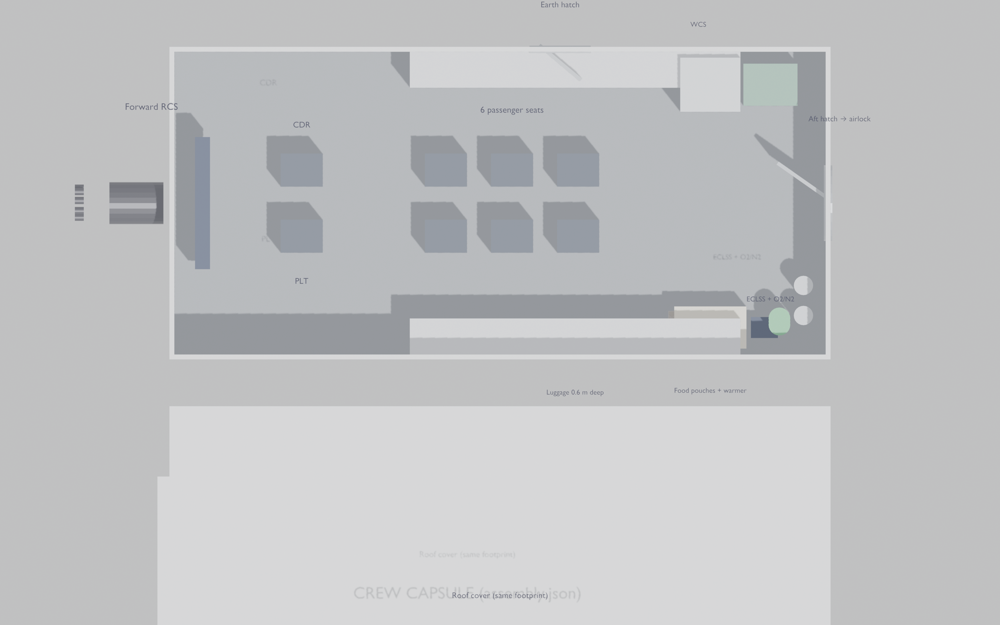
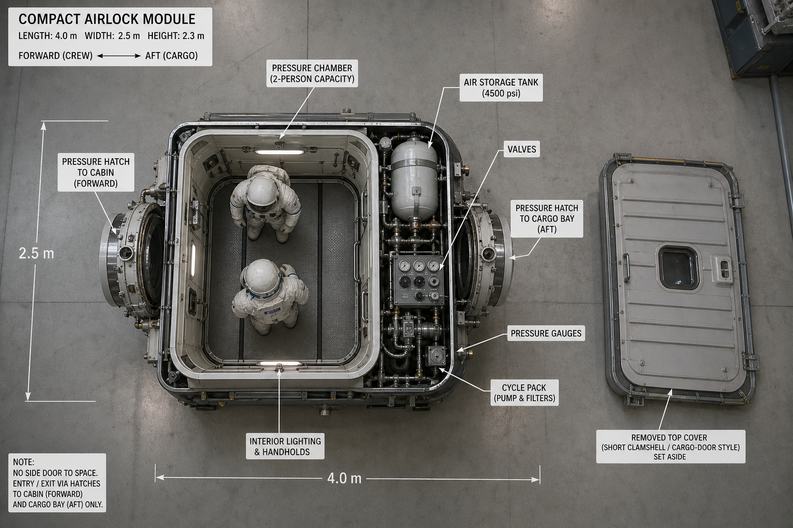
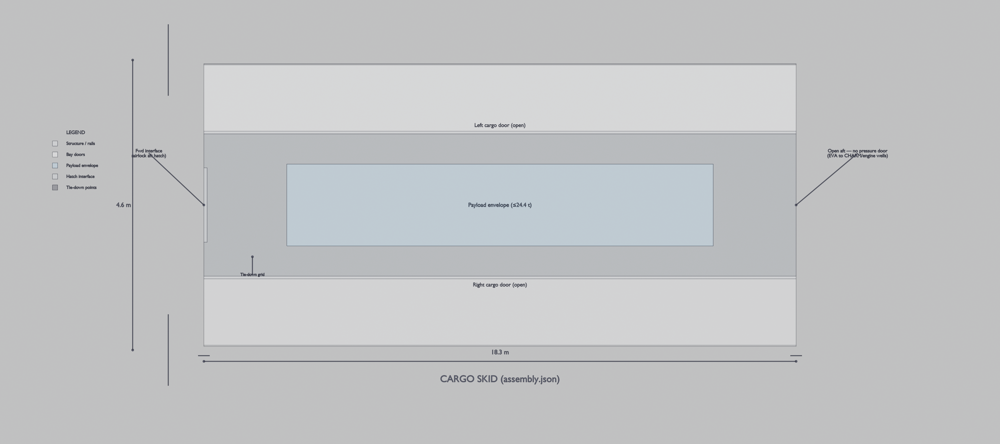

# SSTO fusion powered spaceplane using CHARM architecture with p-¹¹B fuel

**Lars Warren Ericson**  
Catskills Research Company  
ORCID: 0000-0001-8299-9361  
lars.ericson@catskillsresearch.com  

July 22, 2026  

---

## Abstract

We specify a single-stage-to-orbit (SSTO) spaceplane that flies Space Shuttle–style operations—including a Shuttle-class cargo bay—from a municipal airport to International Space Station (ISS) altitude in low Earth orbit (LEO), powered by a continuous Chambered Aneutronic Rotating Mirror (CHARM) \(p\text{-}^{11}\mathrm{B}\) plant [1] with direct energy conversion (DEC). Flight regimes use three electric stages: ducted fan on free air, microwave air plasma on climb, then carried-water plasma with intakes sealed. Each design step is written as a closed set of equations. We guesstimate the reactor mass hole, constrain water as a function of dry mass and vacuum \(\Delta v\), impose a \(1\,\mathrm{GW}\) plant with space restart and DEC, and solve a reference all-up mass. Combined-cycle engine maps and CHARM size/performance constraints follow.

---

## 1. Vehicle vision

Municipal runway to ISS-class LEO: a Shuttle-style SSTO spaceplane with a real cargo bay, a single-deck crew module, and a continuous CHARM \(p\text{-}^{11}\mathrm{B}\) plant driving a three-stage combined-cycle engine (electric ducted fan → microwave air plasma → water plasma). The figures below are the vehicle picture; the equations that close the mass and energy budgets follow.

### Interior floorplan and exterior profile

Crew volume flattens the **Space Shuttle crew module** from two decks to **one** [14,21], then **stretches** the pressurized nose so life support and a suited airlock are not cartoon-thin. Reference overall length **$L \approx 52\,\mathrm{m}$**. ECLSS = **Environmental Control and Life Support System**. Depth $\approx 6.5$–$7\,\mathrm{m}$, span $\approx 28\,\mathrm{m}$.

Figs.~\ref{fig:charm-ssto-interior-floorplan} and \ref{fig:charm-ssto-exterior-profile} are orthographic CAD views of the same station map as `assembly.json` (nose left, length $52\,\mathrm{m}$): crew capsule $0$–$11\,\mathrm{m}$ (flight deck + seats, internal O₂/N₂, port **ground-only** side hatch); airlock $11$–$15\,\mathrm{m}$ (hatches cabin↔airlock and airlock↔bay only); cargo bay $15$–$33.3\,\mathrm{m}$ ($18.3\times 4.6\,\mathrm{m}$, top clamshell doors); **fusion electric plant** $33.3$–$49\,\mathrm{m}$ on one skid (flight battery $33.3$–$35.5\,\mathrm{m}$, water tanks $35.5$–$39.5\,\mathrm{m}$ — relocated ahead of CHARM as a supplemental radiation shield, §9.9 — fuel services $39.5$–$41.5\,\mathrm{m}$, CHARM island incl. permanent shield bulkhead $41.5$–$49\,\mathrm{m}$); **combined-cycle engine** $49$–$52\,\mathrm{m}$ (stages 1–3 + nozzle). The plant schematic (Fig.~\ref{fig:mermaid-fusion-electric-plant}) is 1–1 with that JSON tree. Fig.~\ref{fig:charm-ssto-interior-floorplan} is a top-down cutaway (no landing gear). Fig.~\ref{fig:charm-ssto-exterior-profile} shows white upper OML, dark TPS belly, extended gear, the port crew hatch, and closed top bay doors.

<!-- figure-landscape -->


<!-- figure-landscape -->


### Forward drop-ins (top-down, covers off)

Figs.~\ref{fig:crew-capsule-top}–\ref{fig:fusion-plant-skid-top} are **Blender** orthographic top views built procedurally from `assembly.json` (`make cad-drop-ins`; see `research/figures/cad/build_crew_capsule_blender.py`, `build_airlock_blender.py`, `build_cargo_skid_blender.py`, `build_fusion_plant_skid_blender.py`, and the shared helpers in `research/figures/cad/lib/`). No AI-generated imagery remains in this section.

<!-- figure-landscape -->


<!-- figure-landscape -->


<!-- figure-landscape -->


<!-- figure-landscape -->


### Fusion electric plant (assembly SSOT)

Fig.~\ref{fig:mermaid-fusion-electric-plant} is auto-generated from `research/figures/cad/assembly.json` on every build (`scripts/update_arxiv_mermaid.py`, same visible-set algorithm as the interactive outliner — see `research/figures/cad/lib/mermaid_builder.py`). Boxes are plant parts/collections, not a separate physics cartoon; this figure is hard-scoped to the fusion plant assembly, so the one connection leaving it (to the combined-cycle engine) is drawn as a dashed boundary stub rather than pulling in the engine's own parts.

<!-- mermaid-landscape -->
<!-- mermaid-caption: Fusion electric plant (assembly.json) -->
<!-- mermaid-label: fig:mermaid-fusion-electric-plant -->
<!--mermaid-gen fusion_electric_plant-->

<!--/mermaid-gen-->

### Profile stations

Stations match assembly envelopes: crew \(0\)–\(11\,\mathrm{m}\), airlock \(11\)–\(15\,\mathrm{m}\), cargo \(15\)–\(33.3\,\mathrm{m}\), fusion plant \(33.3\)–\(49\,\mathrm{m}\) (battery + water + fuel + CHARM on one skid — water relocated ahead of CHARM as a supplemental shield, §9.9), engine \(49\)–\(52\,\mathrm{m}\). Fig.~\ref{fig:mermaid-profile-stations} is auto-generated (whole-vehicle scope, one level into the fusion plant and engine) by the same `scripts/update_arxiv_mermaid.py` pipeline as Fig.~\ref{fig:mermaid-fusion-electric-plant}.

<!-- mermaid-landscape -->
<!-- mermaid-caption: Profile stations from assembly envelopes -->
<!-- mermaid-label: fig:mermaid-profile-stations -->
<!--mermaid-gen profile_stations-->

<!--/mermaid-gen-->

---

## 2. Design goals (the plane)

Table: Design goals for the plane.

| ID | Goal | Statement |
|----|------|-----------|
| G1 | **SSTO** | Single stage from runway to ISS-class LEO; no discarded boosters or external tank |
| G2 | **Shuttle style** | Orbiter-like airframe: wing–body, thermal protection system (TPS), runway landing, gear, control surfaces; crew systems (toilet, ECLSS, food) |
| G2b | **Single-deck crew** | Flatten Shuttle cabin to one deck: flight deck; six reclining seats; O₂/N₂ + ECLSS; luggage; forward/side ground door; large aft airlock into bay |
| G2c | **Length** | Stretch OML as needed for airlock, ECLSS tanks, battery, and fusion-fuel tanks—reference \(L \approx 52\,\mathrm{m}\) |
| G3 | **Shuttle cargo bay** | Usable bay \(\approx 18.3\,\mathrm{m}\times 4.6\,\mathrm{m}\) class for payload—not filled with reactors |
| G4 | **Payload** | Shuttle-class cargo: \(m_{\mathrm{pl}} = 24\,400\,\mathrm{kg}\) reference |
| G5 | **Destination** | Circular LEO compatible with ISS altitude (\(\approx 400\,\mathrm{km}\)); plane-change to \(51.6^\circ\) treated as margin |
| G6 | **Municipal airport** | Takeoff/landing on long civil runways; first gear cool enough for noise/oversight; no vertical pad |
| G7 | **One engine** | Single combined-cycle propulsion string; deadstick glide if plant fails |
| G8 | **Clean fuel** | \(p + {}^{11}\mathrm{B} \rightarrow 3\alpha + 8.7\,\mathrm{MeV}\); CHARM bottle; DEC-first electricity |
| G9 | **Power** | Plant electrical bus peak \(P_{\star} = 1\,\mathrm{GW}\) (design target) |

**Not goals:** expendable stages; D–T breeding plant; filling the bay with the fusion island.

---

## 3. Constants and symbols

Table: Physical constants and reference symbols.

| Symbol | Meaning | Reference value |
|--------|---------|-----------------|
| \(R_E\) | Earth radius | \(6.371\times 10^6\,\mathrm{m}\) |
| \(\mu_E\) | \(GM_E\) | \(3.986\times 10^{14}\,\mathrm{m}^3/\mathrm{s}^2\) |
| \(h_{\mathrm{ISS}}\) | ISS-class altitude | \(4.00\times 10^5\,\mathrm{m}\) |
| \(r\) | Orbit radius | \(R_E + h_{\mathrm{ISS}}\) |
| \(g_0\) | Standard gravity | \(9.80665\,\mathrm{m/s}^2\) |
| \(m_{\mathrm{pl}}\) | Cargo-bay payload | \(2.44\times 10^4\,\mathrm{kg}\) |
| \(P_{\star}\) | CHARM bus peak power | \(1.00\times 10^9\,\mathrm{W}\) |

Masses (all kg):

Table: Mass symbol definitions.

| Symbol | Meaning |
|--------|---------|
| \(m_{\mathrm{af}}\) | Airframe primary: fuselage, wings, TPS (excl. gear/controls) |
| \(m_{\mathrm{gear}}\) | Landing gear (nose + mains), doors, actuators |
| \(m_{\mathrm{ctrl}}\) | Control surfaces + actuators (elevons, rudder, speed brake / body flap equiv.) |
| \(m_{\mathrm{crew}}\) | Crew cabin systems: ECLSS, O₂/N₂ tanks, pressure control, toilet, galley, food, luggage, airlock fittings |
| \(m_{\mathrm{str}}\) | \(m_{\mathrm{af}}+m_{\mathrm{gear}}+m_{\mathrm{ctrl}}+m_{\mathrm{crew}}\) |
| \(m_{\mathrm{eng}}\) | Combined-cycle engine + inlets + nozzles + ducts |
| \(m_{\mathrm{C}}\) | CHARM island (chambers, magnets, radio-frequency (RF), DEC, local shield, cryo, bath) |
| \(m_{\mathrm{bat}}\) | Flight battery / auxiliary power unit (APU) (restart + hotel) |
| \(m_{\mathrm{f}}\) | \(p\text{-}^{11}\mathrm{B}\) fuel |
| \(m_{\mathrm{w}}\) | Water carried at takeoff (vacuum reaction mass) |
| \(m_{\mathrm{dry}}\) | All mass except water |
| \(m_0\) | Gross liftoff mass (GLOW) |
| \(m_{\mathrm{ins}}\) | Mass at LEO insertion (after water burn) |

---

## 4. MWh budget: Shuttle-class mass to ISS LEO

### 4.1 Ideal orbital specific energy

\[
r = R_E + h_{\mathrm{ISS}},\qquad
v_{\mathrm{orb}} = \sqrt{\frac{\mu_E}{r}},\qquad
\varepsilon_{\mathrm{orb}} = -\frac{\mu_E}{2r},\qquad
\varepsilon_{\mathrm{surf}} \approx -\frac{\mu_E}{R_E}.
\]

\[
\Delta\varepsilon
  = \varepsilon_{\mathrm{orb}} - \varepsilon_{\mathrm{surf}}
  = \frac{\mu_E}{R_E} - \frac{\mu_E}{2r}
  \approx 3.31\times 10^7\,\mathrm{J/kg}
  = 33.1\,\mathrm{MJ/kg}.
\]

Numerical anchors:

\[
v_{\mathrm{orb}} \approx 7.67\,\mathrm{km/s},\qquad
\Delta\varepsilon \approx 9.19\,\mathrm{kWh/kg}.
\]

### 4.2 Orbital energy of the inserted vehicle

Everything that arrives at ISS altitude is still aboard (SSTO):

\[
E_{\mathrm{orb}} = m_{\mathrm{ins}}\,\Delta\varepsilon.
\]

In MWh:

\[
E_{\mathrm{orb}}^{\mathrm{(MWh)}} = m_{\mathrm{ins}}\cdot\frac{\Delta\varepsilon}{3.6\times 10^9}.
\]

Table: Orbital energy for representative inserted masses.

| \(m_{\mathrm{ins}}\) | \(E_{\mathrm{orb}}\) | \(E_{\mathrm{orb}}\) |
|----------------------|----------------------|----------------------|
| \(100\,\mathrm{t}\) (orbiter+cargo class) | \(3.31\,\mathrm{TJ}\) | **\(920\,\mathrm{MWh}\)** |
| \(150\,\mathrm{t}\) | \(4.97\,\mathrm{TJ}\) | **\(1380\,\mathrm{MWh}\)** |
| \(200\,\mathrm{t}\) | \(6.62\,\mathrm{TJ}\) | **\(1840\,\mathrm{MWh}\)** |

### 4.3 Source energy (plant must supply)

Air-breathing and rocket/plasma paths leave energy in the wake and fight drag/gravity. Define a mission multiplier \(\kappa_E \ge 1\):

\[
E_{\mathrm{src}} = \kappa_E\,E_{\mathrm{orb}}
  = \kappa_E\,m_{\mathrm{ins}}\,\Delta\varepsilon.
\]

Working band for planning:

\[
\kappa_E \in [2,\,4]
\quad\Rightarrow\quad
E_{\mathrm{src}}^{\mathrm{(MWh)}} \approx (18\text{–}37)\,m_{\mathrm{ins},100\mathrm{t}}
\]

i.e. about **\(1.8\)–\(3.7\,\mathrm{GWh}\)** of source energy per \(100\,\mathrm{t}\) inserted, scaling linearly with \(m_{\mathrm{ins}}\).

Time at constant bus power \(P_{\star}\):

\[
t_{\mathrm{src}} = \frac{E_{\mathrm{src}}}{P_{\star}}
  = \frac{\kappa_E\,m_{\mathrm{ins}}\,\Delta\varepsilon}{P_{\star}}.
\]

For \(m_{\mathrm{ins}} = 1.9\times 10^5\,\mathrm{kg}\), \(\kappa_E = 3\), \(P_{\star} = 1\,\mathrm{GW}\):

\[
E_{\mathrm{src}} \approx 18.9\,\mathrm{TJ} \approx 5240\,\mathrm{MWh},\qquad
t_{\mathrm{src}} \approx 5.2\,\mathrm{h}.
\]

So a \(1\,\mathrm{GW}\) CHARM bus is an **energy-throughput** match for Shuttle-class SSTO only if the climb/insert lasts hours at high average power—or peak \(P_{\star}\) is used with \(\kappa_E\) toward the low end and a lighter \(m_{\mathrm{ins}}\).

**ISS note.** Matching ISS inclination adds plane-change \(\Delta v\). Fold into vacuum \(\Delta v\) margin (§5) rather than into \(\Delta\varepsilon\).

---

## 5. Flight regimes: three electric stages

One propulsion string, three stages. No scramjet claim. Plant couples only by **power cable** (DEC → bus).

Table: Combined-cycle stages (reaction mass and thruster family).

| Stage | Ambient | Reaction mass | Thruster family (anchor lit.) |
|-------|---------|---------------|-------------------------------|
| **1** Municipal / dense air | Free air | Ingested air | Electric ducted fan (EDF) |
| **2** Climb / scarce air | Free air | Ingested + compressed air | Microwave **air** plasma jet [23] |
| **3** Vacuum / LEO insert | Intakes sealed | Carried **water** | Microwave **water** plasma thruster lineage [24] |

Cutoff: intakes seal at density/Mach command \(\rho\le\rho_{\mathrm{seal}}\) (or crew/auto seal for reentry); stage 3 begins.

Energy split (schematic):

\[
E_{\mathrm{src}}
  = E_{1} + E_{2} + E_{3} + E_{\mathrm{hotel}} + E_{\mathrm{loss}}.
\]

With free reaction mass in stages 1–2, plant energy primarily raises vehicle mechanical energy and pays drag:

\[
P_{\mathrm{prop}}(t) \approx \frac{D(t)\,v(t)}{\eta_{\mathrm{p}}(t)},
\qquad
\int P_{\mathrm{prop}}\,\mathrm{d}t \subset E_{1}+E_{2}.
\]

In stage 3, jet power for exhaust speed \(v_e\) and water mass flow \(\dot{m}_{\mathrm{w}}\) is

\[
P_{\mathrm{jet}} = \frac{1}{2}\,\dot{m}_{\mathrm{w}} v_e^2,\qquad
T = \dot{m}_{\mathrm{w}} v_e
\quad\Rightarrow\quad
P_{\mathrm{jet}} = \frac{1}{2}\,T\,v_e.
\]

---

## 6. Water mass as a function of whole dry mass

Water is used only in stage 3. Let

\[
m_{\mathrm{dry}}
  = m_{\mathrm{str}} + m_{\mathrm{pl}} + m_{\mathrm{eng}} + m_{\mathrm{C}} + m_{\mathrm{bat}} + m_{\mathrm{f}},
\]

\[
m_0 = m_{\mathrm{dry}} + m_{\mathrm{w}},\qquad
m_{\mathrm{ins}} = m_{\mathrm{dry}}
\]

(all water expended by insertion). Rocket equation for vacuum \(\Delta v_{\mathrm{vac}}\):

\[
\Delta v_{\mathrm{vac}} = v_e\,\ln\!\left(\frac{m_{\mathrm{dry}}+m_{\mathrm{w}}}{m_{\mathrm{dry}}}\right)
  = v_e\,\ln\mu,\qquad
\mu = e^{\Delta v_{\mathrm{vac}}/v_e}.
\]

**Water constraint (closed form):**

\[
\boxed{
m_{\mathrm{w}} = m_{\mathrm{dry}}\left(e^{\Delta v_{\mathrm{vac}}/v_e} - 1\right)
= m_{\mathrm{dry}}\,(\mu - 1)
}
\]

\[
\boxed{
m_0 = m_{\mathrm{dry}}\,\mu = m_{\mathrm{dry}}\,e^{\Delta v_{\mathrm{vac}}/v_e}
}
\]

Vacuum \(\Delta v\) budget:

\[
\Delta v_{\mathrm{vac}}
  = v_{\mathrm{orb}} - v_{\mathrm{ab}}
  + \Delta v_{g,\mathrm{vac}}
  + \Delta v_{\mathrm{steer}}
  + \Delta v_{\mathrm{ISS\,plane}}.
\]

Reference planning values:

\[
v_{\mathrm{ab}} = 3.5\,\mathrm{km/s},\quad
\Delta v_{g,\mathrm{vac}}+\Delta v_{\mathrm{steer}} = 0.8\,\mathrm{km/s},\quad
\Delta v_{\mathrm{ISS\,plane}} = 0.2\,\mathrm{km/s}
\;\Rightarrow\;
\Delta v_{\mathrm{vac}} \approx 5.2\,\mathrm{km/s}.
\]

Optimistic air-breathing (\(v_{\mathrm{ab}} = 5\,\mathrm{km/s}\), small margins) → \(\Delta v_{\mathrm{vac}} \approx 3.5\)–\(4\,\mathrm{km/s}\).

Exhaust speed from specific impulse:

\[
v_e = I_{\mathrm{sp}} g_0.
\]

Table: Water mass fraction versus vacuum $\Delta v$ and $I_{\mathrm{sp}}$.

| \(\Delta v_{\mathrm{vac}}\) | \(I_{\mathrm{sp}}\) | \(v_e\) | \(\mu\) | \(m_{\mathrm{w}}/m_{\mathrm{dry}}\) |
|-----------------------------|---------------------|---------|---------|----------------------------------|
| \(4\,\mathrm{km/s}\) | \(2000\,\mathrm{s}\) | \(19.6\,\mathrm{km/s}\) | \(1.226\) | \(0.226\) |
| \(4\,\mathrm{km/s}\) | \(3000\,\mathrm{s}\) | \(29.4\,\mathrm{km/s}\) | \(1.146\) | \(0.146\) |
| \(5.2\,\mathrm{km/s}\) | \(2000\,\mathrm{s}\) | \(19.6\,\mathrm{km/s}\) | \(1.302\) | \(0.302\) |
| \(5.2\,\mathrm{km/s}\) | \(5000\,\mathrm{s}\) | \(49.0\,\mathrm{km/s}\) | \(1.112\) | \(0.112\) |

---

## 7. Vehicle sizing equations

### 7.1 Structure, crew, gear, controls, and bay

Cargo bay geometry (goal G3):

\[
L_{\mathrm{bay}} = 18.3\,\mathrm{m},\quad
D_{\mathrm{bay}} = 4.6\,\mathrm{m},\quad
V_{\mathrm{bay}} \approx \frac{\pi}{4} D_{\mathrm{bay}}^2 L_{\mathrm{bay}} \approx 304\,\mathrm{m}^3.
\]

Payload density check:

\[
\bar{\rho}_{\mathrm{pl}} = \frac{m_{\mathrm{pl}}}{V_{\mathrm{bay}}} \approx 80\,\mathrm{kg/m}^3
\]

(compatible with mixed cargo; bay remains payload volume).

**Crew (Shuttle functions, single deck).** Forward **flight deck**: commander and pilot **facing forward** into windows and a full control-panel wall [14,21]. Living volume: **six forward-facing passenger seats** (Crew Dragon–like rows, stretched cabin) plus the flight-deck pair; **waste collection system (WCS)**; **galley/food station without a kitchen sink** (0g); **crew luggage** with doors into the aisle; **ECLSS** with **O₂/N₂ tankage inside the pressure vessel**. **Solid port side hatch** (Earth/runway only) and **solid aft pressure hatch** to the airlock. **Airlock** oversized vs a suit-closet: dual-hatch volume on the aft cabin bulkhead facing the **cargo bay**, sized for suited egress (Shuttle middeck airlock pattern, not undersized) [21].

**Landing gear and control surfaces** are explicit mass lines (not buried only in a lump “structure” number):

\[
\begin{aligned}
m_{\mathrm{af}} &= 7.20\times 10^4\,\mathrm{kg}
 && \text{(longer fuselage, wings, TPS, doors)},\\
m_{\mathrm{gear}} &= 4.00\times 10^3\,\mathrm{kg}
 && \text{(nose + dual main trucks; mass bill only—see profile)},\\
m_{\mathrm{ctrl}} &= 3.00\times 10^3\,\mathrm{kg}
 && \text{(elevons, rudder, speed-brake equiv.\ + actuators)},\\
m_{\mathrm{crew}} &= 8.50\times 10^3\,\mathrm{kg}
 && \text{(ECLSS, O$_2$/N$_2$, WCS, galley, food, luggage, airlock)},\\
m_{\mathrm{str}} &= m_{\mathrm{af}}+m_{\mathrm{gear}}+m_{\mathrm{ctrl}}+m_{\mathrm{crew}}
 = 8.75\times 10^4\,\mathrm{kg}.
\end{aligned}
\]

CHARM and propulsion water **do not** consume \(V_{\mathrm{bay}}\). Plant volume sits in a **fuselage island** (spine / aft of bay / wing carry-through), subject to

\[
V_{\mathrm{C}} \le V_{\mathrm{island}}^{\max}
\approx 80\text{–}150\,\mathrm{m}^3
\quad\text{(guesstimate for pancaked Shuttle envelope)}.
\]

### 7.2 CHARM mass hole

Define island specific power on the **electrical bus**:

\[
\alpha_{\mathrm{C}} = \frac{P_{\star}}{m_{\mathrm{C}}}
\quad\Rightarrow\quad
\boxed{m_{\mathrm{C}} = \frac{P_{\star}}{\alpha_{\mathrm{C}}}.}
\]

Table: CHARM island mass versus specific power at $1\,\mathrm{GW}$.

| \(\alpha_{\mathrm{C}}\) | \(m_{\mathrm{C}}\) at \(P_{\star}=1\,\mathrm{GW}\) | Comment |
|------------------------|--------------------------------------------------|---------|
| \(5\,\mathrm{kW/kg}\) | \(<!--gen sens5.m_c_t:.0f-->200<!--/gen-->\,\mathrm{t}\) | Heavy; fights SSTO |
| \(10\,\mathrm{kW/kg}\) | \(<!--gen sens10.m_c_t:.0f-->100<!--/gen-->\,\mathrm{t}\) | Stretch |
| \(15\,\mathrm{kW/kg}\) | \(<!--gen sens15.m_c_t:.0f-->67<!--/gen-->\,\mathrm{t}\) | **Reference hole** — bottom-up roll-up in §9.6 |
| \(25\,\mathrm{kW/kg}\) | \(<!--gen sens25.m_c_t:.0f-->40<!--/gen-->\,\mathrm{t}\) | Aggressive |

Volume consistency:

\[
\bar{p}_{\mathrm{C}} = \frac{P_{\star}}{V_{\mathrm{C}}}
\quad\Rightarrow\quad
V_{\mathrm{C}} = \frac{P_{\star}}{\bar{p}_{\mathrm{C}}}.
\]

For \(V_{\mathrm{C}} \le 120\,\mathrm{m}^3\): \(\bar{p}_{\mathrm{C}} \ge 8.3\,\mathrm{MW/m}^3\) bus-averaged over the island—severe packaging.

### 7.3 Engine and battery holes

\[
m_{\mathrm{eng}}
  = m_{\mathrm{EDF}} + m_{\mu\mathrm{air}} + m_{\mathrm{wth}} + m_{\mathrm{shared}}
  = 1.5\times 10^4\,\mathrm{kg}
\quad\text{(reference packaging hole; closed in §10.6)},
\]

\[
m_{\mathrm{bat}} = 2.0\times 10^3\,\mathrm{kg}
\quad\text{(restart + hotel; ground cart does first light)},
\]

\[
m_{\mathrm{f}} = 5.0\times 10^2\,\mathrm{kg}
\quad(p\text{-}^{11}\mathrm{B}+\mathrm{H}\text{ inventory; water dominates expendables; §10.6)}.
\]

### 7.4 Closed dry / wet mass

\[
\boxed{
\begin{aligned}
m_{\mathrm{str}}
  &= m_{\mathrm{af}} + m_{\mathrm{gear}} + m_{\mathrm{ctrl}} + m_{\mathrm{crew}},\\[4pt]
m_{\mathrm{dry}}
  &= m_{\mathrm{str}} + m_{\mathrm{pl}} + m_{\mathrm{eng}} + \frac{P_{\star}}{\alpha_{\mathrm{C}}} + m_{\mathrm{bat}} + m_{\mathrm{f}},\\[4pt]
m_{\mathrm{w}}
  &= m_{\mathrm{dry}}\left(e^{\Delta v_{\mathrm{vac}}/v_e} - 1\right),\\[4pt]
m_0
  &= m_{\mathrm{dry}}\,e^{\Delta v_{\mathrm{vac}}/v_e},\\[4pt]
m_{\mathrm{ins}}
  &= m_{\mathrm{dry}}.
\end{aligned}
}
\]

---

## 8. Solved reference vehicle (all-up mass)

**Freeze:**

\[
\begin{aligned}
P_{\star} &= 1\,\mathrm{GW},&
\alpha_{\mathrm{C}} &= 15\,\mathrm{kW/kg},&
\Delta v_{\mathrm{vac}} &= 4.0\,\mathrm{km/s},\\
I_{\mathrm{sp}} &= 2000\,\mathrm{s},&
v_e &= I_{\mathrm{sp}} g_0 = <!--gen mass.v_e_km_s:.2f-->19.61<!--/gen-->\,\mathrm{km/s}.
\end{aligned}
\]

**Solve:**

\[
m_{\mathrm{C}} = \frac{10^9}{1.5\times 10^4} = <!--gen charm.m_c_kg_sci-->6.67\times 10^4<!--/gen-->\,\mathrm{kg}
\quad\text{(bottom-up roll-up: §9.6).}
\]

\[
\begin{aligned}
m_{\mathrm{str}}
  &= 72\,000 + 4\,000 + 3\,000 + 8\,500
  = <!--gen mass.m_str_kg_sci-->8.75\times 10^4<!--/gen-->\,\mathrm{kg},\\[6pt]
m_{\mathrm{dry}}
  &= 87\,500 + 24\,400 + 15\,000 + <!--gen charm.m_c_kg_latex-->66\,667<!--/gen--> + 2\,000 + 500
  = <!--gen mass.m_dry_kg_sci-->1.961\times 10^5<!--/gen-->\,\mathrm{kg}
  \;\;(<!--gen mass.m_dry_t:.1f-->196.1<!--/gen-->\,\mathrm{t}),\\[6pt]
\mu &= e^{4000/19613} = <!--gen mass.mu:.3f-->1.226<!--/gen-->,\qquad
m_{\mathrm{w}} = <!--gen mass.mu_minus1:.3f-->0.226<!--/gen-->\,m_{\mathrm{dry}} = <!--gen mass.m_w_kg_sci-->4.44\times 10^4<!--/gen-->\,\mathrm{kg}
  \;\;(<!--gen mass.m_w_t:.1f-->44.4<!--/gen-->\,\mathrm{t}),\\[6pt]
m_0 &= <!--gen mass.m0_kg_sci-->2.404\times 10^5<!--/gen-->\,\mathrm{kg}
  \;\;\mathbf{(<!--gen mass.m0_t:.0f-->240<!--/gen-->\,\mathrm{t}\ GLOW)},\\[6pt]
m_{\mathrm{ins}} &= <!--gen mass.m_ins_t:.1f-->196.1<!--/gen-->\,\mathrm{t}.
\end{aligned}
\]

**Mass bill (reference):**

Table: Reference vehicle mass bill.

| Item | Mass |
|------|------|
| Airframe + TPS (longer OML) | \(72.0\,\mathrm{t}\) |
| Landing gear | \(4.0\,\mathrm{t}\) |
| Control surfaces + actuators | \(3.0\,\mathrm{t}\) |
| Crew systems (ECLSS, O₂/N₂, WCS, galley, food, luggage, airlock) | \(8.5\,\mathrm{t}\) |
| Payload (cargo bay) | \(24.4\,\mathrm{t}\) |
| Combined-cycle engine (EDF \(5.0\) + air-plasma \(4.4\) + water thruster \(3.1\) + shared \(2.5\)) | \(15.0\,\mathrm{t}\) |
| CHARM island (bottom-up roll-up: magnets + cryo + unsized remainder, §9.6) | \(<!--gen charm.m_c_t:.1f-->66.7<!--/gen-->\,\mathrm{t}\) |
| Flight battery | \(2.0\,\mathrm{t}\) |
| \(p\text{-}^{11}\mathrm{B}\) / proton fuel (+ tankage) | \(0.5\,\mathrm{t}\) |
| Water (vacuum propellant) | \(<!--gen mass.m_w_t:.1f-->44.4<!--/gen-->\,\mathrm{t}\) |
| **GLOW** | **\(<!--gen mass.m0_t:.0f-->240<!--/gen-->\,\mathrm{t}\)** |

**Energy at this mass:**

\[
E_{\mathrm{orb}} = 6.49\,\mathrm{TJ} = 1800\,\mathrm{MWh},
\qquad
E_{\mathrm{src}}(\kappa_E=3) = 5410\,\mathrm{MWh},
\qquad
t_{\mathrm{src}}(1\,\mathrm{GW}) = 5.4\,\mathrm{h}.
\]

**Sensitivity (same \(\Delta v_{\mathrm{vac}}, I_{\mathrm{sp}}\); \(m_{\mathrm{str}}\) fixed):**

Table: Sensitivity of dry and wet mass to specific power.

| \(\alpha_{\mathrm{C}}\) | \(m_{\mathrm{C}}\) | \(m_{\mathrm{dry}}\) | \(m_{\mathrm{w}}\) | \(m_0\) |
|------------------------|--------------------|----------------------|--------------------|---------|
| \(10\,\mathrm{kW/kg}\) | \(<!--gen sens10.m_c_t:.0f-->100<!--/gen-->\,\mathrm{t}\) | \(<!--gen sens10.m_dry_t:.0f-->229<!--/gen-->\,\mathrm{t}\) | \(<!--gen sens10.m_w_t:.0f-->52<!--/gen-->\,\mathrm{t}\) | \(<!--gen sens10.m0_t:.0f-->281<!--/gen-->\,\mathrm{t}\) |
| \(15\,\mathrm{kW/kg}\) | \(<!--gen sens15.m_c_t:.0f-->67<!--/gen-->\,\mathrm{t}\) | \(<!--gen sens15.m_dry_t:.0f-->196<!--/gen-->\,\mathrm{t}\) | \(<!--gen sens15.m_w_t:.0f-->44<!--/gen-->\,\mathrm{t}\) | \(\mathbf{<!--gen sens15.m0_t:.0f-->240<!--/gen-->\,\mathrm{t}}\) |
| \(25\,\mathrm{kW/kg}\) | \(<!--gen sens25.m_c_t:.0f-->40<!--/gen-->\,\mathrm{t}\) | \(<!--gen sens25.m_dry_t:.0f-->169<!--/gen-->\,\mathrm{t}\) | \(<!--gen sens25.m_w_t:.0f-->38<!--/gen-->\,\mathrm{t}\) | \(<!--gen sens25.m0_t:.0f-->208<!--/gen-->\,\mathrm{t}\) |

Municipal takeoff weight \(\sim 210\)–\(280\,\mathrm{t}\) is heavy vs airliners but in the large-military / 747-class band—not a Citation.

---

## 9. Constraints on the CHARM power plant

Summarize as a requirement vector \(\mathcal{R}_{\mathrm{C}}\):

### 9.1 Power and mass

\[
\boxed{
P_{\mathrm{bus}}(t) \ge P_{\mathrm{prop}}(t) + P_{\mathrm{hotel}}(t),\qquad
\max P_{\mathrm{bus}} = P_{\star} = 1\,\mathrm{GW},
}
\]

\[
\boxed{
m_{\mathrm{C}} = \frac{P_{\star}}{\alpha_{\mathrm{C}}},\qquad
\alpha_{\mathrm{C}} \ge 15\,\mathrm{kW/kg}
\;\text{(reference; \(\ge 10\,\mathrm{kW/kg}\) hard floor for SSTO)}.
}
\]

\[
V_{\mathrm{C}} \le 120\,\mathrm{m}^3,\qquad
\bar{p}_{\mathrm{C}} = P_{\star}/V_{\mathrm{C}} \ge 8\,\mathrm{MW/m}^3.
\]

### 9.2 Fuel and ash

\[
\dot{N}_{p{}^{11}\mathrm{B}}
  = \frac{P_{\mathrm{fusion}}}{8.7\,\mathrm{MeV}},
\qquad
m_{\mathrm{f}}(t_{\mathrm{mission}}) \ll m_{\mathrm{w}}.
\]

Ash (He) strained per CHARM multi-chamber design; DEC captures charged-product free energy.

### 9.3 DEC

\[
P_{\mathrm{bus}} = \eta_{\mathrm{DEC}} P_{\alpha,\mathrm{ordered}}
  + \eta_{\mathrm{th}} P_{\mathrm{thermal\,reject}},
\qquad
\eta_{\mathrm{DEC}} \gtrsim 0.4\text{–}0.7
\;\text{(design target band)}.
\]

Thermal reject (X-ray, wall, inefficiencies) must be dumped to:

- air path (stage-1/2 heat exchanger / microwave reject), and/or  
- island bath → compact turbine, and/or  
- radiators only after exo-atmospheric (limited area).

### 9.4 Restartable in space

\[
E_{\mathrm{restart}} \le \eta_{\mathrm{bat}} m_{\mathrm{bat}} e_{\mathrm{bat}},
\]

with \(m_{\mathrm{bat}} = 2\,\mathrm{t}\) reference and \(e_{\mathrm{bat}} \sim 0.15\)–\(0.25\,\mathrm{kWh/kg}\) ⇒ **\(300\)–\(500\,\mathrm{kWh}\)** class store—enough for **pilot-chamber relight + cascade**, not for ascent.

\[
\text{Ground cart: } P_{\mathrm{cart}} \ge P_{\mathrm{light-off}},\quad
\text{not carried}.
\]

Doctrine: continuous burn nominally; pilot-string kindling from \(m_{\mathrm{bat}}\) if segmented; glide if relight fails.

### 9.5 Continuous operation / no beam farm

Recirculating power is RF walls, rotation, magnets, vacuum, cryo:

\[
P_{\mathrm{recirc}} = f_{\mathrm{r}} P_{\mathrm{fusion}},\qquad
P_{\mathrm{bus}} = (1 - f_{\mathrm{r}})\,P_{\mathrm{fusion,net\,to\,bus}}.
\]

Design intent: \(f_{\mathrm{r}}\) small enough that \(1\,\mathrm{GW}\) **bus** does not require multi-MW neutral-beam injection (NBI).

### 9.6 CHARM island bottom-up mass roll-up: magnets and cryo, sized; RF/shield/structure, not yet

[1] gives no magnet field, magnet technology, or cryostat design — CHARM's own public materials are pure confinement/ash/DEC physics with zero cryogenics content. §7.2/§9.1's \(m_{\mathrm{C}} = P_{\star}/\alpha_{\mathrm{C}}\) is a **top-down** target, not a sum of parts. This subsection replaces two of that budget's line items — magnets and the cryo compressor bay — with explicit, literature-anchored bottom-up numbers computed by [`constants_model.py`](research/figures/cad/constants_model.py) (plain numpy, no fitting), and is honest about what still isn't independently sized. All boxed numbers below are program-generated (`<!--gen-->` spans); re-running `python research/figures/cad/constants_model.py` regenerates them from the `Params` at the top of that file.

**Magnets — anchor: WHAM, not SPARC.** SPARC's TF coil is a tokamak magnet; CHARM is a chambered rotating **mirror**. The much closer real-hardware analog is the Wisconsin HTS Axisymmetric Mirror (WHAM), an ARPA-E-funded, currently-operating HTS mirror machine whose two magnets — built by Commonwealth Fusion Systems (CFS) — are real, delivered, tested hardware: \(<2\,\mathrm{t}\) each, \(17\,\mathrm{T}\) in the warm bore / \(20\,\mathrm{T}\) on tape, REBCO, "self-contained systems" bundling cryogenic refrigeration, vacuum, and controls on the magnet itself [34,35,36]. Take

\[
N_{\mathrm{coil}} = <!--gen charm.n_coil:.0f-->6<!--/gen-->
\quad\text{(two WHAM-style end-mirror coils per fusion chamber, \(\times 2\) chambers, + 2 shaping coils at the heat-exchange chamber)},
\]

\[
\boxed{
m_{\mathrm{magnets}} = N_{\mathrm{coil}} \times <!--gen charm.m_magnet_each_t:.1f-->1.8<!--/gen--> \,\mathrm{t} = <!--gen charm.m_magnets_t:.1f-->10.8<!--/gen-->\,\mathrm{t}
}
\]

(WHAM's "self-contained" description means the on-coil cold head is already inside that \(1.8\,\mathrm{t}\) figure — only the skid-mounted compressor package is a separate line item, below).

**Cryo compressor bay — 6 flight-remanufactured AL630-class compressors.** One dedicated Cryomech AL630-class compressor **package** per magnet (echoing WHAM/CFS's "self-contained per-magnet" cryo philosophy); the cold head stays on the magnet (counted above), only the CPA1114 compressor package sits on the skid. Bare datasheet: \(191\,\mathrm{kg}\), \(12.7\,\mathrm{kW}\) electrical (60 Hz), \(100\,\mathrm{W}\) at \(20\,\mathrm{K}\) per cold head [33].

\[
N_{\mathrm{AL630}} = <!--gen charm.n_al630:.0f-->6<!--/gen-->
\quad\Rightarrow\quad
Q_{20\mathrm{K}} = N_{\mathrm{AL630}}\times 100\,\mathrm{W} = <!--gen charm.q20k_w:.0f-->600<!--/gen--> \,\mathrm{W}
\;\;(\approx <!--gen charm.q20k_w_per_coil:.0f-->100<!--/gen--> \,\mathrm{W/coil}).
\]

This \(\approx 100\,\mathrm{W/coil}\) is **six times lighter** than the \(600\,\mathrm{W/coil}\) SPARC actually measured on its TFMC test coil (next subsection) — flagged plainly as an aggressive assumption resting on WHAM-style production coils (optimized current leads, no test-article instrumentation) rather than anything measured for CHARM.

We do not have vendor or test data for re-engineering an AL630 to fly (vibration qualification; swapping the water-cooled compressor for a radiator/pumped-loop interface). **This multiplier is a guess, flagged as such:**

\[
\text{flight mass multiplier} = <!--gen charm.flight_mass_mult:.1f-->1.5<!--/gen-->\times,\qquad
\text{flight power penalty} = <!--gen charm.flight_power_mult:.2f-->1.15<!--/gen-->\times
\]

("remanufacturing a proven, efficient ground design for flight qualification is assumed cheaper in mass than developing new lightweight cryocooler tech from scratch — no vendor or test data backs either number"). With the same \(\times 1.4\) integration margin as before (cryostat structure, transfer lines, manifolds — also a guess):

\[
\boxed{
m_{\mathrm{cryo}} = N_{\mathrm{AL630}}\times 191\,\mathrm{kg}\times <!--gen charm.flight_mass_mult:.1f-->1.5<!--/gen--> \times 1.4 = <!--gen charm.m_cryo_t:.2f-->2.41<!--/gen-->\,\mathrm{t},\qquad
P_{\mathrm{cryo}} = <!--gen charm.p_cryo_kw:.1f-->87.6<!--/gen--> \,\mathrm{kW}
}
\]

**CHARM island roll-up.** Compare the parts we can now ground (magnets + cryo) against the existing top-down target:

\[
m_{\mathrm{bottom\text{-}up,known}} = m_{\mathrm{magnets}} + m_{\mathrm{cryo}} = <!--gen charm.m_bottom_up_known_t:.1f-->13.2<!--/gen-->\,\mathrm{t},
\qquad
m_{\mathrm{C,target}} = \frac{P_{\star}}{\alpha_{\mathrm{C}}} = <!--gen charm.m_c_target_t:.1f-->66.7<!--/gen-->\,\mathrm{t}.
\]

RF launchers/amplifiers, Bremsstrahlung/neutron shielding, and the CHARM backbone/chamber structure are **not independently sized in this pass** — no citable specific-mass number for gyrotron/RF-launcher hardware or \(p\text{-}^{11}\mathrm{B}\) photon-shield areal density was found that we trust enough to present as engineering (one search result claimed an RF specific mass near \(0.5\,\mathrm{kg/kW}\), which is implausibly light for gyrotron + waveguide + power-supply hardware and is deliberately **not used**). Rather than fabricate precision, the model carries the gap as one honestly-labeled remainder:

\[
m_{\mathrm{remainder}} = m_{\mathrm{C,target}} - m_{\mathrm{bottom\text{-}up,known}} = <!--gen charm.m_remainder_t:.1f-->53.5<!--/gen-->\,\mathrm{t}
\quad\text{("RF + shielding + backbone/chamber structure + margin — future work").}
\]

§9.9 below sources the first real piece of this bucket — a permanent radiation-shield bulkhead, \(<!--gen shield.b1_mass_t:.1f-->21.9<!--/gen--> \,\mathrm{t}\) — leaving \(<!--gen charm.m_remainder_after_b1_t:.1f-->31.5<!--/gen--> \,\mathrm{t}\) still unsized (RF hardware + backbone/chamber structure).

\[
\boxed{
m_{\mathrm{C}} = \max\!\left(m_{\mathrm{C,target}},\; m_{\mathrm{bottom\text{-}up,known}}\right) = <!--gen charm.m_c_t:.1f-->66.7<!--/gen-->\,\mathrm{t}
\quad\Rightarrow\quad
\alpha_{\mathrm{C,implied}} = <!--gen charm.alpha_c_implied_kw_per_kg:.2f-->15.00<!--/gen--> \,\mathrm{kW/kg}
}
\]

i.e. magnets are \(<!--gen charm.pct_magnets:.1f-->16.2<!--/gen-->\%\) of \(m_{\mathrm{C}}\), cryo is \(<!--gen charm.pct_cryo:.1f-->3.6<!--/gen-->\%\), and the unsized remainder is \(<!--gen charm.pct_remainder:.1f-->80.2<!--/gen-->\%\). Because the known bottom-up pieces fit comfortably inside the existing \(67\,\mathrm{t}\) target, **\(m_{\mathrm{C}}\), \(m_{\mathrm{dry}}\), and GLOW in §7.4/§8 do not move** — but the mechanism is live: `m_C = max(...)` in `constants_model.py` means a future RF/shield/structure sizing pass (or a heavier magnet/cryo number) would cascade into \(m_0\) automatically rather than needing another hand edit.

**Conservative risk case — SPARC TFMC per-coil heat load.** If CHARM's production coils do **not** beat the \(600\,\mathrm{W/coil}\) SPARC actually measured on its Toroidal Field Model Coil (TFMC) — a real \(10{,}058\,\mathrm{kg}\) REBCO coil tested at \(20.1\,\mathrm{T}\), cooled by eight Cryomech AL630s in a liquid-free loop [29,30] — the bracket is much heavier. For \(N_{\mathrm{coil}}=4\)–\(8\):

\[
Q_{20\mathrm{K}}^{\mathrm{TFMC}} = N_{\mathrm{coil}}\times 600\,\mathrm{W} = <!--gen cons.q_low_kw:.1f-->2.4<!--/gen-->\text{–}<!--gen cons.q_high_kw:.1f-->4.8<!--/gen-->\,\mathrm{kW}
\;\Rightarrow\;
N_{\mathrm{AL630}} = <!--gen cons.n_al630_low:.0f-->24<!--/gen-->\text{–}<!--gen cons.n_al630_high:.0f-->48<!--/gen-->\;\text{units},
\]

\[
m_{\mathrm{cryo}}^{\mathrm{risk}} \approx <!--gen cons.m_installed_low_t:.1f-->7.9<!--/gen-->\text{–}<!--gen cons.m_installed_high_t:.1f-->15.8<!--/gen-->\,\mathrm{t},\qquad
P_{\mathrm{cryo}}^{\mathrm{risk}} \approx <!--gen cons.p_low_kw:.0f-->305<!--/gen-->\text{–}<!--gen cons.p_high_kw:.0f-->610<!--/gen-->\,\mathrm{kW}.
\]

This is still \(\ll\) the \(53.5\,\mathrm{t}\) remainder, so it would not by itself force \(m_{\mathrm{C}}\) up — but it is the number to reach for if the \(100\,\mathrm{W/coil}\) baseline assumption above turns out to be too optimistic.

**Sanity check against a real full-scale plant ("why not a warehouse").** The Politico/CFS reporting on SPARC's actual cryoplant hall is the right gut-check, and the real numbers back the instinct that it's a *categorically* bigger machine, for reasons that don't apply here: SPARC's production TF magnet is \(18{,}025\,\mathrm{kg}\) per coil, eighteen of them (\(\gtrsim 324\,\mathrm{t}\) of TF magnet alone, before poloidal-field/central-solenoid coils, cryostat, or vacuum vessel) [29], and its full cryoplant needs \(17\,\mathrm{kW}\) steady-state (\(4.5\,\mathrm{K}\)-equivalent) plus a separate \(2.9\,\mathrm{MW}\) blowdown system to absorb the heat pulse from each \(\gtrsim 1\,\mathrm{GJ}\)-class shot — infrastructure that fills a dedicated cryoplant building and helium storage yard next to the tokamak hall [31]. Even the conservative TFMC-anchored risk case above is \(14\)–\(28\%\) of SPARC's *steady-state* number alone, for a coil inventory two orders of magnitude lighter — defensible **only** because (i) \(p\text{-}^{11}\mathrm{B}\) is aneutronic, so there is no nuclear heating of the magnets/shield that dominates a D–T tokamak's cryoplant sizing, and (ii) CHARM runs continuously rather than in pulses, so there is no SPARC-style blowdown/buffer system to size at all. Neither of those is a CHARM-specific result; both are architecture-level consequences of the fuel choice already assumed elsewhere in this note (G8, §9.2).

**Ceiling check — flight-cryocooler technology instead of a remanufactured ground unit.** If remanufacturing an AL630 for flight turns out not to work and a clean-sheet space-qualified cryocooler is needed instead, NASA's own \(20\,\mathrm{W}/20\,\mathrm{K}\) reverse turbo-Brayton flight-cryocooler program is the closest public benchmark: state-of-the-art specific mass is \(18.7\,\mathrm{kg/W}\) (vs. that program's own \(4.4\)–\(5.5\,\mathrm{kg/W}\) *goal*, not yet demonstrated) [32] — \(12\)–\(45\times\) heavier than our \(2.4\,\mathrm{t}/600\,\mathrm{W} \approx 4.0\,\mathrm{kg/W}\) flight-remanufactured-AL630 assumption. Applied to the conservative TFMC-level risk-case load instead of the optimistic baseline:

\[
m_{\mathrm{cryo}}^{\mathrm{ceiling}} = Q_{20\mathrm{K}}^{\mathrm{TFMC}}\times 18.7\,\mathrm{kg/W} \approx <!--gen ceil.m_low_t:.0f-->45<!--/gen-->\text{–}<!--gen ceil.m_high_t:.0f-->90<!--/gen-->\,\mathrm{t}
\]

— up to, or beyond, the *entire* \(67\,\mathrm{t}\) CHARM island budget by itself. This stays tracked as its own named unobtainium (§13.3 item 6) rather than silently absorbed into \(\alpha_{\mathrm{C}}\); it is also the reason "remanufacture, don't clean-sheet" is load-bearing for this vehicle closing at all.

**Reference point carried forward.** \(N_{\mathrm{coil}}=6\), \(N_{\mathrm{AL630}}=6\), \(m_{\mathrm{magnets}}\approx <!--gen charm.m_magnets_t:.1f-->10.8<!--/gen-->\,\mathrm{t}\), \(m_{\mathrm{cryo}}\approx <!--gen charm.m_cryo_t:.1f-->2.4<!--/gen-->\,\mathrm{t}\), \(P_{\mathrm{cryo}}\approx <!--gen charm.p_cryo_kw:.0f-->88<!--/gen--> \,\mathrm{kW}\) (\(<!--gen charm.p_cryo_frac_bus_pct:.3f-->0.009<!--/gen-->\%\) of the \(1\,\mathrm{GW}\) bus — negligible next to RF/magnet recirculating power, consistent with §9.5) are the working numbers carried into `assembly.json`'s `charm_magnet_rack` (6 magnet nodes) and `cryo_compressor_bay` (6 compressor nodes). The \(53.5\,\mathrm{t}\) remainder stays an explicit, tracked placeholder — not a rounding error, and not yet real engineering.

### 9.7 Municipal and flight safety

- No tritium breeding inventory.  
- Shield so that ramp and cabin doses meet civil constraints with plant running in fan mode.  
- Single-string plant: accept engine-out ≡ plant-out → glide.

### 9.8 How CHARM is lit (and how much energy)

CHARM is **not** lit with a neutral-beam farm. Published architecture lights a **rotating open-field mirror** with **species-separated chambers** and **RF / ponderomotive walls** [1,8,9]. A practical light-off sequence for this vehicle is:

Table: CHARM light-off sequence.

| Step | Action | Power plant elements |
|------|--------|----------------------|
| 0 | Evacuate, interlocks, ground-cart connect | Vacuum, controls |
| 1 | Energize mirror / chamber **magnets** | Magnet PSU ← cart or battery |
| 2 | Spin up **plasma rotation** (centrifugal boron trap) | Rotation drive; energy later recoverable in principle [1] |
| 3 | Raise **RF one-way / ponderomotive barriers** | RF units |
| 4 | Inject **protons** and **boron** into separated regions | Fuel injectors + \(p\) / \({}^{11}\mathrm{B}\) tanks |
| 5 | Establish fusion cell; route alphas to **heat-exchange / DEC** | DEC electrodes / wave couplers |
| 6 | Disconnect cart; bus takes hotel + propulsion | Continuous burn doctrine |

**Energy scale (engineering estimate — CHARM papers do not publish a flight kWh bill of materials (BOM)):**

Magnet + RF + rotation spin-up for a segmented \(1\,\mathrm{GW}\) island is treated as **\(50\)–\(200\,\mathrm{kWh}\)** class to first useful plasma (seconds–minutes of MW-class RF/magnet draw), not **MWh-class beams**. That is why

\[
E_{\mathrm{restart}} \le 300\text{–}500\,\mathrm{kWh}
\quad(m_{\mathrm{bat}} = 2\,\mathrm{t})
\]

is booked for **on-orbit relight**, while **first light on Earth** uses the ground cart. One-way RF walls can be energetically expensive if overused [1]; the vehicle concept of operations (CONOPS) keeps barriers as needed for separation, not as a continuous full-power sink that eats the \(1\,\mathrm{GW}\) bus.

**Pilot-string kindling:** battery (or cart) lights a fraction of chambers → DEC/RF bus cascades the rest.

### 9.9 Radiation and RF shielding: permanent bulkhead (baseline), water relocation (bonus), RF leakage (separate)

Crew/cargo safety must not depend on the water tank's fill state — water is a consumable that can legitimately be empty (post-insertion, pre-fueling, or after an early dump). This is therefore **three separate, independently-motivated additions**, computed by [`constants_model.py`](research/figures/cad/constants_model.py) (plain numpy, no fitting) and reported as `<!--gen-->` spans. All three are explicitly-flagged, 1D slab, order-of-magnitude estimates — no real photon/neutron spectrum, scatter, or 3D solid-angle coverage is modeled, and no CHARM-specific source term exists in [1] or the CHARM literature search behind §9.6.

**Shared methodology.** A representative bremsstrahlung/X-ray photon energy of \(\sim 300\,\mathrm{keV}\) is assumed (flagged guess, informed by the \(100\)s-of-keV electron temperatures discussed for radiation-trapping \(p\text{-}^{11}\mathrm{B}\) regimes [7]), with NIST XCOM mass-attenuation coefficients [39] for water and polyethylene at that energy. A residual-neutron source term is also carried even though \(p\text{-}^{11}\mathrm{B}\) is billed as aneutronic: secondary/contamination reactions give a small non-zero yield, flagged at \(\lesssim 1\%\) of a D–T-equivalent yield per general \(p\text{-}^{11}\mathrm{B}\) literature, attenuated using standard polyethylene/water fast-neutron removal cross sections [40] (a different physical mechanism than the photon \(\mu/\rho\) above, reported separately). A **target attenuation** of \(<!--gen shield.target_db:.0f-->30<!--/gen--> \,\mathrm{dB}\) (\(<!--gen shield.n_hvl_target:.1f-->10.0<!--/gen-->\) half-value layers, \(1000\times\) flux reduction) is the flagged baseline design requirement — a planning choice, absent a real CHARM source-term/dose calculation, applied identically to both B1 and B2 below.

**B1 — Permanent dedicated shield bulkhead (baseline, sized for zero water present).** A polyethylene (or borated-polyethylene) bulkhead between CHARM and the forward vehicle — the standard aerospace choice for combined photon+neutron shielding (hydrogen-rich; the NASA/ISS/Orion reference material) — spans the fuselage cross-section (\(<!--gen shield.area_m2:.0f-->34<!--/gen--> \,\mathrm{m}^2\), reused from §10.2's aero frontal-area estimate) and is thick enough to hit the target attenuation against **both** hazards independently:

\[
t_{\gamma} = N_{\mathrm{HVL}}\times\mathrm{HVL}_{\gamma,\mathrm{poly}} \approx <!--gen shield.b1_thickness_gamma_cm:.0f-->61<!--/gen--> \,\mathrm{cm},\qquad
t_{n} = N_{\mathrm{HVL}}\times\mathrm{HVL}_{n,\mathrm{poly}} \approx <!--gen shield.b1_thickness_n_cm:.0f-->69<!--/gen--> \,\mathrm{cm},
\]

\[
\boxed{
t_{\mathrm{B1}} = \max(t_{\gamma}, t_n) \approx <!--gen shield.b1_thickness_m:.2f-->0.69<!--/gen--> \,\mathrm{m}
\quad\Rightarrow\quad
m_{\mathrm{B1}} = t_{\mathrm{B1}}\times A \times \rho_{\mathrm{poly}} \approx <!--gen shield.b1_mass_t:.1f-->21.9<!--/gen--> \,\mathrm{t}
}
\]

This mass becomes the **first real, sourced line item** inside the \(<!--gen charm.m_remainder_t:.1f-->53.5<!--/gen-->\,\mathrm{t}\) "RF + shielding + backbone/chamber structure" remainder carried since §9.6 — \(<!--gen shield.b1_pct_of_remainder:.0f-->41<!--/gen-->\%\) of it, leaving \(<!--gen charm.m_remainder_after_b1_t:.1f-->31.5<!--/gen-->\,\mathrm{t}\) still unsized (RF hardware and backbone/chamber structure). It is a partial de-risking, not a closure — \(m_{\mathrm{C}}\) does not move, since the bottom-up known total (magnets + cryo + B1) still fits inside the top-down target.

**B2 — Relocate water tanks (bonus/supplemental shield, unchanged station lengths).** Moving the water tanks from aft-of-CHARM (§1/§11, previously shielding nothing) to between CHARM and the forward vehicle adds *supplemental* shielding on top of B1 whenever the tank is full — new layout: `crew → airlock → cargo → battery → water → fuel → charm → engine` (§1/§11). At the full-tank slab depth (\(<!--gen mass.m_w_t:.0f-->44<!--/gen-->\,\mathrm{t}\) reference load, \(4.0\,\mathrm{m}\) envelope), water alone provides:

\[
<!--gen shield.water_gamma_db:.0f-->206<!--/gen--> \,\mathrm{dB}\ \text{(photon)},\qquad
<!--gen shield.water_n_db:.0f-->179<!--/gen--> \,\mathrm{dB}\ \text{(neutron)}
\]

— both far beyond the \(30\,\mathrm{dB}\) B1 baseline target, i.e. a full water tank is vastly better shielding than the permanent bulkhead alone, but B1 is what remains when it is empty.

**B3 — RF/microwave leakage (separate physics, own brief treatment).** "Damaging RF energy" — stray microwave/RF leakage from the RF confinement racks, a non-ionizing occupational-exposure hazard — is a **different shielding problem** from B1/B2: solved by continuous conductive (Faraday-cage) enclosure, not mass shielding. At a flagged representative frequency of \(2.45\,\mathrm{GHz}\) (CHARM's actual RF launcher frequency is unspecified in [1]), the skin depth in aluminum is \(<!--gen shield.rf_skin_depth_um:.1f-->1.7<!--/gen--> \,\mu\mathrm{m}\), so a \(1\,\mathrm{mm}\) structural skin (\(\approx <!--gen shield.rf_thickness_over_skin_depths:.0f-->582<!--/gen-->\) skin depths) gives

\[
\mathrm{SE} \approx <!--gen shield.rf_se_db:.0f-->5054<!--/gen--> \,\mathrm{dB}
\]

— i.e. the airframe/backbone structure and B1's likely metal facesheets already provide near-total RF attenuation at **zero incremental mass**. This is explicitly **not a mass driver**; the real engineering risk is penetrations and seams (hatches, feedthroughs) needing EMI gaskets, called out qualitatively rather than mass-costed.

---

## 10. Combined-cycle engine (detail)

One propulsion string with stage index \(\sigma \in \{1,2,3\}\). Plant couples **only** by power cable. Stages 1–2 burn **free air** (reaction mass not carried). Stage 3 burns **carried water**. Fusion fuel \(m_{\mathrm{f}}\) is not propellant for the nozzle.

### 10.1 Stage map and literature anchors

Table: Stages, reaction mass, and primary literature (one family each — not a survey).

| \(\sigma\) | Name | Reaction mass | Primary lit. | What we take from it |
|------------|------|---------------|--------------|----------------------|
| 1 | Electric ducted fan | Free air | NASA HEMM megawatt motor [25] | \(\alpha_{\mathrm{mot}}\sim 16\,\mathrm{kW/kg}\) (EM mass), \(\eta_{\mathrm{m}}\gtrsim 0.98\) stretch / \(0.90\) system |
| 2 | Microwave air plasma jet | Free compressed air | Ye et al. microwave air plasma [23]; efficiency comment [26] | **Architecture** (magnetron → compressed-air plasma duct). Do **not** use Ye’s \(28\,\mathrm{N/kW}\) thrust claim — control-volume comment shows stagnation-pressure artifact [26] |
| 3 | Water plasma thruster | Carried \(\mathrm{H_2O}\) | Nakagawa water microwave ion thruster [24]; water MPD high-\(I_{\mathrm{sp}}\) path [27]; water MET [28] | Water + microwave/EM plasma is real [24], [28]. Demo \(I_{\mathrm{sp}}\sim 400\)–\(665\,\mathrm{s}\) (gridded) [24]; water-MPD \(I_{\mathrm{sp}}\sim 3000\,\mathrm{s}\) class at low \(\eta\) [27]. Vehicle reference uses \(I_{\mathrm{sp}}=2000\,\mathrm{s}\) as a mid stretch (§10.6) |

Switching:

\[
\sigma =
\begin{cases}
1 & \rho > \rho_{12},\ M < M_{12},\\
2 & \rho > \rho_{\mathrm{seal}},\ M \ge M_{12},\\
3 & \rho \le \rho_{\mathrm{seal}}\ \text{or intakes sealed}.
\end{cases}
\]

### 10.2 Performance constants (frozen for sizing)

Table: Frozen stage constants (literature-anchored; packaging \(\alpha\) are design holes like \(\alpha_{\mathrm{C}}\)).

| Symbol | Stage | Meaning | Freeze |
|--------|-------|---------|--------|
| \(\eta_{\mathrm{m}}\) | 1 | Motor + drive electrical efficiency | \(0.90\) [25] |
| \(\eta_{\mathrm{prop}}\) | 1 | Fan propulsive efficiency (\(T v / P_{\mathrm{shaft}}\)) | \(0.80\) |
| \(\eta_1=\eta_{\mathrm{m}}\eta_{\mathrm{prop}}\) | 1 | Bus → \(T v\) | \(0.72\) |
| \((T/W)_{\min}\) | 1 | Takeoff thrust / weight | \(0.25\) |
| \(v_{\mathrm{to}}\) | 1 | Takeoff / early climb reference speed | \(80\,\mathrm{m/s}\) |
| \(k_{\mathrm{fan}}\) | 1 | Fan+duct+inverter mass / EM motor mass | \(1.35\) |
| \(\alpha_{\mathrm{mot}}\) | 1 | Motor specific power (EM) | \(16\,\mathrm{kW/kg}\) [25] |
| \(\eta_{\mu}\) | 2 | Bus → microwave power in plasma | \(0.55\) |
| \(\eta_{\mathrm{j},2}\) | 2 | Plasma enthalpy → directed jet | \(0.45\) |
| \(v_{\mathrm{j},2}\) | 2 | Reference jet speed (electrothermal) | \(600\,\mathrm{m/s}\) |
| \(\eta_{\mathrm{jet}}\) | 3 | Bus → jet kinetic power | \(0.55\) (stretch vs water-MPD demo \(\sim 0.07\)–\(0.11\) [27]) |
| \(I_{\mathrm{sp}}\) | 3 | Vacuum specific impulse (reference) | \(2000\,\mathrm{s}\) |
| \(v_e=I_{\mathrm{sp}}g_0\) | 3 | Exhaust speed | \(19.61\,\mathrm{km/s}\) |
| \(P_{\mathrm{hotel}}\) | all | Hotel / plant recirculating floor | \(5\,\mathrm{MW}\) |
| \(C_{\mathrm{cap}}\) | 1–2 | Inlet capture coefficient | \(\le 1\) (free air; not a carried mass) |
| \(\rho(h)\) | 2 | US Standard Atmosphere 1976 [37] | Closed-form piecewise layers (textbook, not a guess) |
| \(S\) | 2 | Wing reference area | \(<!--gen aero.wing_area_m2:.0f-->229<!--/gen-->\,\mathrm{m}^2\) — computed from `vehicle_spec.json`'s double-delta geometry (§1); cross-checks OpenVSP's own \(\approx 229\,\mathrm{m}^2\) |
| \(C_D(M)\) | 2 | Generic hypersonic lifting-body drag table [38] | Flagged for hypersonic; subsonic/transonic now cross-checked by OpenVSP/VSPAERO (§10.2.1). Table freeze still \(0.045\) subsonic, \(0.09\) transonic peak, \(0.05\) hypersonic |
| \(Q_{\mathrm{ascent}}\) | 2 | Design ascent dynamic pressure | Flagged guess, X-15/Shuttle-class order: \(<!--gen stage.q_ascent_kpa:.0f-->25<!--/gen-->\,\mathrm{kPa}\) |
| \(v_1\) | 1→2 | Stage 1→2 transition speed | Flagged guess (transonic handoff): \(<!--gen stage.v1_m_s:.0f-->300<!--/gen-->\,\mathrm{m/s}\) |

#### 10.2.1 OpenVSP / VSPAERO digital wind tunnel (subsonic–transonic)

The living exterior (`.vsp3` from `vehicle_spec.json` / `make cad-figures`) is run through the bundled **VSPAERO** vortex-lattice solver (`make cad-vspaero`; gear pods deleted for the working copy). Reference area is the OpenVSP `MAIN_WING` component (\(S\approx 229\,\mathrm{m}^2\), same as the paper freeze). This is a **potential-flow digital tunnel**, not hypersonic CFD and not a stage-2/3 propulsion aero model — it qualifies the *outline* in the regime VSPAERO is built for.

Table: VSPAERO polar on `catskills_ssto.vsp3` (gear retracted; \(Re_c/10^6=10\); thin-surface VLM). Source: `research/figures/cad/vspaero/polar.csv`.

| \(M\) | \(\alpha=0^\circ\): \(C_D\) | \(\alpha=4^\circ\): \(C_L\), \(C_D\), \(L/D\) | \(\alpha=8^\circ\): \(C_L\), \(C_D\), \(L/D\) |
|------|---------------------------|---------------------------------------------|---------------------------------------------|
| \(0.30\) | \(0.027\) | \(0.232\), \(0.021\), \(10.9\) | \(0.478\), \(0.038\), \(12.6\) |
| \(0.60\) | \(0.033\) | \(0.250\), \(0.028\), \(8.9\) | \(0.515\), \(0.047\), \(10.9\) |
| \(0.80\) | \(0.108\) | \(0.237\), \(0.096\), \(2.5\) | \(0.534\), \(0.111\), \(4.8\) |
| \(0.95\) | \(0.077\) | \(0.350\), \(0.075\), \(4.7\) | \(0.680\), \(0.106\), \(6.4\) |

**Read against the §10.2 \(C_D(M)\) freeze.** At \(\alpha=0\) the VLM zero-lift drag is \(\sim 0.027\) subsonic (lighter than the frozen \(0.045\) floor — VSPAERO under-counts some parasite/excrescence) and peaks near \(0.11\) at \(M=0.8\) (same *order* as the frozen \(0.09\) transonic peak). Best \(L/D\) in this grid is \(\approx 12.6\) at \(M=0.3\), \(\alpha=8^\circ\). The climb energy integral in §10.4 still uses the conservative generic table [38]; replacing that table with a VSPAERO-fitted \(C_D(M)\) (and extending past Mach 1 with real hypersonic CFD) is future work — Mach \(\gtrsim 1.2\) cases on this full airframe did not converge in practical wall time under VLM.

**Stage 1 pass analysis.** Stage 1 (electric ducted fan, municipal runway through the transonic handoff at \(v_1\)) is the propulsion segment whose airframe loads sit inside VSPAERO’s credible band. Treating the digital tunnel as a **Stage 1 outline go / no-go**:

| Check | Verdict | Note |
|-------|---------|------|
| Solver ran; polar written | **Pass** | 12 cases (\(M\in\{0.3,0.6,0.8,0.95\}\), \(\alpha\in\{0^\circ,4^\circ,8^\circ\}\)) |
| Reference area \(S\) | **Pass** | \(\approx 229\,\mathrm{m}^2\) matches the paper freeze |
| Transonic drag peak | **Pass** | \(C_D\sim 0.11\) at \(M=0.8\), \(\alpha=0\) vs frozen \(\sim 0.09\) |
| Subsonic \(C_D\) floor | **Soft pass** | VSPAERO \(\sim 0.027\) vs frozen \(0.045\) — solver optimistic on parasite; paper keeps the heavier floor |

**Verdict:** Stage 1 **passes** this outline check — the planform is sane in the subsonic–transonic band and nothing in VSPAERO breaks the Stage 1 power/drag story (§10.3). Stage 2 and Stage 3 have their own pass analyses (§10.4, §10.5); they are not VSPAERO freestream polars.

**Reaction-mass utilization:**
- Stages 1–2: utilization of **carried** propellant is zero (air is free). Inlet capture \(C_{\mathrm{cap}}\) only limits available \(\dot{m}_{\mathrm{air}}\).
- Stage 3: mass accounting assumes all loaded water is expelled (\(u_{\mathrm{w}}=1\)); power conversion is \(\eta_{\mathrm{jet}}\) (not all bus power becomes \({\tfrac12}\dot{m}v_e^2\)).

### 10.3 Stage 1 — power and mass

\[
\boxed{
T_1 \ge (T/W)_{\min}\,m_0 g_0,\qquad
P_1 = \frac{T_1\,v_{\mathrm{to}}}{\eta_1},\qquad
m_{\mathrm{EDF}} = k_{\mathrm{fan}}\frac{P_1}{\alpha_{\mathrm{mot}}}.
}
\]

At the solved reference \(m_0=<!--gen mass.m0_t:.0f-->240<!--/gen-->\,\mathrm{t}\) (§8):

\[
T_1 \approx <!--gen stage.t1_kn:.0f-->589<!--/gen-->\,\mathrm{kN},\qquad
P_1 \approx <!--gen stage.p1_mw:.0f-->65<!--/gen-->\,\mathrm{MW},\qquad
m_{\mathrm{EDF}}\approx <!--gen stage.m_edf_t:.1f-->5.5<!--/gen-->\,\mathrm{t}
\ \text{(HEMM-class \(\alpha_{\mathrm{mot}}\); within the \(15\,\mathrm{t}\) engine budget)}.
\]

Municipal segment is **not** the \(P_{\star}\) driver: an impulse-estimate ground-roll/initial-climb duration to \(v_1\) gives \(t_1\approx <!--gen stage.t1_s:.0f-->122<!--/gen-->\,\mathrm{s}\), \(E_1\approx <!--gen stage.e1_mwh:.1f-->2.2<!--/gen-->\,\mathrm{MWh}\) — negligible next to stages 2–3 below.

### 10.4 Stage 2 — power and mass (electrothermal, not Ye’s N/kW)

Energy-consistent thrust-to-power (comment [26] kills super-unity claims):

\[
\boxed{
\frac{T_2}{P_2}
  = \frac{2\,\eta_{\mu}\,\eta_{\mathrm{j},2}}{v_{\mathrm{j},2}}
  \approx 0.825\,\mathrm{N/kW}
\quad(v_{\mathrm{j},2}=600\,\mathrm{m/s}).
}
\]

(Ye’s reported \(\sim 28\,\mathrm{N/kW}\) [23] would imply \(\gg 100\%\) efficiency and is discarded [26].)

\[
\dot{m}_{\mathrm{air}} = \rho A_{\mathrm{i}} v\,C_{\mathrm{cap}},\qquad
\Delta h = \frac{\eta_{\mu} P_2}{\dot{m}_{\mathrm{air}}},\qquad
P_2 \le P_{\star} - P_{\mathrm{hotel}}.
\]

Climb still sets the bus:

\[
D_{\mathrm{ram}} = \tfrac12\rho v^2 C_D S = Q\,C_D(M)\,S,\qquad
P_{\mathrm{need}} \approx \frac{(D_{\mathrm{ram}}-T_{\mathrm{excess}})v}{\eta_{\mathrm{p}}}.
\]

**Freeze for sizing:** \(P_2^{\star} = P_{\star}-P_{\mathrm{hotel}} = <!--gen stage.p2_star_mw:.0f-->995<!--/gen-->\,\mathrm{MW}\) → \(T_2 = \left(2\eta_{\mu}\eta_{\mathrm{j},2}/v_{\mathrm{j},2}\right)P_2^{\star} \approx <!--gen stage.t2_kn:.0f-->821<!--/gen-->\,\mathrm{kN}\), constant along the climb since \(P_2\) sits at the ceiling and \(v_{\mathrm{j},2}\) is frozen.

**Why \(P_2^{\star}=P_3^{\star}\) does not mean stage 2 and stage 3 look alike.** Both freezes above are taken *at the same ceiling* \(P_{\star}-P_{\mathrm{hotel}}\) — that is a packaging/bus-sizing choice, not a claim that the two mission phases consume comparable energy. Under a **constant ascent dynamic pressure** \(Q_{\mathrm{ascent}}\) climb schedule (Bryson-style energy-height method [38]: \(E_s=h+v^2/2g_0\), \(dE_s/dt=(T-D)v/(mg_0)\)), the path \(h(v)\) is fixed by \(\rho(h)=2Q_{\mathrm{ascent}}/v^2\) (US Standard Atmosphere 1976 [37]), collapsing the 2D trajectory to a 1D quadrature

\[
\boxed{
\frac{dt}{dv} = \frac{m_0\left(g_0\,\dfrac{dh}{dv} + v\right)}{\left(T_2 - Q_{\mathrm{ascent}}\,C_D(M)\,S\right)v}
}
\]

integrated numerically (`integrate_stage2_climb` in [`constants_model.py`](research/figures/cad/constants_model.py), plain numpy quadrature) from \(v_1\) to the existing air-breathing handoff speed \(v_{\mathrm{ab}}=<!--gen stage.v_ab_km_s:.1f-->3.5<!--/gen-->\,\mathrm{km/s}\) (§6 — reused, not re-guessed). Mass is held at \(m_0\) (stages 1–2 burn free air; no carried propellant depletes). The sealing altitude is **not** assumed — it falls out as \(h(v_{\mathrm{ab}})\):

\[
\boxed{
t_2 \approx <!--gen stage.t2_min:.1f-->28.7<!--/gen-->\,\mathrm{min},\qquad
h_{\mathrm{seal}} \approx <!--gen stage.h_seal_km:.1f-->39.6<!--/gen-->\,\mathrm{km},\qquad
M_{\mathrm{seal}} \approx <!--gen stage.mach_seal:.1f-->11.0<!--/gen-->
}
\]

\[
E_2 = P_2^{\star}\,t_2 \approx <!--gen stage.e2_mwh:.0f-->476<!--/gen-->\,\mathrm{MWh}.
\]

**Stage 2 pass analysis.** Stage 2 is microwave air plasma on a hypersonic constant-\(Q\) climb — **not** a VSPAERO freestream polar. The smoke tests that exist today are energy / climb bookkeeping and literature anchors, not a duct CFD:

| Check | Verdict | Note |
|-------|---------|------|
| Climb quadrature closes (\(T_2>D\) along path) | **Pass** | `integrate_stage2_climb` returns finite \(t_2\), \(h_{\mathrm{seal}}\), \(M_{\mathrm{seal}}\) at \(P_2^{\star}\) |
| Electrothermal \(T/P\) (not Ye N/kW) | **Pass (physics)** | \(T_2/P_2 = 2\eta_{\mu}\eta_{\mathrm{j},2}/v_{\mathrm{j},2}\) — energy-consistent; super-unity claims rejected [26] |
| \(E_2 = P_2^{\star}t_2\) vs top-down \(\kappa_E\) | **Soft pass** | Bottom-up stage energies land inside the §4 \(\kappa_E\in[2,4]\) band (§10.5 reconciliation) |
| Hypersonic airframe \(C_D(M)\) | **Not tested** | Generic table [38]; VSPAERO did not finish Mach \(\gtrsim 1.2\) |
| GW-class air-plasma thruster + packaging \(\sim 230\,\mathrm{kW/kg}\) | **Fail / unobtainium** | Lab ducts exist [23]; vehicle-scale power and specific mass do not (§13.3) |

**Verdict:** Stage 2 **passes the energy/climb smoke** (the trajectory integral and \(T/P\) physics close on paper) and **fails the thruster/packaging smoke** until a real MW→GW air-plasma string exists. Next smoke tests worth building: (i) a 1D inlet + applicator mass-flow / \(\Delta h\) model at \(Q_{\mathrm{ascent}}\) that must recover \(\dot{m}_{\mathrm{air}}\) and \(T_2\) without magic \(C_{\mathrm{cap}}\); (ii) OpenVSP **actuator-disk** or jet boundary on the same `.vsp3` (still not plasma CFD); (iii) subscale literature replay — reproduce published microwave-air thrust/power within a factor of a few before trusting the vehicle freeze.

### 10.5 Stage 3 — water, power, and \(I_{\mathrm{sp}}\) cases

\[
\boxed{
T_3 = \frac{2\,\eta_{\mathrm{jet}} P_3}{v_e},\qquad
\dot{m}_{\mathrm{w}} = \frac{T_3}{v_e},\qquad
P_3 \le P_{\star}-P_{\mathrm{hotel}},
}
\]

\[
m_{\mathrm{w}} = m_{\mathrm{dry}}\bigl(e^{\Delta v_{\mathrm{vac}}/v_e}-1\bigr)
\quad(u_{\mathrm{w}}=1).
\]

With \(P_3=<!--gen stage.p3_star_mw:.0f-->995<!--/gen-->\,\mathrm{MW}\), \(\eta_{\mathrm{jet}}=0.55\), \(I_{\mathrm{sp}}=2000\,\mathrm{s}\):

\[
T_3 \approx <!--gen stage.t3_kn:.0f-->56<!--/gen-->\,\mathrm{kN},\qquad
\dot{m}_{\mathrm{w}} \approx <!--gen stage.mdot_w_kg_s:.2f-->2.85<!--/gen-->\,\mathrm{kg/s}.
\]

**\(E_3\) is a physical invariant, independent of the \(P_3\) ceiling.** Unlike stage 2 (§10.4), stage 3's total energy does not depend on which power ceiling gets assumed — the closed form

\[
\boxed{
E_3 = \tfrac12\,m_{\mathrm{w}}\,v_e^2/\eta_{\mathrm{jet}} \approx <!--gen stage.e3_mwh:.0f-->4309<!--/gen-->\,\mathrm{MWh}
}
\]

follows purely from \((m_{\mathrm{w}}, v_e, \eta_{\mathrm{jet}})\) — pick a *smaller* \(P_3\) and \(t_3\) simply grows in proportion (\(t_3=E_3/P_3\)), the total energy delivered to the water is the same. At the \(P_3^{\star}\) ceiling this gives the burn time already used above (§10.6): \(t_3\approx m_{\mathrm{w}}/\dot m_{\mathrm{w}}\approx <!--gen stage.t3_h:.2f-->4.33<!--/gen-->\,\mathrm{h}\), and \(P_3^{\star}t_3\equiv E_3\) exactly by construction (same physics, not a coincidence).

Table: Water store versus stage-3 $I_{\mathrm{sp}}$ at fixed $m_{\mathrm{dry}}=196\,\mathrm{t}$, $\Delta v_{\mathrm{vac}}=4\,\mathrm{km/s}$.

| \(I_{\mathrm{sp}}\) | Anchor | \(m_{\mathrm{w}}\) | \(m_0\) | Note |
|--------------------|--------|------------------|---------|------|
| \(665\,\mathrm{s}\) | Nakagawa water ion demo [24] | \(166\,\mathrm{t}\) | \(362\,\mathrm{t}\) | Architecture real; SSTO water brutal |
| \(2000\,\mathrm{s}\) | **Reference stretch** | \(44\,\mathrm{t}\) | \(240\,\mathrm{t}\) | Between gridded water and water-MPD \(I_{\mathrm{sp}}\) |
| \(3150\,\mathrm{s}\) | Water MPD class [27] | \(27\,\mathrm{t}\) | \(223\,\mathrm{t}\) | Demo \(\eta\) much lower than our \(\eta_{\mathrm{jet}}\) freeze |

Path: tanks → pump/injector → vaporizer → microwave/EM plasma → shared nozzle [24], [27], [28].

**Stage 3 pass analysis.** Stage 3 is carried-water plasma in vacuum — **no atmosphere**, so no wind tunnel. The smoke tests that exist today are propellant / power bookkeeping and demo-literature anchors:

| Check | Verdict | Note |
|-------|---------|------|
| Rocket-equation water mass \(m_{\mathrm{w}}(I_{\mathrm{sp}})\) | **Pass** | Closed form at fixed \(m_{\mathrm{dry}}\), \(\Delta v_{\mathrm{vac}}\) (table above) |
| \(E_3=\tfrac12 m_{\mathrm{w}}v_e^2/\eta_{\mathrm{jet}}\) invariant | **Pass** | Independent of \(P_3\) ceiling; \(P_3^{\star}t_3\equiv E_3\) by construction |
| \(T_3\), \(\dot{m}_{\mathrm{w}}\), \(t_3\) consistency | **Pass** | \(T_3=2\eta_{\mathrm{jet}}P_3/v_e\), \(t_3=m_{\mathrm{w}}/\dot{m}_{\mathrm{w}}\) |
| Reference \(I_{\mathrm{sp}}=2000\,\mathrm{s}\) at \(\eta_{\mathrm{jet}}=0.55\) | **Soft fail / stretch** | Between gridded water-ion demos [24] and high-\(I_{\mathrm{sp}}\)/low-\(\eta\) water-MPD [27] — not jointly demonstrated |
| Packaging \(\sim 320\,\mathrm{kW/kg}\) in \(3.1\,\mathrm{t}\) | **Fail / unobtainium** | Same class hole as stage 2 (§10.6, §13.3) |

**Verdict:** Stage 3 **passes the propellant/energy smoke** (water, \(\Delta v\), and bus energy close on paper) and **does not pass the thruster-performance or packaging smoke** at the reference freeze. Next smoke tests worth building: (i) a 0D thruster I/O block \((P,\eta_{\mathrm{jet}},I_{\mathrm{sp}})\to(T,\dot{m}_{\mathrm{w}})\) with hard bounds from [24], [27], [28] that flags when the vehicle freeze leaves the demo envelope; (ii) burn the \(44\,\mathrm{t}\) water store in that block and check \(\Delta v\) vs \(4\,\mathrm{km/s}\); (iii) tank→injector feed pressure / vaporizer power draw as a hotel-load line item; (iv) later, FlightGear/JSBSim vacuum coast+burn using that same I/O map — orbit is where stage 3 actually lives.

**Stage energy comparison — same peak power, very different mission phases.** \(P_2^{\star}=P_3^{\star}\) is a **bus-ceiling coincidence**, not a claim that the two phases are alike: stage 2 is a short, low-mass-flow hypersonic climb; stage 3 is a long, power-limited vacuum burn that expends the entire water store.

Table: Stage energy comparison at the closed reference vehicle ($m_0=<!--gen mass.m0_t:.0f-->240<!--/gen--> \,\mathrm{t}$).

| Stage | Peak \(P^{\star}\) | Duration | Energy | Why |
|-------|--------------------|----------|--------|-----|
| 1 — EDF | \(<!--gen stage.p1_mw:.0f-->65<!--/gen-->\,\mathrm{MW}\) | \(<!--gen stage.t1_s:.0f-->122<!--/gen-->\,\mathrm{s}\) | \(<!--gen stage.e1_mwh:.1f-->2.2<!--/gen-->\,\mathrm{MWh}\) | Ground roll / initial climb only |
| 2 — air plasma | \(<!--gen stage.p2_star_mw:.0f-->995<!--/gen-->\,\mathrm{MW}\) | \(<!--gen stage.t2_min:.1f-->28.7<!--/gen-->\,\mathrm{min}\) | \(<!--gen stage.e2_mwh:.0f-->476<!--/gen-->\,\mathrm{MWh}\) | Short, steep constant-\(Q\) climb to \(h_{\mathrm{seal}}\) |
| 3 — water plasma | \(<!--gen stage.p3_star_mw:.0f-->995<!--/gen-->\,\mathrm{MW}\) | \(<!--gen stage.t3_h:.2f-->4.33<!--/gen-->\,\mathrm{h}\) | \(<!--gen stage.e3_mwh:.0f-->4309<!--/gen-->\,\mathrm{MWh}\) | Long, power-limited vacuum insertion burn |
| Hotel | \(5\,\mathrm{MW}\) | \(t_1+t_2+t_3\) | \(<!--gen stage.e_hotel_mwh:.1f-->24.2<!--/gen-->\,\mathrm{MWh}\) | Continuous recirculating floor (§9.5) |
| **Bottom-up total** | — | — | \(<!--gen stage.e_bottom_up_mwh:.0f-->4811<!--/gen-->\,\mathrm{MWh}\) | \(E_1+E_2+E_3+E_{\mathrm{hotel}}\) |

Same peak power (\(P_2^{\star}=P_3^{\star}\) by ceiling), but \(t_2 \ll t_3\) and \(E_2 \ll E_3\) by **actual physics** — this is the answer to why stage 2 and stage 3 previously looked identical on paper: the ceiling was the only number ever shown; duration and energy were never independently derived until this pass.

**Reconciliation against the §4/§8 top-down energy budget.** §4/§8 assume \(E_{\mathrm{src}}=\kappa_E E_{\mathrm{orb}}\) with \(\kappa_E\in[2,4]\) as a chain-efficiency guess, without a bottom-up check. Summing the stage energies above against \(E_{\mathrm{orb}}=6.49\,\mathrm{TJ}\) (§4.1):

\[
\kappa_{E,\mathrm{implied}} = \frac{E_1+E_2+E_3+E_{\mathrm{hotel}}}{E_{\mathrm{orb}}}
\approx <!--gen stage.kappa_e_implied:.2f-->2.67<!--/gen-->
\]

— inside the assumed \([2,4]\) band (not forced to agree by construction; the two derivations are independent), and \(<!--gen stage.e_bottom_up_over_topdown_pct:.0f-->89<!--/gen-->\%\) of the top-down \(\kappa_E=3\) figure of \(<!--gen stage.e_src_topdown_mwh:.0f-->5408<!--/gen-->\,\mathrm{MWh}\) used to freeze the reference vehicle in §8. This is an honesty check, not a new closure — §7/§8's mass chain is not re-solved against this bottom-up number.

### 10.6 Closed solve: powers, component masses, fuels

**Power ratings (required outputs):**

\[
\boxed{
\begin{aligned}
P_1^{\star} &\approx <!--gen stage.p1_mw:.0f-->65<!--/gen-->\,\mathrm{MW}
 && \text{(stage 1 at \(m_0=<!--gen mass.m0_t:.0f-->240<!--/gen-->\,\mathrm{t}\))},\\
P_2^{\star} &= <!--gen stage.p2_star_mw:.0f-->995<!--/gen-->\,\mathrm{MW}
 && \text{(stage 2 sizes \(P_{\star}\); }t_2\approx <!--gen stage.t2_min:.1f-->28.7<!--/gen-->\,\mathrm{min)},\\
P_3^{\star} &= <!--gen stage.p3_star_mw:.0f-->995<!--/gen-->\,\mathrm{MW}
 && \text{(stage 3 vacuum; \(T_3\sim <!--gen stage.t3_kn:.0f-->56<!--/gen-->\,\mathrm{kN}\); }t_3\approx <!--gen stage.t3_h:.2f-->4.33<!--/gen-->\,\mathrm{h)}.
\end{aligned}
}
\]

\(P_2^{\star}=P_3^{\star}\) by the shared bus ceiling — §10.4/§10.5 now derive \(t_2\), \(h_{\mathrm{seal}}\), and \(E_2\) independently of that ceiling coincidence, and show \(E_2\ll E_3\) despite it (comparison table, §10.5).

**How to read the equal peak loads.** The plant is sized so that a feasible flight envelope exists in *both* stage 2 and stage 3 when the bus is run at its ceiling \(P_{\star}-P_{\mathrm{hotel}}\). The CHARM plant is assumed throttleable (§5; stage 1 only needs \(\sim P_1^{\star}\)), but the reference mission holds stages 2 and 3 at that same maximum: stage 2 because the constant-\(Q\) climb *requires* that power to close \(t_2\) and \(h_{\mathrm{seal}}\) on a municipal-runway GLOW; stage 3 because \(E_3\) is fixed by \((m_{\mathrm{w}},I_{\mathrm{sp}})\) and \(t_3=E_3/P_3\), so running below the ceiling only lengthens an already multi-hour insertion. The equal ratings therefore imply an asymmetry of *need*, not of physics: **stage 2 is the power-sizing driver** (it sets how large \(P_{\star}\) must be for the envelope to close), while **stage 3 is somewhat underpowered** relative to a short vacuum burn — even flat-out at the stage-2-sized plant it still takes \(t_3\sim <!--gen stage.t3_h:.2f-->4.33<!--/gen-->\,\mathrm{h}\). A bigger plant would shorten stage 3 without changing \(E_3\); a smaller plant would break stage 2 first.

**Engine mass budget** (reference hole \(m_{\mathrm{eng}}=15\,\mathrm{t}\)):

Table: Engine component mass allocation and implied packaging specific power.

| Component | Mass | Sized to | Implied \(\alpha = P/m\) |
|-----------|------|----------|---------------------------|
| Stage-1 EDF (motor+fan+duct) | \(5.0\,\mathrm{t}\) | \(P_1^{\star}\) | \(\sim 13\,\mathrm{kW/kg}\) (near HEMM [25] after \(k_{\mathrm{fan}}\)) |
| Stage-2 MW farm + applicator + precompress | \(4.4\,\mathrm{t}\) | \(P_2^{\star}\) | \(\sim 230\,\mathrm{kW/kg}\) (**packaging unobtainium**) |
| Stage-3 thruster head + vaporizer/feed | \(3.1\,\mathrm{t}\) | \(P_3^{\star}\) | \(\sim 320\,\mathrm{kW/kg}\) (**packaging unobtainium**) |
| Shared nacelle / nozzle / inlets / bus coupler | \(2.5\,\mathrm{t}\) | structure | — |
| **Engine total** | **\(15\,\mathrm{t}\)** | §8 freeze | — |

If stage-2/3 hardware were packaged at a more literal \(\alpha_{\mu}\sim 8\,\mathrm{kW/kg}\), \(m_{\mathrm{eng}}\) would jump to \(\mathcal{O}(100\,\mathrm{t})\) and GLOW to \(\sim 400\,\mathrm{t}\). The \(15\,\mathrm{t}\) engine line is therefore a **same-class hole as \(\alpha_{\mathrm{C}}=15\,\mathrm{kW/kg}\)** — called out in §13 — while **power** and **water** closes are on firmer ground.

**Fusion fuel (not nozzle propellant):** mission bus energy \(E_{\mathrm{src}}=\kappa_E m_{\mathrm{ins}}\Delta\varepsilon\). Stoichiometric \(p\text{-}^{11}\mathrm{B}\) rest-mass for that energy is \(\ll 1\,\mathrm{kg}\) at ideal conversion; with chain efficiency \(\sim 0.25\) still \(\sim 1\,\mathrm{kg}\). Freeze \(m_{\mathrm{f}}=0.5\,\mathrm{t}\) covers tankage, residuals, and margin — **water dominates expendables**.

**Vacuum burn time** at constant \(T_3\): \(t_3 \approx m_{\mathrm{w}}/\dot{m}_{\mathrm{w}} \approx <!--gen stage.t3_h:.2f-->4.33<!--/gen-->\,\mathrm{h}\) — long insertion, consistent with power-limited electric thrust, and \(\gg t_2\approx <!--gen stage.t2_min:.1f-->28.7<!--/gen-->\,\mathrm{min}\) (§10.5 comparison table).

### 10.7 Physical envelope

- One nacelle with **external air scoops** (OML lips + close-off shutters) feeding an **inlet duct/plenum**.  
- Stage-1 EDF sits **in-duct** behind the scoops (not a bare fan on the skid face); duct also feeds stage-2 precompressor.  
- **Shared flared** aft nozzle — common exit for **all three** stages (stage-1 EDF bypass + stages 2–3 plasma).  
- Water tanks moved to the **fusion plant skid**, ahead of CHARM (\(m_{\mathrm{w}}\approx <!--gen mass.m_w_t:.0f-->44<!--/gen-->\,\mathrm{t}\approx 44\,\mathrm{m}^{3}\) at the reference \(I_{\mathrm{sp}}\); envelope \(35.5\)–\(39.5\,\mathrm{m}\), not small service bottles) — a supplemental radiation shield when full, §9.9; fed to the engine skid by a long cross-skid duct (`j_water_to_injector`). MW farm shared in packaging intent between stages 2 and 3.  
- \(m_{\mathrm{eng}}=15\,\mathrm{t}\) reference as in §10.6.
---

## 11. Layout details

Station map for the vision figures in §1. The **top-down bay connectivity** diagram is a reading aid for the floorplan; gear remains on the exterior profile only.

Table: Longitudinal station and bay layout.

| Station (m) | Bay | Contents |
|-------------|-----|----------|
| \(0\)–\(11\) | Crew module | Forward-facing CDR/PLT flight deck; **six** forward-facing passenger seats; WCS; galley (no sink); **luggage stowage**; **ECLSS + O₂/N₂** inside pressure vessel; solid side + aft hatches |
| \(-\) | Ground door | **Forward/port crew door (side hatch)** — terrestrial ingress only |
| \(11\)–\(15\) | Airlock | **Suited-crew airlock** (\(\sim 2.5\,\mathrm{m}\) class clear), aft bulkhead facing **into cargo bay** |
| \(15\)–\(33.3\) | Cargo | \(18.3\,\mathrm{m}\times 4.6\,\mathrm{m}\) payload bay (no reactors) |
| \(33.3\)–\(35.5\) | Battery | Flight battery \(\approx 2\,\mathrm{t}\) (restart / hotel) |
| \(35.5\)–\(39.5\) | Water | \(\approx <!--gen mass.m_w_t:.0f-->44<!--/gen-->\,\mathrm{t}\) H\(_2\)O — relocated ahead of CHARM: supplemental radiation shield when full (§9.9) |
| \(39.5\)–\(41.5\) | Fusion fuel | Proton / \({}^{11}\mathrm{B}\) feed tanks + plumbing (low mass, real volume) |
| \(41.5\)–\(49\) | CHARM | Reactor island incl. permanent shield bulkhead (\(\lesssim 120\,\mathrm{m}^3\), \(<!--gen charm.m_c_t:.1f-->66.7<!--/gen-->\,\mathrm{t}\)) |
| \(49\)–\(52\) | Engine | Combined-cycle nacelle + nozzle |
| Wings | Controls | Elevons, rudder (gear not drawn on this figure) |

**Doors (Shuttle pattern).** (1) **Side/forward crew door** — runway/ground only; (2) **airlock** — on-orbit cabin ↔ cargo bay / vacuum for suited operations [21]. Fig.~\ref{fig:mermaid-floorplan} is auto-generated (whole-vehicle scope; crew capsule expanded to system level, airlock/cargo bay as single boxes, plant/engine one level) by the same pipeline as Figs.~\ref{fig:mermaid-fusion-electric-plant}–\ref{fig:mermaid-profile-stations}.

<!-- mermaid-landscape -->
<!-- mermaid-caption: Top-down floorplan from assembly.json -->
<!-- mermaid-label: fig:mermaid-floorplan -->
<!--mermaid-gen floorplan-->

<!--/mermaid-gen-->

---

## 12. Systems checklist (equations → constraints)

Table: Systems checklist: equations to constraints.

| Step | Governing relations | Binding output |
|------|---------------------|----------------|
| Goals | G1–G9 + single-deck crew | Shuttle bay + municipal SSTO to ISS |
| LEO energy | \(E_{\mathrm{orb}}=m_{\mathrm{ins}}\Delta\varepsilon\), \(E_{\mathrm{src}}=\kappa_E E_{\mathrm{orb}}\) | **\(\sim 1.8\,\mathrm{GWh}\)** orbital @ \(196\,\mathrm{t}\); **\(\sim 5.4\,\mathrm{GWh}\)** source @ \(\kappa_E=3\) |
| Regimes | Stages 1–3 mass-flow logic | EDF → microwave air plasma → water plasma |
| Water | \(m_{\mathrm{w}}=m_{\mathrm{dry}}(e^{\Delta v_{\mathrm{vac}}/v_e}-1)\) | **\(\sim 23\%\) of dry mass** @ ref |
| Structure | \(m_{\mathrm{str}}=m_{\mathrm{af}}+m_{\mathrm{gear}}+m_{\mathrm{ctrl}}+m_{\mathrm{crew}}\) | **\(87.5\,\mathrm{t}\)** incl.\ gear/controls/ECLSS+O₂/luggage/airlock |
| CHARM | \(m_{\mathrm{C}}=P_{\star}/\alpha_{\mathrm{C}}\), DEC, restart | **\(67\,\mathrm{t}\) @ \(15\,\mathrm{kW/kg}\)** |
| Light-off | Magnets + RF + rotation; no NBI | **\(50\)–\(200\,\mathrm{kWh}\)** est.; cart / \(2\,\mathrm{t}\) battery |
| Solve | \(m_0 = m_{\mathrm{dry}} e^{\Delta v_{\mathrm{vac}}/v_e}\) | **\(m_0 \approx 240\,\mathrm{t}\)**; **\(L \approx 52\,\mathrm{m}\)** |
| Engine | \(P_1^{\star}\!\approx\!65\,\mathrm{MW}\); \(P_2^{\star}\!=\!P_3^{\star}\!\approx\!995\,\mathrm{MW}\); \(m_{\mathrm{w}}(I_{\mathrm{sp}})\) | §10.6; lit [23]–[28] |

---

## 13. Imputed CHARM plant specs, gap to present design, and unobtainiums

### 13.1 Specs this vehicle imputes to CHARM

The SSTO solve does not invent new plasma physics; it **back-solves** a power island that must fit the airframe. Reference imputed plant:

Table: Imputed CHARM plant requirements for this SSTO.

| Quantity | Imputed requirement | Source in this note |
|----------|---------------------|---------------------|
| Fuel | Continuous \(p\text{-}^{11}\mathrm{B}\) | G8; §2 |
| Architecture | Multi-chamber rotating mirror; species separation; ash strain; DEC | §3, §9, §1; [1,8–11] |
| Electrical bus peak | \(P_{\star} = 1\,\mathrm{GW}\) | G9; Phase B/C power |
| Mission source energy | \(\sim 5\,\mathrm{GWh}\) class per ascent (\(\kappa_E\sim 3\)) | §4, §8 |
| Island mass | \(m_{\mathrm{C}} \approx 67\,\mathrm{t}\) | \(\alpha_{\mathrm{C}} = 15\,\mathrm{kW/kg}\) |
| Specific power (bus) | \(\alpha_{\mathrm{C}} \ge 15\,\mathrm{kW/kg}\) (floor \(\sim 10\,\mathrm{kW/kg}\)) | §7.2, §9.1 |
| Island volume | \(V_{\mathrm{C}} \lesssim 120\,\mathrm{m}^3\) | Fuselage bay aft of cargo |
| Volumetric power | \(\bar{p}_{\mathrm{C}} \gtrsim 8\,\mathrm{MW/m}^3\) | \(P_{\star}/V_{\mathrm{C}}\) |
| DEC | \(\eta_{\mathrm{DEC}} \sim 0.4\)–\(0.7\) on ordered \(\alpha\) / wave channel | §9.3 |
| Aux heating | RF + rotation + magnets; **no** multi-MW NBI farm | §9.5, §9.8 |
| Magnets (6, WHAM-anchored) | \(\approx <!--gen charm.m_magnets_t:.1f-->10.8<!--/gen-->\,\mathrm{t}\) (\(<!--gen charm.pct_magnets:.1f-->16.2<!--/gen-->\%\) of \(m_{\mathrm{C}}\)) | §9.6 |
| Cryo compressor bay (6 AL630, flight-remanufactured) | \(\approx <!--gen charm.m_cryo_t:.1f-->2.4<!--/gen-->\,\mathrm{t}\), \(\approx <!--gen charm.p_cryo_kw:.0f-->88<!--/gen--> \,\mathrm{kW}\) (\(<!--gen charm.pct_cryo:.1f-->3.6<!--/gen-->\%\) of \(m_{\mathrm{C}}\)) | §9.6 |
| Permanent radiation shield bulkhead (poly, sized empty-tank) | \(\approx <!--gen shield.b1_mass_t:.1f-->21.9<!--/gen-->\,\mathrm{t}\) (\(<!--gen shield.b1_thickness_m:.2f-->0.69<!--/gen--> \,\mathrm{m}\)), first sourced piece of the remainder | §9.9 |
| RF + backbone/chamber structure | \(\approx <!--gen charm.m_remainder_after_b1_t:.1f-->31.5<!--/gen-->\,\mathrm{t}\) remaining, **not independently sized** | §9.6, §9.9 |
| Light-off energy | \(\sim 50\)–\(200\,\mathrm{kWh}\) to useful plasma (est.) | §9.8 |
| Space restart | Pilot-string from \(\sim 2\,\mathrm{t}\) battery (\(\sim 300\)–\(500\,\mathrm{kWh}\)) | §6, §9.4 |
| Duty | Continuous burn through climb/insert; throttleable bus | §5 |
| Environment | Flight loads, TPS-adjacent thermal, municipal dose with fan-mode plant | G6, §9.7 |

### 13.2 Where published CHARM stands today

Relative to that invoice, the Fisch / Advanced Research Projects Agency–Energy (ARPA-E) / Pale Blue line today is a **physics and intellectual-property (IP) program**, not a flight power plant [1,2]:

Table: Gap between present CHARM and vehicle need.

| Gate | Present CHARM (public) | Vehicle need |
|------|------------------------|--------------|
| Fuel / kinetics | Strong papers on hybrid fast–thermal \(p\text{-}^{11}\mathrm{B}\), alpha channeling, ash poisoning [3–7] | Same fuel family — **aligned in intent** |
| Chambering | Architecture + patent filings for separated reactants, ponderomotive walls, open-trap HV, differential confinement [1,8–11] | Must work **together** in one island |
| Lawson / \(Q\) | Component studies and 0D balances; **integrated self-consistent power-positive reactor not demonstrated** [1] | Net bus power after recirculating RF/rotation |
| Hardware | No public GW-class (or even pilot) CHARM machine; software-first / early company path | Flyable \(67\,\mathrm{t}\) island |
| DEC | Themes in theory and open-trap high-voltage (HV) patents [1,10] | Flight-qualified \(\eta_{\mathrm{DEC}}\) at GW |
| Mass / volume | Not published as \(\mathrm{kW/kg}\) or \(\mathrm{MW/m}^3\) plant envelopes | \(15\,\mathrm{kW/kg}\), \(\gtrsim 8\,\mathrm{MW/m}^3\) |
| Operations | Lab/site thinking | Continuous ascent, g-load, restart, airport licensing |

**Gap in one line:** CHARM has a credible **aneutronic architecture story**; this vehicle needs a **closed, flight-packaged, gigawatt, high specific-power product** that does not yet exist on paper as an engineered BOM.

### 13.3 Unobtainiums in the gap

Call a requirement **unobtainium** if it is not implied by present CHARM results and would break the SSTO close if false. Ranked for this airframe:

1. **Integrated \(p\text{-}^{11}\mathrm{B}\) power balance with chambered species + ash removal + tolerable synchrotron/bremsstrahlung simultaneously** — components suggest feasibility; full self-consistency is explicitly still open [1].  
2. **Centrifugal / rotating-mirror differential confinement at useful density and confinement time**, including rotation sustainment **without intolerable wall voltage drops** [1].  
3. **Selective RF / ponderomotive “one-way” walls** that regulate ion traffic at acceptable recirculating power (slides note one-way walls can be energetically costly if overused) [1,9].  
4. **Wave-mediated ash extraction / alpha channeling into protons (or DEC)** fast enough that helium does not poison the cell [3,6].  
5. **Ultra-high DC / open-field electrode structures** that survive \(\alpha\) and X-ray loads while feeding a GW bus [10].  
6. **Flight specific power** \(\alpha_{\mathrm{C}} \sim 15\,\mathrm{kW/kg}\) **and** \(\bar{p}_{\mathrm{C}} \gtrsim 8\,\mathrm{MW/m}^3\) including magnets, RF, shield, cryo, and structure — beyond any published CHARM packaging study. §9.6 now sizes magnets (\(\approx 10.8\,\mathrm{t}\), WHAM-anchored) and cryo (\(\approx 2.4\,\mathrm{t}\), 6 flight-remanufactured AL630s) bottom-up, and §9.9 now sizes a permanent radiation-shield bulkhead (\(\approx 21.9\,\mathrm{t}\), sized for the empty-water-tank case) bottom-up; on demonstrated flight-cryocooler specific mass instead of the remanufactured-AL630 guess, cryo alone could reach \(45\)–\(90\,\mathrm{t}\) — i.e., **flight-weight cryocooler specific mass is its own unobtainium**, not just a rounding term inside \(\alpha_{\mathrm{C}}\). The remaining \(\approx 31.5\,\mathrm{t}\) (RF hardware + backbone/chamber structure) is **still an unsized placeholder**, not fabricated engineering — the largest unresolved piece of \(\alpha_{\mathrm{C}}\).  
7. **Continuous GW-class operation** through a multi-hour ascent with vibration, thrust-vector loads, and thermal transients — not part of the present ARPA-E scope.  
8. **Pilot-string light-off / space restart** at \(50\)–\(200\,\mathrm{kWh}\) class — engineering estimate only; not a CHARM experimental result.  
9. **Stage-2/3 thruster packaging** at \(\sim 200\)–\(300\,\mathrm{kW/kg}\) inside a \(15\,\mathrm{t}\) engine (§10.6) — HEMM-class stage 1 is nearer [25]; microwave air / water plasma at GW in a few tonnes is not [23], [24], [26], [27].  
10. **Stage-3** \(I_{\mathrm{sp}}\sim 2000\,\mathrm{s}\) **at** \(\eta_{\mathrm{jet}}\sim 0.55\) on water — between demonstrated water-ion \(I_{\mathrm{sp}}\) [24] and water-MPD \(I_{\mathrm{sp}}\) at much lower \(\eta\) [27].

Items 1–5 are **physics/architecture unobtainiums** shared with any CHARM plant. Items 6–10 are **aerospace packing / propulsion unobtainiums** imposed by SSTO. If 1–5 fail, no amount of airframe cleverness saves the mission; if 1–5 hold but 6–10 fail, CHARM may still be a ground plant while this spaceplane does not close.

### 13.4 How to read the rest of this paper

Sections 1–12 are a **requirements mirror** held up to CHARM: they say what a successful bottle must look like to fly Shuttle-class cargo from a municipal runway to ISS altitude. They are **not** a claim that Pale Blue / Princeton has those numbers. Closing the gap is future plasma physics, materials, and packaging work—tracked against the unobtainium list above.

---

## 14. Conclusion

Design goals fix a **Shuttle-style SSTO** with a **real cargo bay**, municipal runway ops, and ISS-altitude LEO. Closing \(P_{\star}=1\,\mathrm{GW}\) at \(\alpha_{\mathrm{C}}=15\,\mathrm{kW/kg}\) yields a reference vehicle of about **\(196\,\mathrm{t}\) dry, \(44\,\mathrm{t}\) water, \(240\,\mathrm{t}\) GLOW**. Vision figures (Figs.~\ref{fig:charm-ssto-interior-floorplan}–\ref{fig:mermaid-profile-stations}) show the interior floorplan, exterior profile, drop-in cutaways, and assembly trees that those numbers must fit.

### CHARM reactor performance goals (what this airframe invoices)

The plant that closes the mass/energy budget must deliver, as a single flight-packaged island:

- **Continuous \(p\text{-}^{11}\mathrm{B}\) fusion** with multi-chamber rotating-mirror confinement, species separation, ash strain, and **DEC** onto a **\(1\,\mathrm{GW}\) electrical bus**.
- **Mission source energy** \(\sim 5\,\mathrm{GWh}\) class per ascent (\(\kappa_E\sim 3\)), not a pulsed shot.
- **Island mass / volume** \(m_{\mathrm{C}}\approx 67\,\mathrm{t}\), \(V_{\mathrm{C}}\lesssim 120\,\mathrm{m}^3\) \(\Rightarrow\) \(\alpha_{\mathrm{C}}\ge 15\,\mathrm{kW/kg}\) and \(\bar{p}_{\mathrm{C}}\gtrsim 8\,\mathrm{MW/m}^3\).
- **Light-off / space restart** at \(50\)–\(200\,\mathrm{kWh}\) class from a \(\sim 2\,\mathrm{t}\) battery (no multi-MW NBI farm).
- **Continuous throttleable duty** through climb and multi-hour insertion, under flight loads and airport-compatible dose with the plant in fan mode.

These are the numbers the in-silico CHARM plant must satisfy; they are a requirements mirror, not a claim that present CHARM hardware has them (§13).

### Unmet materials-science and packaging challenges

The still-open gaps that would break this close if false are materials/packaging as much as plasma physics (§13.3):

- **Flight-weight cryogenics** for six HTS mirror magnets — remanufactured industrial AL630-class coolers are assumed; demonstrated flight cryocooler specific mass alone could consume most of \(m_{\mathrm{C}}\).
- **REBCO / cryostat structure** that survives ascent vibration and \(\alpha\)/X-ray loads at WHAM-class field without a tokamak-scale cryoplant hall.
- **DEC electrodes / open-field HV structures** that take continuous \(\alpha\) and bremsstrahlung while feeding a GW bus.
- **Permanent radiation/RF shield** (polyethylene bulkhead + Faraday skin) already carved out of the mass remainder; **RF hardware and backbone/chamber structure** (\(\approx 31.5\,\mathrm{t}\)) remain an **unsized placeholder**, not fabricated engineering.
- **Integrated \(p\text{-}^{11}\mathrm{B}\) power balance** with chambered species, ash removal, and tolerable synchrotron/bremsstrahlung simultaneously — still open in the CHARM literature.

### Propulsion maturity: stages 1, 2, and 3

| Stage | Maturity judgment for this vehicle |
|-------|-------------------------------------|
| **1 — Electric ducted fan** | **Relatively vanilla engineering** at the architecture level. NASA HEMM-class MW motors [25] and ducted-fan propulsion are demonstrated families; the stretch is packaging a \(\sim 65\,\mathrm{MW}\) string at the assumed motor/fan mass, not inventing a new thruster physics. |
| **2 — Microwave air plasma** | **Experimental / unproven at vehicle scale.** Lab microwave-air-plasma ducts exist [23], but published thrust claims are contested [26], and there is **no** demonstrated GW-class, flight-packaged, air-breathing microwave plasma jet. Architecture is real; the power, \(C_D(M)\), and specific-mass closes are not. |
| **3 — Water plasma** | **Experimental / unproven at the reference point.** Water microwave / MET thrusters and water-MPD paths are real [24], [27], [28], but demo \(I_{\mathrm{sp}}\) and \(\eta\) do **not** jointly support the vehicle freeze (\(I_{\mathrm{sp}}=2000\,\mathrm{s}\) at \(\eta_{\mathrm{jet}}\sim 0.55\) in a few tonnes). Stage 3 is a mid-stretch between gridded water-ion demos and high-\(I_{\mathrm{sp}}\)/low-\(\eta\) MPD — not flight-qualified engineering. |

In short: **stage 1 is near-term electric-propulsion packaging; stages 2 and 3 are the propulsion unobtainiums.** If CHARM physics closes but stages 2–3 packaging fails, CHARM may still be a ground plant while this spaceplane does not.

---

## Appendix A. Design software

This appendix inventories **software still in active use** for the vehicle packaging model and this paper’s figure/PDF pipeline. Tools tried and discarded are omitted. Further subsections will be added as the toolchain grows.

### A.1 Imported packages actually used

Table: External packages and tools used by the living design / paper build.

| Package / tool | Role in this project |
|----------------|----------------------|
| **Python** \(\ge 3.12\) + **Poetry** | Project environment; CAD scripts; assembly JSON tooling; paper build driver |
| **NumPy** | Numeric support in OpenVSP figure export |
| **Matplotlib** | Raster floorplan / profile renders from the OpenVSP model |
| **OpenVSP** (optional Poetry group; upstream `.deb` + Python API; NOSA 1.3) | Parametric vehicle CAD (`.vsp3`); source of the orthographic floorplan and profile figures |
| **VSPAERO** (bundled with OpenVSP; NOSA 1.3) | Digital wind tunnel on `catskills_ssto.vsp3` — Mach×α VLM polar (`make cad-vspaero` → `research/figures/cad/vspaero/`); cross-checks §10.2 \(C_D(M)\) in the subsonic/transonic band |
| **Blender** 5.x (snap `/snap/bin/blender`) | Drop-in cutaways from `assembly.json` (crew capsule, airlock, cargo skid, fusion plant skid top-down; `make cad-drop-ins`) |
| **NumPy** (`research/figures/cad/constants_model.py`) | Single source for every sizing-constraint number in §6–§9 and the CHARM bottom-up mass roll-up (§9.6); regenerates `<!--gen-->` spans in this file and patches `assembly.json` / `vehicle_spec.json` — plain arithmetic, never an LLM call |
| **Pillow** | Image handling when the paper build ingests raster figure assets |
| **Pandoc** | `arxiv.md` → LaTeX body conversion inside `scripts/build_arxiv_tex.py` |
| **Mermaid CLI** (`mmdc` / `@mermaid-js/mermaid-cli`) | Paper mermaid fences → `figures/figure-NNN.pdf` |
| **latexmk** + **LuaLaTeX** | Local `arxiv.pdf` / `zenodo.pdf` compile (`.latexmkrc`) |
| **Mermaid.js** v11 (CDN, browser) | Live diagram engine inside the assembly outliner (§A.2) |

Python’s standard library (**json**, **http.server**, etc.) serves assembly I/O and the outliner static server; it is not listed as an imported third-party package.

### A.2 Assembly outliner

The **assembly outliner** is a small local web app under `research/figures/cad/hierarchy_app/`. It is the interactive view of the vehicle packaging tree.

**Source of truth.** `research/figures/cad/assembly.json` holds the hierarchy (collections vs parts), ports, and joints. Paper mermaid plant/station figures are reconciled to this file (§1). A companion emitter writes `assembly_hierarchy.mmd` for offline diffs.

**UI.** Left pane: Blender-style tree (expand/collapse, collections marked). Right pane: Mermaid flowchart of the **visible** subtree — grey containment edges, teal functional joints; collapsed mates **proxy** to the nearest expanded ancestor; neighboring expanded siblings get distinct tints so stage-1/2/3 (and plant sub-racks) read at a glance.

**How to run.** From the repo root: `make cad-outliner` (or `./research/figures/cad/serve_hierarchy_app.sh`) → open `http://127.0.0.1:8765/hierarchy_app/`. The server sends `Cache-Control: no-store`; use **Reload data** after editing `assembly.json`.

**Stack.** Static HTML/CSS/JS; Mermaid.js in the browser; no build step. The serve script is a tiny Python `ThreadingHTTPServer`.

### A.3 Blender drop-in cutaways

Layout-critical packaging figures (hatches, seat rows, aisle clearances, bay doors, magnet/cryo layout) are built as **editable Blender geometry** from `assembly.json`, not AI image prompts. Four modules are done this way — crew capsule, airlock, cargo skid, and fusion plant skid:

```bash
make cad-drop-ins
# research/figures/{crew_capsule_top,airlock_top,cargo_skid_top,fusion_plant_skid_top}.png
# research/figures/cad/{crew_capsule_cutaway,airlock_cutaway,cargo_skid_cutaway,fusion_plant_skid_cutaway}.blend
./bl.sh   # GUI edit (crew capsule; edit the path for the others)
```

### A.4 Generated numeric constants

Every numeric value wrapped in a machine-readable HTML comment pair in this document (the CHARM mass/power/cryo chain of §6–§9, most visibly §9.6) is **program-controlled**, not hand-typed: it is written by [`scripts/update_arxiv_constants.py`](scripts/update_arxiv_constants.py), which re-runs [`research/figures/cad/constants_model.py`](research/figures/cad/constants_model.py) (pure NumPy + Python stdlib, no LLM in the loop) and regex-replaces only the text between each marker pair, leaving surrounding prose untouched. The same run also writes `research/figures/cad/constants.generated.json`, which [`scripts/apply_constants_to_assembly.py`](scripts/apply_constants_to_assembly.py) reads to patch `assembly.json`'s magnet/cryocooler node counts and `size` blocks, and which `build_fusion_plant_skid_blender.py` reads for its magnet/cryocooler counts — so the paper, the JSON single source of truth, and the Blender renders can never numerically disagree. `make paper-render` runs the whole chain; it is a dependency of `make arxiv` and `make zenodo-tex`.

Each figure has its own placement script — `build_crew_capsule_blender.py`, `build_airlock_blender.py`, `build_cargo_skid_blender.py` — sharing common primitives, hatch/shell/door "kits", and camera setup from `research/figures/cad/lib/` (`assembly_parser.py`, `procedural_geometry.py`, `render_utils.py`). The fusion-plant skid (CHARM chambers) and combined-cycle engine skid (scoops/duct/nozzle/water tanks) are not yet migrated — those need real procedural modeling of hardware that has no library equivalent, and remain AI concept sketches for now.

---

## Acknowledgments

CHARM denotes the chambered aneutronic rotating-mirror architecture developed at Princeton Plasma Physics Laboratory (PPPL) under the ARPA-E economical \(p\text{-}^{11}\mathrm{B}\) program [1]–[11] and discussed toward Pale Blue Fusion. This vehicle sketch is an independent systems exercise and does not speak for that program.

---

## References

[1] N. J. Fisch et al. (Princeton Plasma Physics Laboratory), “Why pB11?” ARPA-E Fusion Annual Meeting slides (Day2\_08\_Fisch.pdf), Aug. 2025. Primary public overview of the Chambered Aneutronic Rotating Mirror (CHARM) / chambered rotating-mirror \(p\text{-}^{11}\mathrm{B}\) architecture. [Online]. Available: https://arpa-e.energy.gov/sites/default/files/2025-08/Day2_08_Fisch.pdf

[2] Advanced Research Projects Agency–Energy (ARPA-E), “Economical Proton-Boron11 Fusion,” Award No. DE-AR0001554, OPEN 2021.

[3] E. J. Kolmes, I. E. Ochs, and N. J. Fisch, “Wave-supported hybrid fast-thermal \(p\)-\({}^{11}\)B fusion,” *Phys. Plasmas*, vol. 29, no. 11, Art. no. 110701, 2022, doi: 10.1063/5.0118337.

[4] I. E. Ochs, E. J. Kolmes, M. E. Mlodik, T. Rubin, and N. J. Fisch, “Improving the feasibility of economical proton–boron-11 fusion via alpha channeling with a hybrid fast and thermal proton scheme,” arXiv:2210.08076 [physics.plasm-ph], 2022.

[5] I. E. Ochs and N. J. Fisch, “Lowering the reactor breakeven requirements for proton–boron 11 fusion,” *Phys. Plasmas*, 2024, doi: 10.1063/5.0184945. (ARPA-E DE-AR0001554.)

[6] I. E. Ochs, E. J. Kolmes, and N. J. Fisch, “Preventing ash from poisoning proton–boron 11 fusion,” *Phys. Plasmas*, 2025. [Online]. Available: https://w3.pppl.gov/~fisch/fischpapers/2025/Ochs.poisoning.POP2025.pdf

[7] I. E. Ochs, E. J. Kolmes, and N. J. Fisch, “On the feasibility of radiation-trapping regimes in compressed proton-boron-11 plasmas,” *Phys. Plasmas*, vol. 32, no. 2, Art. no. 022504, 2025, doi: 10.1063/5.024504.

[8] N. J. Fisch, I. E. Ochs, E. J. Kolmes, M. E. Mlodik, and T. Rubin, “Nonthermal Proton-Boron11 Fusion with Separated Reactant Regions,” U.S. Patent Application 19/083,790, filed Mar. 19, 2025.

[9] T. Rubin, J.-M. Rax, N. J. Fisch, I. E. Ochs, and E. J. Kolmes, “Enhanced Particle Confinement with Positive and Negative Ponderomotive Potentials,” U.S. Patent Application 19/084,168, filed Mar. 19, 2025.

[10] N. J. Fisch et al., “Systems and Methods for Producing Ultra-high DC Voltages in Open Field Line Traps…,” U.S. Patent Application 19/175,473, filed Apr. 10, 2025.

[11] E. J. Kolmes, I. E. Ochs, and N. J. Fisch, “Method and Apparatus for Differential Confinement, Mixing, and Demixing…,” U.S. Provisional Patent 63/794,470, filed Apr. 25, 2025.

[12] N. J. Fisch, “Theory of current drive in plasmas,” *Rev. Mod. Phys.*, vol. 59, no. 1, pp. 175–208, 1987, doi: 10.1103/RevModPhys.59.175. (Alpha-channeling / wave–particle foundations.)

[13] N. J. Fisch and J.-M. Rax, “Interaction of energetic alpha particles with intense lower hybrid waves,” *Phys. Rev. Lett.*, vol. 69, no. 4, pp. 612–615, 1992, doi: 10.1103/PhysRevLett.69.612.

[14] National Aeronautics and Space Administration, *Space Shuttle Orbiter / OV-105 Atlantis* dimensional and mass data (cargo bay \(18.3\times 4.6\,\mathrm{m}\); payload to LEO \(\approx 24\,400\,\mathrm{kg}\); empty mass \(\approx 78\,000\,\mathrm{kg}\) class). NASA fact sheets and Orbiter inventory documentation.

[15] International Space Station Program, nominal orbital altitude \(\approx 400\,\mathrm{km}\) and inclination \(51.6^\circ\). NASA ISS reference.

[16] D. A. Vallado, *Fundamentals of Astrodynamics and Applications*, 4th ed. Hawthorne, CA: Microcosm Press / Springer, 2013. (Two-body orbital energy; LEO \(\Delta\varepsilon\).)

[17] G. P. Sutton and O. Biblarz, *Rocket Propulsion Elements*, 9th ed. Hoboken, NJ: Wiley, 2017. (Rocket equation; \(I_{\mathrm{sp}}\)–\(v_e\) relation.)

[18] J. D. Anderson Jr., *Modern Compressible Flow*, 3rd ed. New York, NY: McGraw-Hill, 2003. (Ram drag / inlet thermo context for stage-2 air path.)

[19] W. J. D. Escher, E. H. Hyde, and D. M. Anderson, “A preliminary systems assessment of the ‘Star-Raker’… airbreathing SSTO concept,” AIAA Paper, 1980s SABRE/airbreathing SSTO literature context for multi-regime airbreathing logic (this paper replaces scramjet claims with microwave air plasma [23]).

[20] T. H. Rider, “Fundamental limitations on plasma fusion systems not in thermodynamic equilibrium,” Ph.D. dissertation, Massachusetts Institute of Technology, Cambridge, MA, 1995. (Non-equilibrium / radiation-limit context motivating chambered \(p\text{-}^{11}\mathrm{B}\) approaches.)

[21] NASA, *Space Shuttle Vehicle Familiarization* (SSV FAM), crew module description: flight deck; middeck galley, personal hygiene, airlock, and **side hatch** for ground ingress/egress; equipment bay ECLSS. Training document SSV-FAM-1107 and NASA *Space Shuttle News Reference* crew-cabin arrangement figures (flight deck p.\ 3-9; middeck p.\ 3-10).

[22] NASA, “A Walk Around the Space Shuttle,” crew compartment summary: flight deck controls; middeck living; side hatch; airlock hatch into the cargo bay. [Online]. Available: https://www.nasa.gov/wp-content/uploads/2016/08/113009main_walkaround.pdf

[23] D. Ye, J. Li, and J. Tang, “Jet propulsion by microwave air plasma in the atmosphere,” *AIP Advances*, vol. 10, no. 5, Art. no. 055002, 2020, doi: 10.1063/5.0005814. (Stage-2 anchor: magnetron → compressed-air microwave plasma jet.)

[24] Y. Nakagawa, H. Koizumi, H. Kawahara, and K. Komurasaki, “Performance characterization of a miniature microwave discharge ion thruster operated with water,” *Acta Astronautica*, vol. 157, pp. 294–299, 2019, doi: 10.1016/j.actaastro.2018.12.031. (Stage-3 architecture: water + microwave plasma; demo \(I_{\mathrm{sp}}\sim 665\,\mathrm{s}\), \(\mu\mathrm{N}\) thrust.)

[25] R. H. Jansen et al., “High Efficiency Megawatt Motor conceptual design,” AIAA Propulsion and Energy Forum, 2018 (NASA/TM / NTRS). (Stage-1: \(\gtrsim 16\,\mathrm{kW/kg}\) EM mass, \(\eta\gtrsim 0.98\) stretch for MW-class motors.)

[26] Comment on Ye et al., “Jet propulsion by microwave air plasma in the atmosphere,” *AIP Advances*, vol. 10, 2020, doi: 10.1063/5.0013575. (Stage-2: Ye’s \(\sim 28\,\mathrm{N/kW}\) is stagnation pressure, not jet thrust — use electrothermal \(T/P=2\eta/v_{\mathrm{j}}\).)

[27] D. Komatsu, K. Nishii, and A. Kakami, “Study on electrodes design for MPD thruster using water propellant,” *Trans. JSASS*, vol. 68, 2025, doi: 10.2322/tjsass.68.108. (Stage-3 high-\(I_{\mathrm{sp}}\) water-MPD path: \(\sim 3150\,\mathrm{s}\) class at \(\eta\sim 0.07\)–\(0.11\), \(\sim 5\,\mathrm{mN/kW}\).)

[28] J. E. Brandenburg, J. Kline, and D. Sullivan, “The microwave electro-thermal (MET) thruster using water vapor propellant,” *IEEE Trans. Plasma Sci.*, vol. 33, no. 2, pp. 776–782, 2005, doi: 10.1109/TPS.2005.845252. (Stage-3 water MET / electrothermal lineage; \(I_{\mathrm{sp}}\gtrsim 800\,\mathrm{s}\) reported class.)

[29] Z. S. Hartwig et al., “The SPARC Toroidal Field Model Coil Program,” *IEEE Trans. Appl. Supercond.*, vol. 34, no. 2, Art. no. 0600316, Mar. 2024, doi: 10.1109/TASC.2023.3332613; arXiv:2308.12301. (§9.6 anchor: \(10{,}058\,\mathrm{kg}\) TFMC test coil at \(20.1\,\mathrm{T}\); \(18{,}025\,\mathrm{kg}\) per production SPARC TF coil, 18 coils per tokamak.)

[30] P. C. Michael et al., “A 20-K, 600-W, Cryocooler-Based, Supercritical Helium Circulation System for the SPARC Toroidal Field Model Coil Program,” *IEEE Trans. Appl. Supercond.*, vol. 34, no. 2, Art. no. 0600313, Mar. 2024, doi: 10.1109/TASC.2023.3332266. (§9.6 anchor: measured \(600\,\mathrm{W}\) at \(20\,\mathrm{K}\) via eight Cryomech AL630 cryocoolers, cooling one HTS test coil.)

[31] A. Dalesandro et al., “The SPARC cryogenic system,” *IOP Conf. Ser.: Mater. Sci. Eng.*, vol. 1301, Art. no. 012107, 2024, doi: 10.1088/1757-899X/1301/1/012107. (§9.6 full-scale contrast: \(17\,\mathrm{kW}\) steady-state \(4.5\,\mathrm{K}\)-equivalent cryoplant plus a separate \(2.9\,\mathrm{MW}\) blowdown system for pulse heat removal.)

[32] B. T. Nugent, R. J. Grotenrath, and W. L. Johnson (NASA Glenn Research Center), “20 Watt 20 Kelvin Reverse Turbo-Brayton Cycle Cryocooler Testing and Applications,” 22nd Int. Cryocooler Conf. (ICC), Bethlehem, PA, Jun. 27–30, 2022, NASA/TM (NTRS 20220009350). (§9.6 flight-cryocooler ceiling check: \(4.4\)–\(5.5\,\mathrm{kg/W}\) goal vs. \(18.7\,\mathrm{kg/W}\) state-of-the-art specific mass at \(20\,\mathrm{K}\).)

[33] Cryomech, Inc., “AL630 Gifford-McMahon Cryocooler” datasheet: \(100\,\mathrm{W}\) at \(20\,\mathrm{K}\), \(44\,\mathrm{kg}\) cold head + \(191\,\mathrm{kg}\) CPA1114 compressor package, \(11.7\)–\(12.7\,\mathrm{kW}\) electrical input. [Online]. Available: https://bluefors.com/products/gifford-mcmahon-cryocoolers/al630-gifford-mcmahon-cryocooler/

[34] Commonwealth Fusion Systems, “Commonwealth Fusion Systems Delivers Superconducting Magnets to University of Wisconsin’s WHAM Project,” press release, Jul. 12, 2024. (§9.6 magnet anchor: two \(<2\,\mathrm{t}\) REBCO magnets, \(17\,\mathrm{T}\) warm bore / \(20\,\mathrm{T}\) on tape, self-contained with integrated cryo/vacuum/controls.) [Online]. Available: https://www.cfs.energy/news-and-media/commonwealth-fusion-systems-delivers-hts-magnets-to-uw-wham-project/

[35] A. Radovinsky et al., “Design of High Field HTS Coils for Magnetic Mirror,” *IEEE Trans. Appl. Supercond.*, vol. 33, no. 5, 2023, doi: 10.1109/TASC.2023.3240377. (§9.6 magnet anchor: preliminary design of the \(<2\,\mathrm{t}\), \(\sim 20\,\mathrm{T}\)-on-tape, conduction-cooled WHAM mirror coil.)

[36] “Manufacturing and Testing HTS Coils for Magnetic Mirror,” *IEEE Trans. Appl. Supercond.*, vol. 35, 2025, doi: 10.1109/TASC.2025.3542351. (§9.6 magnet anchor: as-built/tested confirmation of the \(<2\,\mathrm{t}\) WHAM magnet pair, conduction-cooled to \(20\,\mathrm{K}\).)

[37] National Oceanic and Atmospheric Administration (NOAA), National Aeronautics and Space Administration (NASA), and U.S. Air Force, *U.S. Standard Atmosphere, 1976*, NOAA-S/T 76-1562. (§10.2/§10.4 atmosphere model: closed-form piecewise density/temperature/pressure layers used by the stage-2 climb integrator in `constants_model.py`.)

[38] J. D. Anderson Jr., *Hypersonic and High-Temperature Gas Dynamics*, 3rd ed. Reston, VA: American Institute of Aeronautics and Astronautics (AIAA), 2019. (§10.4 generic hypersonic lifting-body \(C_D(M)\) drag-coefficient shape and constant-dynamic-pressure ascent-trajectory design point — a flagged non-CHARM-specific stand-in for the stage-2 climb, in lieu of any CFD/wind-tunnel data for this airframe.)

[39] National Institute of Standards and Technology (NIST), “X-Ray Mass Attenuation Coefficients (XCOM),” NIST Standard Reference Database 8. (§9.9 photon-shielding order-of-magnitude estimate: \(\mu/\rho\) for water and polyethylene.) [Online]. Available: https://www.nist.gov/pml/xcom-photon-cross-sections-database

[40] J. K. Shultis and R. E. Faw, *Fundamentals of Nuclear Science and Engineering*, 3rd ed. Boca Raton, FL: CRC Press, 2016. (§9.9 neutron-shielding order-of-magnitude estimate: standard fast-neutron removal cross sections for water and polyethylene.)

---

*Working draft for HAL.science deposit. Not a license to operate a reactor.*
